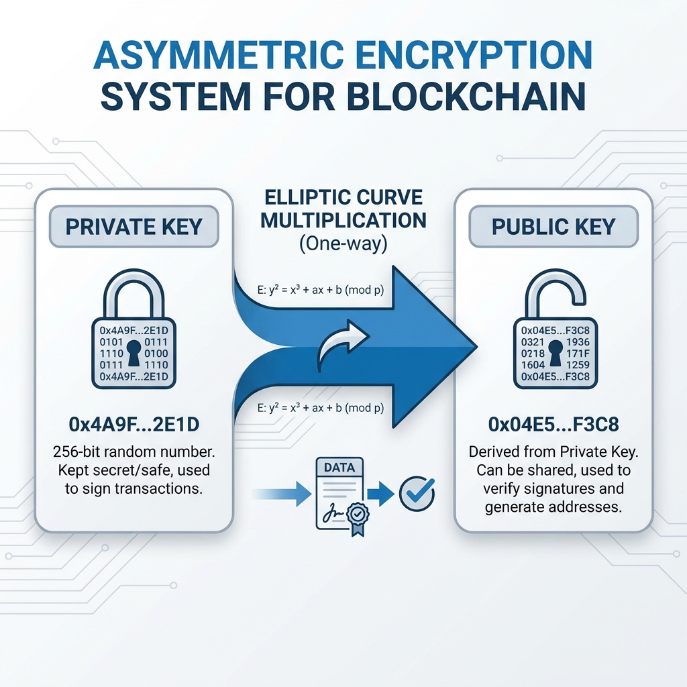
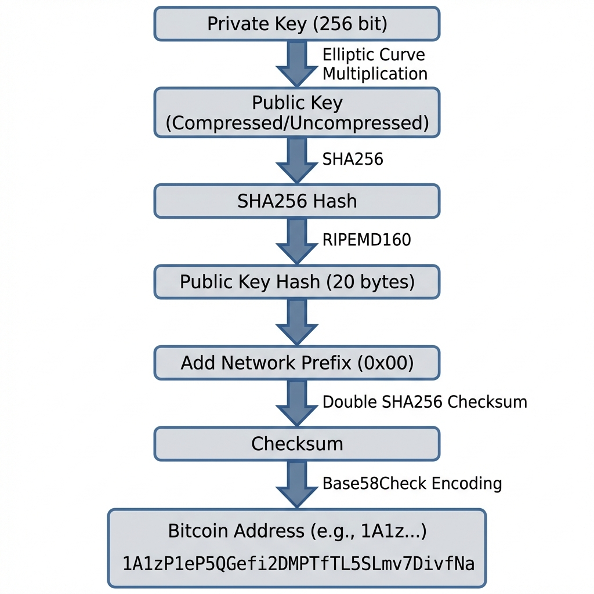
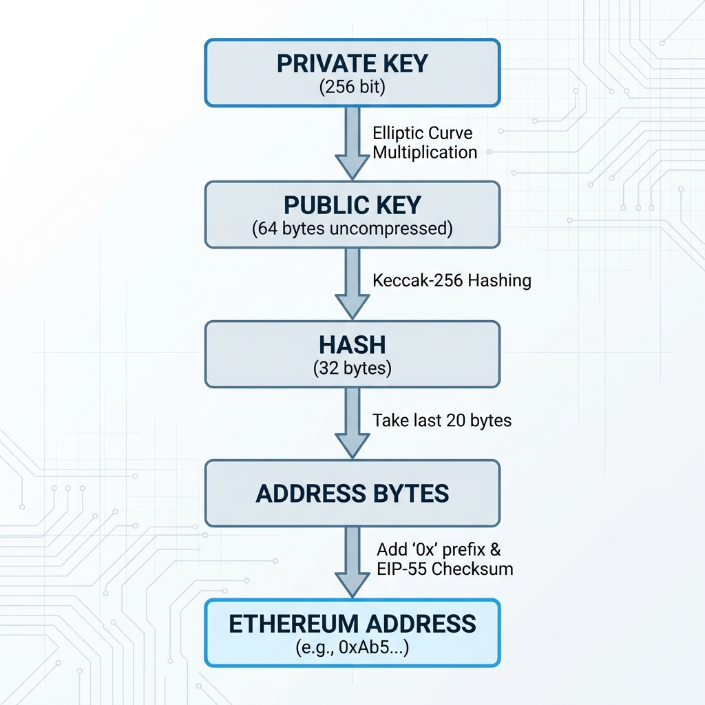
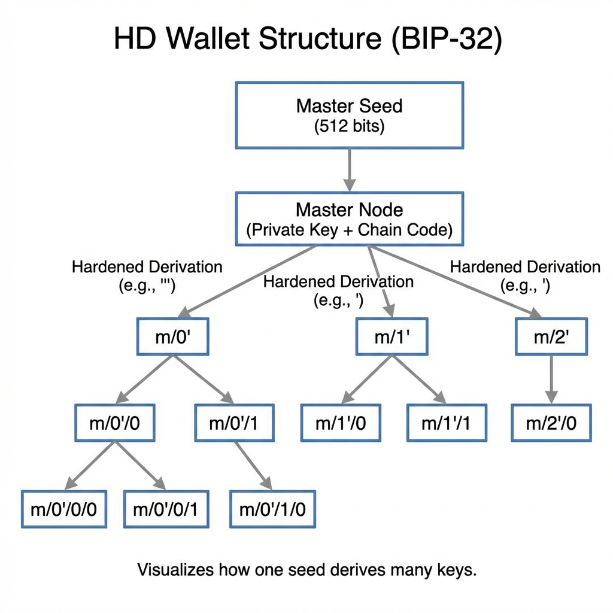
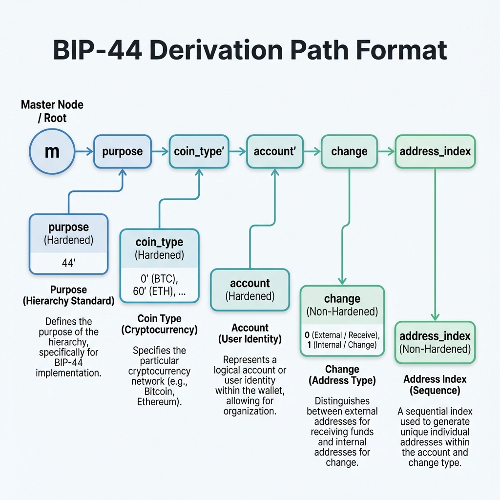

# Day 2: 密码学基础与钱包原理

> **学习时间**：4-6 小时（理论 1.5h + 实战 3-4h + 复习 0.5h）
> 
> **核心目标**：掌握区块链密码学基础，理解地址生成与 HD 钱包原理

---

## 🎯 今日学习目标

- [ ] 理解非对称加密与数字签名 (ECDSA)
- [ ] 掌握 SHA-256 和 Keccak-256 哈希函数
- [ ] 理解 Bitcoin 和 Ethereum 地址生成流程
- [ ] 掌握 BIP-39 助记词标准
- [ ] 理解 HD 钱包 (BIP-32/44) 派生机制
- [ ] 使用 Go 生成多链地址

---

## 📚 理论课

### 1. 非对称加密基础

#### 1.1 公钥密码学原理



**核心特性**：
- ✅ 私钥 → 公钥：容易计算
- ❌ 公钥 → 私钥：计算不可行（离散对数问题）

#### 1.2 椭圆曲线数字签名算法 (ECDSA)

**Bitcoin 和 Ethereum 都使用 secp256k1 曲线**：

```
曲线方程: y² = x³ + 7 (mod p)
其中 p = 2²⁵⁶ - 2³² - 977
```

**签名过程**：

```go
// 伪代码理解签名过程
func Sign(privateKey, messageHash) (r, s) {
    k := generateRandomNonce()           // 随机数，必须保密且唯一
    R := k * G                           // G 是曲线生成点
    r := R.x mod n                       // 签名的 r 部分
    s := (messageHash + r*privateKey)/k mod n  // 签名的 s 部分
    return (r, s)
}

// 验证过程
func Verify(publicKey, messageHash, r, s) bool {
    u1 := messageHash / s mod n
    u2 := r / s mod n
    R' := u1*G + u2*publicKey
    return R'.x mod n == r
}
```

> [!WARNING]
> **随机数 k 绝对不能重复使用！** 
> 
> 2010 年索尼 PS3 被破解就是因为在 ECDSA 签名中重用了同一个 k 值，导致私钥泄露。

#### 1.3 后端开发者对比理解

| 概念         | 传统后端      | 区块链                   |
| :----------- | :------------ | :----------------------- |
| **身份**     | 用户名 + 密码 | 私钥                     |
| **认证**     | Session / JWT | 数字签名                 |
| **授权**     | RBAC / ACL    | 智能合约逻辑             |
| **密码找回** | 邮箱/手机验证 | 不可能（除非备份助记词） |

---

### 2. 哈希函数

#### 2.1 SHA-256 (Bitcoin)

```
特性:
- 输入：任意长度数据
- 输出：固定 256 位 (32 字节)
- 单向性：无法从哈希反推原文
- 抗碰撞：几乎不可能找到两个不同输入产生相同输出
```

**Bitcoin 中的应用**：
- 区块哈希：`SHA256(SHA256(block_header))`
- 交易 ID (TXID)
- 地址生成的一部分

#### 2.2 Keccak-256 (Ethereum)

```
注意：Ethereum 使用的是 Keccak-256，不是标准化后的 SHA-3
两者在 padding 方式上有细微差别
```

**Ethereum 中的应用**：
- 地址生成：`Keccak256(publicKey)[12:32]`
- 函数选择器：`Keccak256("transfer(address,uint256)")[:4]`
- 事件签名

#### 2.3 RIPEMD-160 (Bitcoin 地址)

```
Bitcoin 地址生成使用 Hash160:
Hash160(data) = RIPEMD160(SHA256(data))
```

---

### 3. 地址生成

#### 3.1 Bitcoin 地址生成流程



**地址格式对比**：

| 类型    | 前缀 | 示例                                       | 说明          |
| :------ | :--- | :----------------------------------------- | :------------ |
| P2PKH   | 1    | 1BvBMSEYstWetqTFn5Au4m4GFg7xJaNVN2         | 传统地址      |
| P2SH    | 3    | 3J98t1WpEZ73CNmQviecrnyiWrnqRhWNLy         | 多签/脚本地址 |
| Bech32  | bc1q | bc1qar0srrr7xfkvy5l643lydnw9re59gtzzwf5mdq | SegWit 原生   |
| Bech32m | bc1p | bc1p...                                    | Taproot       |

#### 3.2 Ethereum 地址生成流程



**EIP-55 校验和**：地址字符的大小写编码校验信息

---

### 4. 助记词标准 (BIP-39)

#### 4.1 为什么需要助记词？

```
私钥格式:
0x1a2b3c4d5e6f7890abcdef1234567890abcdef1234567890abcdef1234567890

助记词格式:
abandon ability able about above absent absorb abstract absurd abuse access accident
```

**优势**：
- 人类可读，易于抄写备份
- 内置校验和，防止抄写错误
- 支持多语言 (中文、日文等)

#### 4.2 生成流程

```
1. 生成熵 (128-256 bits)
   例: 128 bits = 16 bytes 随机数

2. 计算校验和
   checksum = SHA256(entropy)[0:熵位数/32]
   128 bits 熵 → 4 bits 校验和

3. 熵 + 校验和 = 132 bits

4. 每 11 bits 映射一个单词
   132 / 11 = 12 个单词
   
5. 查询 BIP-39 词表 (2048 个单词)
```

| 熵 (bits) | 校验和 (bits) | 总位数 | 单词数 |
| :-------- | :------------ | :----- | :----- |
| 128       | 4             | 132    | 12     |
| 160       | 5             | 165    | 15     |
| 192       | 6             | 198    | 18     |
| 224       | 7             | 231    | 21     |
| 256       | 8             | 264    | 24     |

#### 4.3 从助记词到种子

```
Seed = PBKDF2(
    password = mnemonic_words,
    salt = "mnemonic" + passphrase,  // passphrase 可选
    iterations = 2048,
    keyLength = 64 bytes
)
```

> [!TIP]
> **Passphrase 的妙用**
> 
> 同一组助记词 + 不同 passphrase = 完全不同的钱包
> 可用于创建"伪装钱包"，应对胁迫场景

---

### 5. HD 钱包 (BIP-32/44)

#### 5.1 分层确定性钱包

**问题**：为每个用户/交易生成独立地址时，如何管理大量私钥？

**解决方案**：从单一种子派生无限数量的密钥对



#### 5.2 BIP-44 派生路径



**常用派生路径**：

| 链        | 派生路径示例      | coin_type |
| :-------- | :---------------- | :-------- |
| Bitcoin   | m/44'/0'/0'/0/0   | 0         |
| Ethereum  | m/44'/60'/0'/0/0  | 60        |
| BNB Chain | m/44'/60'/0'/0/0  | 60        |
| Solana    | m/44'/501'/0'/0'  | 501       |
| Tron      | m/44'/195'/0'/0/0 | 195       |

#### 5.3 硬化派生 vs 普通派生

```
普通派生 (index < 2³¹):
- 可以从 xpub 派生子公钥
- 适合：收款地址生成（服务器只需 xpub）

硬化派生 (index >= 2³¹, 表示为 0', 1', ...):
- 必须有 xprv 才能派生
- 更安全：子密钥泄露不影响父密钥
- 适合：账户级别的隔离
```

> [!IMPORTANT]
> **交易所收款系统设计**
> 
> 将 Master xpub 部署在在线服务器，为每个用户派生唯一收款地址。
> Master xprv 保存在离线冷钱包，仅在需要签名时使用。

---

## 🔧 实战作业

### 作业 1: 使用 Go 生成地址

#### 1.1 环境准备

```bash
mkdir -p ~/blockchain-course/day02
cd ~/blockchain-course/day02
go mod init day02

# 安装依赖
go get github.com/btcsuite/btcd/btcec/v2
go get github.com/btcsuite/btcd/btcutil
go get github.com/btcsuite/btcd/chaincfg
go get github.com/ethereum/go-ethereum/crypto
go get github.com/tyler-smith/go-bip39
go get github.com/tyler-smith/go-bip32
```

#### 1.2 Bitcoin 地址生成

创建 `bitcoin_address.go`:

```go
package main

import (
	"crypto/rand"
	"fmt"
	"log"

	"github.com/btcsuite/btcd/btcec/v2"
	"github.com/btcsuite/btcd/btcutil"
	"github.com/btcsuite/btcd/chaincfg"
)

func main() {
	// 1. 生成私钥 (256位随机数)
	privateKey, err := btcec.NewPrivateKey()
	if err != nil {
		log.Fatal(err)
	}

	fmt.Println("=== Bitcoin 地址生成 ===")
	fmt.Printf("私钥 (Hex): %x\n", privateKey.Serialize())

	// 2. 获取公钥
	publicKey := privateKey.PubKey()
	fmt.Printf("公钥 (压缩, 33 bytes): %x\n", publicKey.SerializeCompressed())
	fmt.Printf("公钥 (未压缩, 65 bytes): %x\n", publicKey.SerializeUncompressed())

	// 3. 生成 P2PKH 地址 (以 1 开头)
	pubKeyHash := btcutil.Hash160(publicKey.SerializeCompressed())
	addr, err := btcutil.NewAddressPubKeyHash(pubKeyHash, &chaincfg.MainNetParams)
	if err != nil {
		log.Fatal(err)
	}
	fmt.Printf("\nP2PKH 地址 (Mainnet): %s\n", addr.EncodeAddress())

	// 4. 生成测试网地址
	testAddr, _ := btcutil.NewAddressPubKeyHash(pubKeyHash, &chaincfg.TestNet3Params)
	fmt.Printf("P2PKH 地址 (Testnet): %s\n", testAddr.EncodeAddress())

	// 5. 生成 SegWit 地址 (以 bc1q 开头)
	segwitAddr, err := btcutil.NewAddressWitnessPubKeyHash(pubKeyHash, &chaincfg.MainNetParams)
	if err != nil {
		log.Fatal(err)
	}
	fmt.Printf("SegWit 地址 (Mainnet): %s\n", segwitAddr.EncodeAddress())

	// 6. WIF 格式私钥 (钱包导入格式)
	wif, err := btcutil.NewWIF(privateKey, &chaincfg.MainNetParams, true)
	if err != nil {
		log.Fatal(err)
	}
	fmt.Printf("\nWIF 私钥: %s\n", wif.String())
}
```

#### 1.3 Ethereum 地址生成

创建 `ethereum_address.go`:

```go
package main

import (
	"crypto/ecdsa"
	"fmt"
	"log"

	"github.com/ethereum/go-ethereum/common/hexutil"
	"github.com/ethereum/go-ethereum/crypto"
)

func main() {
	// 1. 生成私钥
	privateKey, err := crypto.GenerateKey()
	if err != nil {
		log.Fatal(err)
	}

	fmt.Println("=== Ethereum 地址生成 ===")
	
	// 私钥转 bytes
	privateKeyBytes := crypto.FromECDSA(privateKey)
	fmt.Printf("私钥 (Hex): %s\n", hexutil.Encode(privateKeyBytes)[2:])

	// 2. 获取公钥
	publicKey := privateKey.Public()
	publicKeyECDSA, ok := publicKey.(*ecdsa.PublicKey)
	if !ok {
		log.Fatal("无法转换公钥类型")
	}

	publicKeyBytes := crypto.FromECDSAPub(publicKeyECDSA)
	fmt.Printf("公钥 (Hex): %s\n", hexutil.Encode(publicKeyBytes)[2:])

	// 3. 从公钥生成地址
	// Keccak256(publicKey[1:]) 取后 20 字节
	address := crypto.PubkeyToAddress(*publicKeyECDSA)
	fmt.Printf("\n地址: %s\n", address.Hex())

	// 4. 手动演示地址生成过程
	fmt.Println("\n=== 手动推导过程 ===")
	// 去掉公钥前缀 0x04 (表示未压缩)
	pubKeyWithoutPrefix := publicKeyBytes[1:]
	fmt.Printf("公钥 (去掉前缀, 64 bytes): %x\n", pubKeyWithoutPrefix)
	
	// Keccak256 哈希
	hash := crypto.Keccak256(pubKeyWithoutPrefix)
	fmt.Printf("Keccak256 哈希: %x\n", hash)
	
	// 取后 20 字节
	addressBytes := hash[12:]
	fmt.Printf("地址 (后20字节): 0x%x\n", addressBytes)
}
```

#### 1.4 签名与验证

创建 `signature.go`:

```go
package main

import (
	"crypto/ecdsa"
	"fmt"
	"log"

	"github.com/ethereum/go-ethereum/common/hexutil"
	"github.com/ethereum/go-ethereum/crypto"
)

func main() {
	// 1. 生成密钥对
	privateKey, err := crypto.GenerateKey()
	if err != nil {
		log.Fatal(err)
	}

	publicKey := privateKey.Public()
	publicKeyECDSA, _ := publicKey.(*ecdsa.PublicKey)
	address := crypto.PubkeyToAddress(*publicKeyECDSA)

	fmt.Println("=== ECDSA 签名与验证 ===")
	fmt.Printf("地址: %s\n\n", address.Hex())

	// 2. 准备消息
	message := []byte("Hello, Blockchain!")
	fmt.Printf("原始消息: %s\n", message)

	// 3. 计算消息哈希 (Ethereum 使用 Keccak256)
	messageHash := crypto.Keccak256Hash(message)
	fmt.Printf("消息哈希: %s\n\n", messageHash.Hex())

	// 4. 签名
	signature, err := crypto.Sign(messageHash.Bytes(), privateKey)
	if err != nil {
		log.Fatal(err)
	}
	fmt.Printf("签名 (65 bytes): %s\n", hexutil.Encode(signature))
	fmt.Printf("  - R (32 bytes): %s\n", hexutil.Encode(signature[:32]))
	fmt.Printf("  - S (32 bytes): %s\n", hexutil.Encode(signature[32:64]))
	fmt.Printf("  - V (1 byte): %d\n\n", signature[64])

	// 5. 从签名恢复公钥
	recoveredPubKey, err := crypto.SigToPub(messageHash.Bytes(), signature)
	if err != nil {
		log.Fatal(err)
	}
	recoveredAddr := crypto.PubkeyToAddress(*recoveredPubKey)
	
	fmt.Println("=== 验证结果 ===")
	fmt.Printf("恢复的地址: %s\n", recoveredAddr.Hex())
	
	if address == recoveredAddr {
		fmt.Println("✅ 签名验证成功！")
	} else {
		fmt.Println("❌ 签名验证失败")
	}

	// 6. 使用 VerifySignature 验证 (无恢复)
	signatureNoRecoverID := signature[:64] // 去掉 V
	pubKeyBytes := crypto.FromECDSAPub(publicKeyECDSA)
	valid := crypto.VerifySignature(pubKeyBytes, messageHash.Bytes(), signatureNoRecoverID)
	fmt.Printf("VerifySignature 结果: %v\n", valid)
}
```

---

### 作业 2: HD 钱包与助记词

#### 2.1 生成助记词和派生地址

创建 `hd_wallet.go`:

```go
package main

import (
	"fmt"
	"log"

	"github.com/btcsuite/btcd/btcec/v2"
	"github.com/btcsuite/btcd/btcutil"
	"github.com/btcsuite/btcd/btcutil/hdkeychain"
	"github.com/btcsuite/btcd/chaincfg"
	"github.com/ethereum/go-ethereum/crypto"
	"github.com/tyler-smith/go-bip39"
)

func main() {
	// 1. 生成助记词
	entropy, err := bip39.NewEntropy(128) // 128 bits = 12 words
	if err != nil {
		log.Fatal(err)
	}

	mnemonic, err := bip39.NewMnemonic(entropy)
	if err != nil {
		log.Fatal(err)
	}

	fmt.Println("=== HD 钱包生成 ===")
	fmt.Printf("助记词 (12 words): %s\n\n", mnemonic)

	// 2. 从助记词生成种子
	passphrase := "" // 可选的额外密码
	seed := bip39.NewSeed(mnemonic, passphrase)
	fmt.Printf("种子 (64 bytes): %x\n\n", seed)

	// 3. 生成主密钥 (BIP-32)
	masterKey, err := hdkeychain.NewMaster(seed, &chaincfg.MainNetParams)
	if err != nil {
		log.Fatal(err)
	}
	fmt.Printf("Master Private Key (xprv): %s\n\n", masterKey.String())

	// 4. 派生 Bitcoin 地址 (m/44'/0'/0'/0/0)
	fmt.Println("=== Bitcoin 地址派生 (m/44'/0'/0'/0/x) ===")
	btcPath := []uint32{
		44 + hdkeychain.HardenedKeyStart,  // purpose
		0 + hdkeychain.HardenedKeyStart,   // coin_type (Bitcoin)
		0 + hdkeychain.HardenedKeyStart,   // account
		0,                                  // change (0=external)
	}
	
	btcAccountKey := masterKey
	for _, index := range btcPath {
		btcAccountKey, err = btcAccountKey.Derive(index)
		if err != nil {
			log.Fatal(err)
		}
	}

	// 生成前 5 个地址
	for i := uint32(0); i < 5; i++ {
		childKey, err := btcAccountKey.Derive(i)
		if err != nil {
			log.Fatal(err)
		}
		
		pubKey, err := childKey.ECPubKey()
		if err != nil {
			log.Fatal(err)
		}
		
		pubKeyHash := btcutil.Hash160(pubKey.SerializeCompressed())
		addr, _ := btcutil.NewAddressPubKeyHash(pubKeyHash, &chaincfg.MainNetParams)
		fmt.Printf("  m/44'/0'/0'/0/%d: %s\n", i, addr.EncodeAddress())
	}

	// 5. 派生 Ethereum 地址 (m/44'/60'/0'/0/0)
	fmt.Println("\n=== Ethereum 地址派生 (m/44'/60'/0'/0/x) ===")
	masterKeyETH, _ := hdkeychain.NewMaster(seed, &chaincfg.MainNetParams)
	ethPath := []uint32{
		44 + hdkeychain.HardenedKeyStart,  // purpose
		60 + hdkeychain.HardenedKeyStart,  // coin_type (Ethereum)
		0 + hdkeychain.HardenedKeyStart,   // account
		0,                                  // change
	}
	
	ethAccountKey := masterKeyETH
	for _, index := range ethPath {
		ethAccountKey, err = ethAccountKey.Derive(index)
		if err != nil {
			log.Fatal(err)
		}
	}

	// 生成前 5 个地址
	for i := uint32(0); i < 5; i++ {
		childKey, err := ethAccountKey.Derive(i)
		if err != nil {
			log.Fatal(err)
		}
		
		privKey, err := childKey.ECPrivKey()
		if err != nil {
			log.Fatal(err)
		}
		
		// 转换为 go-ethereum 格式
		privateKeyECDSA := privKey.ToECDSA()
		address := crypto.PubkeyToAddress(privateKeyECDSA.PublicKey)
		fmt.Printf("  m/44'/60'/0'/0/%d: %s\n", i, address.Hex())
	}
}
```

---

### 作业 3: 挑战 —— 手动实现地址推导

创建 `manual_derivation.go`:

```go
package main

import (
	"crypto/sha256"
	"fmt"
	"math/big"

	"github.com/btcsuite/btcd/btcec/v2"
	"golang.org/x/crypto/ripemd160"
)

// Base58 字母表
const base58Alphabet = "123456789ABCDEFGHJKLMNPQRSTUVWXYZabcdefghijkmnopqrstuvwxyz"

// Base58Encode 编码
func Base58Encode(input []byte) string {
	var result []byte

	// 转换为大整数
	x := new(big.Int).SetBytes(input)
	base := big.NewInt(58)
	zero := big.NewInt(0)
	mod := new(big.Int)

	for x.Cmp(zero) != 0 {
		x.DivMod(x, base, mod)
		result = append([]byte{base58Alphabet[mod.Int64()]}, result...)
	}

	// 处理前导零
	for _, b := range input {
		if b != 0 {
			break
		}
		result = append([]byte{base58Alphabet[0]}, result...)
	}

	return string(result)
}

// Hash160 = RIPEMD160(SHA256(data))
func Hash160(data []byte) []byte {
	sha := sha256.Sum256(data)
	ripemd := ripemd160.New()
	ripemd.Write(sha[:])
	return ripemd.Sum(nil)
}

// DoubleHash = SHA256(SHA256(data))
func DoubleHash(data []byte) []byte {
	first := sha256.Sum256(data)
	second := sha256.Sum256(first[:])
	return second[:]
}

func main() {
	fmt.Println("=== 手动推导 Bitcoin 地址 ===\n")

	// 1. 生成私钥
	privateKey, _ := btcec.NewPrivateKey()
	privateKeyBytes := privateKey.Serialize()
	fmt.Printf("步骤 1 - 私钥 (32 bytes):\n%x\n\n", privateKeyBytes)

	// 2. 计算公钥
	pubKey := privateKey.PubKey()
	pubKeyCompressed := pubKey.SerializeCompressed()
	fmt.Printf("步骤 2 - 压缩公钥 (33 bytes):\n%x\n", pubKeyCompressed)
	fmt.Printf("  前缀: %02x (02=y偶数, 03=y奇数)\n\n", pubKeyCompressed[0])

	// 3. SHA256
	sha256Hash := sha256.Sum256(pubKeyCompressed)
	fmt.Printf("步骤 3 - SHA256(公钥):\n%x\n\n", sha256Hash)

	// 4. RIPEMD160
	ripemd := ripemd160.New()
	ripemd.Write(sha256Hash[:])
	pubKeyHash := ripemd.Sum(nil)
	fmt.Printf("步骤 4 - RIPEMD160(SHA256(公钥)) = 公钥哈希 (20 bytes):\n%x\n\n", pubKeyHash)

	// 5. 添加版本前缀
	version := byte(0x00) // Mainnet P2PKH
	versionedPayload := append([]byte{version}, pubKeyHash...)
	fmt.Printf("步骤 5 - 添加版本前缀 (0x00 = Mainnet):\n%x\n\n", versionedPayload)

	// 6. 计算校验和 (Double SHA256 取前 4 字节)
	checksum := DoubleHash(versionedPayload)[:4]
	fmt.Printf("步骤 6 - 校验和 (Double SHA256 前 4 字节):\n%x\n\n", checksum)

	// 7. 拼接并 Base58 编码
	fullPayload := append(versionedPayload, checksum...)
	address := Base58Encode(fullPayload)
	fmt.Printf("步骤 7 - Base58Check 编码:\n%s\n\n", address)

	// 验证地址格式
	if address[0] == '1' {
		fmt.Println("✅ 地址格式正确 (以 '1' 开头的 P2PKH 地址)")
	}
}
```

---

### 作业 4: 批量生成地址

创建 `batch_addresses.go`:

```go
package main

import (
	"encoding/csv"
	"fmt"
	"log"
	"os"

	"github.com/btcsuite/btcd/btcutil"
	"github.com/btcsuite/btcd/btcutil/hdkeychain"
	"github.com/btcsuite/btcd/chaincfg"
	"github.com/ethereum/go-ethereum/crypto"
	"github.com/tyler-smith/go-bip39"
)

func main() {
	// 使用固定助记词(仅用于测试！)
	mnemonic := "abandon abandon abandon abandon abandon abandon abandon abandon abandon abandon abandon about"
	
	seed := bip39.NewSeed(mnemonic, "")
	masterKey, _ := hdkeychain.NewMaster(seed, &chaincfg.MainNetParams)

	// 创建 CSV 文件
	file, err := os.Create("addresses.csv")
	if err != nil {
		log.Fatal(err)
	}
	defer file.Close()

	writer := csv.NewWriter(file)
	defer writer.Flush()

	// 写入表头
	writer.Write([]string{"Index", "BTC Address", "ETH Address"})

	// 派生路径准备
	btcPath := deriveToPath(masterKey, []uint32{44, 0, 0, 0}, true)
	ethPath := deriveToPath(masterKey, []uint32{44, 60, 0, 0}, true)

	// 生成 1000 个地址
	fmt.Println("生成 1000 个地址...")
	for i := uint32(0); i < 1000; i++ {
		// BTC 地址
		btcChild, _ := btcPath.Derive(i)
		btcPubKey, _ := btcChild.ECPubKey()
		btcHash := btcutil.Hash160(btcPubKey.SerializeCompressed())
		btcAddr, _ := btcutil.NewAddressPubKeyHash(btcHash, &chaincfg.MainNetParams)

		// ETH 地址
		ethChild, _ := ethPath.Derive(i)
		ethPriv, _ := ethChild.ECPrivKey()
		ethAddr := crypto.PubkeyToAddress(ethPriv.ToECDSA().PublicKey)

		writer.Write([]string{
			fmt.Sprintf("%d", i),
			btcAddr.EncodeAddress(),
			ethAddr.Hex(),
		})

		if (i+1)%100 == 0 {
			fmt.Printf("已生成 %d 个地址\n", i+1)
		}
	}

	fmt.Println("✅ 地址已保存到 addresses.csv")
}

func deriveToPath(master *hdkeychain.ExtendedKey, path []uint32, harden bool) *hdkeychain.ExtendedKey {
	key := master
	for i, index := range path {
		if harden && i < 3 { // 前3级使用硬化派生
			index += hdkeychain.HardenedKeyStart
		}
		key, _ = key.Derive(index)
	}
	return key
}
```

---

## 📋 今日 Checklist

- [ ] 完成 `bitcoin_address.go`，理解 P2PKH 和 SegWit 地址
- [ ] 完成 `ethereum_address.go`，理解 Keccak256 哈希
- [ ] 完成 `signature.go`，理解 ECDSA 签名与验证
- [ ] 完成 `hd_wallet.go`，理解 BIP-44 派生路径
- [ ] (挑战) 完成手动地址推导，深入理解底层原理
- [ ] 生成 1000 个派生地址，验证批量生成能力

---

## 📖 扩展阅读

1. **BIP-39 规范**: [github.com/bitcoin/bips/blob/master/bip-0039.mediawiki](https://github.com/bitcoin/bips/blob/master/bip-0039.mediawiki)
2. **BIP-32 HD Wallets**: [github.com/bitcoin/bips/blob/master/bip-0032.mediawiki](https://github.com/bitcoin/bips/blob/master/bip-0032.mediawiki)
3. **BIP-44 Multi-Account**: [github.com/bitcoin/bips/blob/master/bip-0044.mediawiki](https://github.com/bitcoin/bips/blob/master/bip-0044.mediawiki)
4. **secp256k1 曲线**: [bitcoin.it/wiki/Secp256k1](https://en.bitcoin.it/wiki/Secp256k1)

---

## 🔑 今日关键词

| 术语           | 解释                            |
| :------------- | :------------------------------ |
| **ECDSA**      | 椭圆曲线数字签名算法            |
| **secp256k1**  | Bitcoin/Ethereum 使用的椭圆曲线 |
| **Keccak-256** | Ethereum 使用的哈希函数         |
| **BIP-39**     | 助记词生成标准                  |
| **BIP-32**     | 分层确定性钱包标准              |
| **BIP-44**     | 多币种/多账户派生路径标准       |
| **WIF**        | 钱包导入格式，Base58 编码的私钥 |
| **xpub/xprv**  | 扩展公钥/扩展私钥               |

---

> **明日预告**：Day 3 将深入 Bitcoin UTXO 模型，学习交易结构、Coin Selection 算法，开始与 Bitcoin 节点交互。
