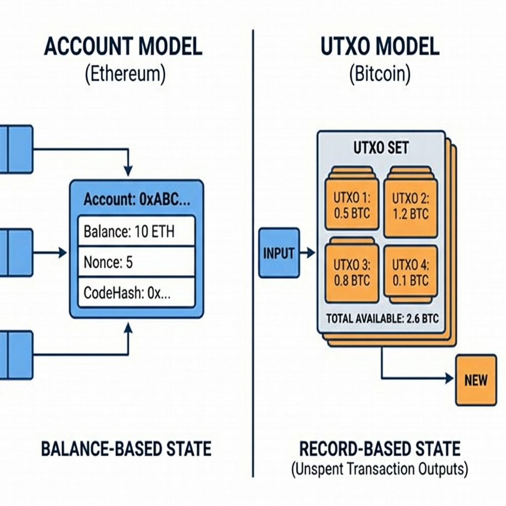
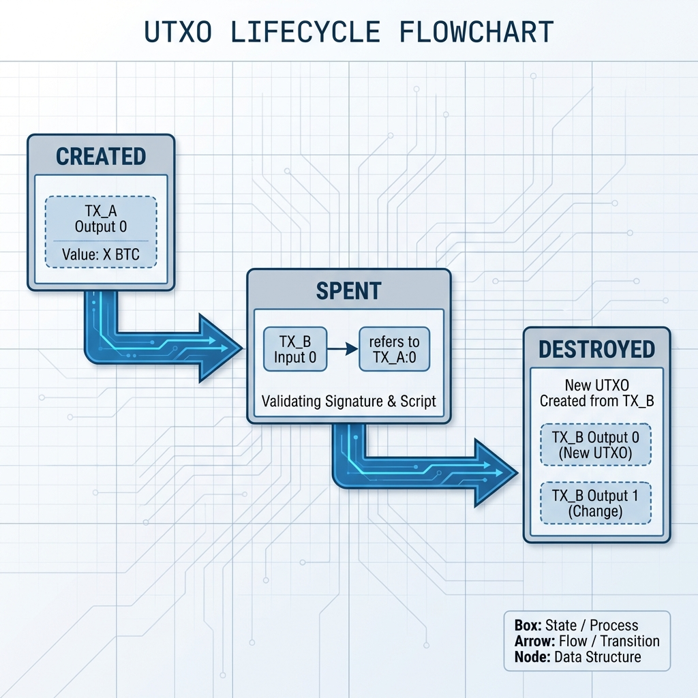
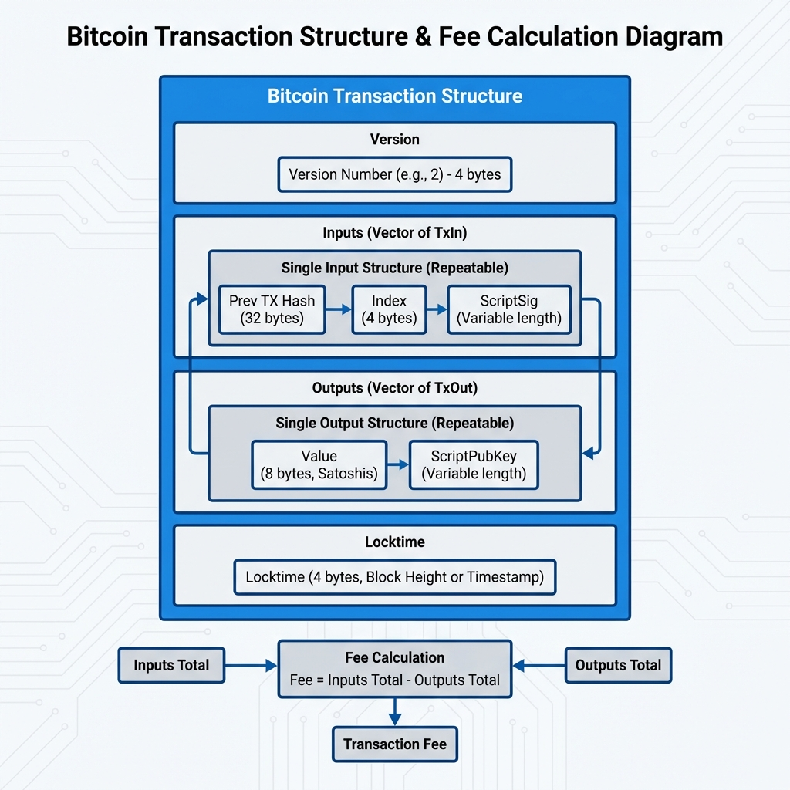
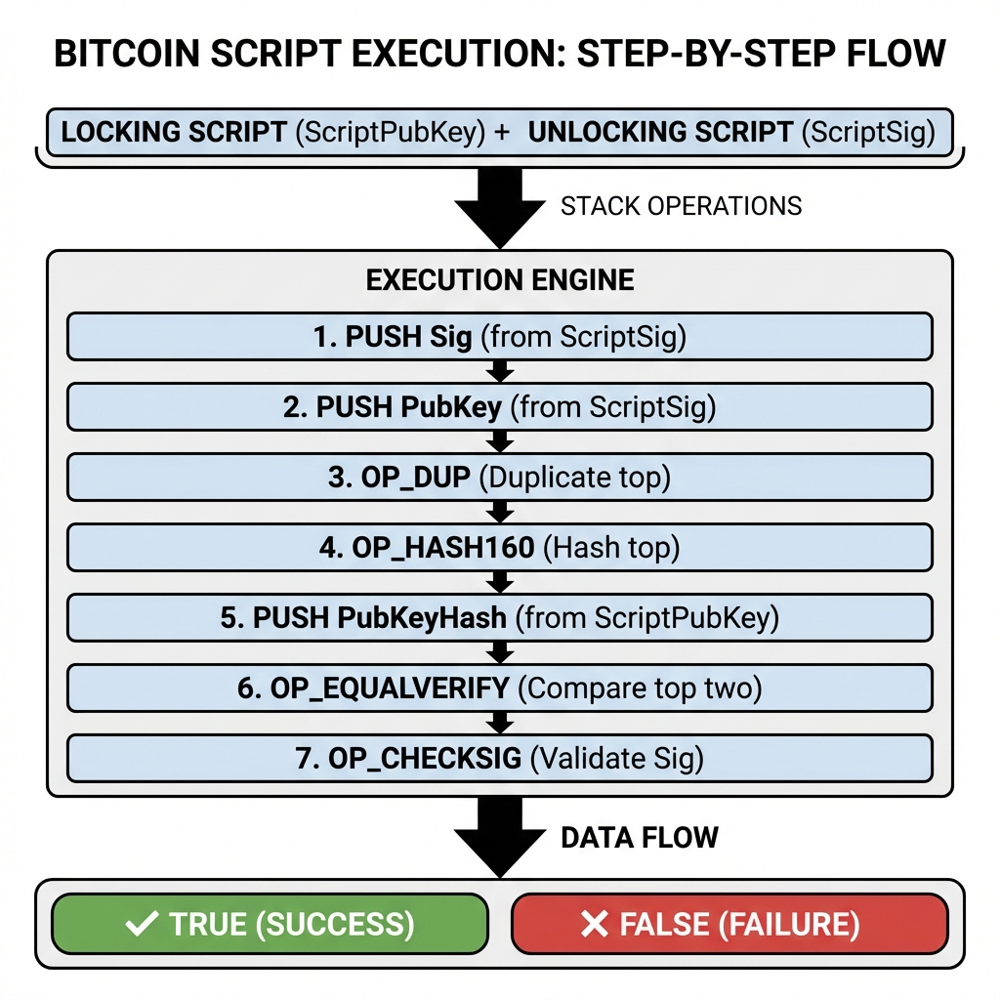

# Day 3: Bitcoin 核心 —— UTXO 模型详解

> **学习时间**：4-6 小时（理论 1.5h + 实战 3-4h + 复习 0.5h）
> 
> **核心目标**：深入理解 UTXO 模型，掌握 Bitcoin 交易结构与 Coin Selection 算法

---

## 🎯 今日学习目标

- [ ] 理解 UTXO vs Account 模型的本质区别
- [ ] 掌握 Bitcoin 交易的输入输出结构
- [ ] 理解交易手续费计算
- [ ] 实现 Coin Selection 算法
- [ ] 使用 Go 与 Bitcoin 测试网交互
- [ ] 编写 UTXO 余额查询工具

---

## 📚 理论课

### 1. UTXO vs Account 模型

#### 1.1 两种模型的本质区别



#### 1.2 后端开发者的理解

| 概念         | Account 模型            | UTXO 模型                  |
| :----------- | :---------------------- | :------------------------- |
| **类比**     | 银行账户余额            | 钱包里的现金钞票           |
| **余额查询** | 直接读取 `balance` 字段 | 遍历所有 UTXO 求和         |
| **转账**     | 原子更新两个余额        | 销毁旧 UTXO，创建新 UTXO   |
| **并发处理** | 需要锁（Nonce 排序）    | 天然并行（不同 UTXO 独立） |
| **隐私性**   | 地址可追踪              | 可使用多个找零地址增强隐私 |
| **数据结构** | 全局状态树 (MPT)        | UTXO Set (集合)            |

#### 1.3 UTXO 的生命周期



**关键规则**：
1. 每个 UTXO 只能被花费一次（防止双花）
2. 交易输入必须完整花费 UTXO（不能部分花费）
3. 差额通过"找零输出"返回给自己

---

### 2. Bitcoin 交易结构

#### 2.1 交易的组成部分



#### 2.2 锁定脚本与解锁脚本



#### 2.3 常见脚本类型

| 类型       | 锁定脚本                          | 地址前缀 | 说明             |
| :--------- | :-------------------------------- | :------- | :--------------- |
| **P2PKH**  | OP_DUP OP_HASH160 ... OP_CHECKSIG | 1        | 传统地址         |
| **P2SH**   | OP_HASH160 ... OP_EQUAL           | 3        | 脚本哈希（多签） |
| **P2WPKH** | OP_0 <20-byte-hash>               | bc1q     | SegWit 原生      |
| **P2TR**   | OP_1 <32-byte-key>                | bc1p     | Taproot          |

---

### 3. 手续费机制

#### 3.1 手续费计算

```
手续费 = ∑(所有输入金额) - ∑(所有输出金额)

手续费率 = 手续费 / 交易大小 (satoshis/vByte)
```

**交易大小估算**：

| 组件              | 大小 (bytes)      |
| :---------------- | :---------------- |
| 版本号            | 4                 |
| 输入数量          | 1-9 (VarInt)      |
| 每个输入 (P2PKH)  | ~148              |
| 每个输入 (P2WPKH) | ~68 (SegWit 折扣) |
| 输出数量          | 1-9 (VarInt)      |
| 每个输出 (P2PKH)  | ~34               |
| 锁定时间          | 4                 |

**估算公式**：
```
P2PKH 交易大小 ≈ 10 + 148 * 输入数 + 34 * 输出数
P2WPKH 交易大小 ≈ 10 + 68 * 输入数 + 31 * 输出数
```

#### 3.2 手续费策略

```go
// 手续费策略示例
type FeeStrategy int

const (
    FeeLow    FeeStrategy = iota  // 慢速确认 (1-2 小时)
    FeeMedium                      // 中速确认 (30 分钟)
    FeeHigh                        // 快速确认 (下一个区块)
)

func GetFeeRate(strategy FeeStrategy) int64 {
    // 实际应用中应该查询 mempool 状态
    switch strategy {
    case FeeLow:
        return 1  // 1 sat/vB
    case FeeMedium:
        return 10 // 10 sat/vB
    case FeeHigh:
        return 50 // 50 sat/vB
    default:
        return 10
    }
}
```

---

### 4. Coin Selection 算法

#### 4.1 问题定义

```
给定:
- 目标金额: 1.5 BTC
- 可用 UTXO 集合:
  - UTXO_A: 0.3 BTC
  - UTXO_B: 0.8 BTC
  - UTXO_C: 1.0 BTC
  - UTXO_D: 0.2 BTC

目标:
选择一组 UTXO 使得:
1. 总额 >= 目标金额 + 预估手续费
2. 最小化手续费（减少输入数量）
3. 最小化找零金额（减少链上碎片）
```

#### 4.2 常见算法

**1. 贪婪算法 (Greedy / Largest First)**

```go
func GreedySelect(utxos []UTXO, target int64) []UTXO {
    // 按金额降序排序
    sort.Slice(utxos, func(i, j int) bool {
        return utxos[i].Value > utxos[j].Value
    })
    
    var selected []UTXO
    var total int64
    
    for _, utxo := range utxos {
        if total >= target {
            break
        }
        selected = append(selected, utxo)
        total += utxo.Value
    }
    
    if total < target {
        return nil // 余额不足
    }
    return selected
}
```

**优点**：简单，通常输入数量较少
**缺点**：可能产生较大找零，不利于隐私

**2. 分支定界算法 (Branch and Bound)**

```go
// 目标：找到精确匹配（无找零）的组合
func BranchAndBound(utxos []UTXO, target int64) []UTXO {
    // 使用回溯法搜索所有可能组合
    // 剪枝条件：当前总额 + 剩余 UTXO 最大值 < 目标
    // ...
}
```

**优点**：可能找到无找零的完美匹配
**缺点**：计算复杂度高，UTXO 多时可能超时

**3. 随机选择 (Random)**

```go
func RandomSelect(utxos []UTXO, target int64) []UTXO {
    // 随机打乱顺序
    rand.Shuffle(len(utxos), func(i, j int) {
        utxos[i], utxos[j] = utxos[j], utxos[i]
    })
    
    // 逐个添加直到满足目标
    var selected []UTXO
    var total int64
    
    for _, utxo := range utxos {
        selected = append(selected, utxo)
        total += utxo.Value
        if total >= target {
            break
        }
    }
    
    return selected
}
```

**优点**：增强隐私（不可预测）
**缺点**：结果不稳定

#### 4.3 Bitcoin Core 的策略

Bitcoin Core 使用组合策略：
1. 首先尝试 Branch and Bound 寻找精确匹配
2. 如果超时或失败，回退到 Knapsack 算法
3. 考虑手续费影响，避免创建"尘埃输出"

> [!IMPORTANT]
> **尘埃输出 (Dust Output)**
> 
> 如果输出金额太小，花费它的手续费比它本身还高，就成了"尘埃"。
> Bitcoin Core 默认尘埃阈值约为 546 satoshis (P2PKH)。

---

### 5. UTXO 模型的优势与挑战

#### 5.1 优势

| 优势         | 说明                                   |
| :----------- | :------------------------------------- |
| **并行验证** | 不同交易引用不同 UTXO，可并行验证      |
| **简单状态** | 全局状态只是 UTXO 集合，无需复杂状态树 |
| **隐私增强** | 可为每笔交易使用新地址                 |
| **可追溯性** | 资金来源清晰可追溯                     |

#### 5.2 挑战

| 挑战           | 说明                                       |
| :------------- | :----------------------------------------- |
| **余额查询慢** | 需要遍历所有相关 UTXO                      |
| **碎片化**     | 大量小额 UTXO 导致交易成本增加             |
| **复杂度**     | 构造交易比 Account 模型复杂                |
| **智能合约**   | 不适合复杂状态管理（Bitcoin 脚本能力有限） |

---

## 🔧 实战作业

### 作业 1: 环境准备与测试网

#### 1.1 安装依赖

```bash
mkdir -p ~/blockchain-course/day03
cd ~/blockchain-course/day03
go mod init day03

# 安装 btcsuite 相关包
go get github.com/btcsuite/btcd
go get github.com/btcsuite/btcd/btcjson
go get github.com/btcsuite/btcd/rpcclient
go get github.com/btcsuite/btcd/chaincfg
go get github.com/btcsuite/btcd/btcutil
go get github.com/btcsuite/btcd/wire
```

#### 1.2 获取测试币

1. 访问 Bitcoin Testnet 水龙头：
   - [coinfaucet.eu/btc-testnet](https://coinfaucet.eu/en/btc-testnet/)
   - [bitcoinfaucet.uo1.net](https://bitcoinfaucet.uo1.net/)

2. 使用 Day 2 的代码生成一个测试网地址

3. 领取测试币并在区块浏览器上确认：
   - [blockstream.info/testnet](https://blockstream.info/testnet/)

---

### 作业 2: UTXO 数据结构与操作

创建 `utxo.go`:

```go
package main

import (
	"fmt"
)

// UTXO 表示一个未花费的交易输出
type UTXO struct {
	TxID         string // 来源交易的哈希
	OutputIndex  uint32 // 输出索引
	Value        int64  // 金额 (satoshis)
	ScriptPubKey []byte // 锁定脚本
	Address      string // 对应地址 (便于查询)
	Confirmations int   // 确认数
}

// OutPoint 唯一标识一个 UTXO
type OutPoint struct {
	TxID  string
	Index uint32
}

func (u *UTXO) OutPoint() OutPoint {
	return OutPoint{TxID: u.TxID, Index: u.OutputIndex}
}

// UTXOSet 管理 UTXO 集合
type UTXOSet struct {
	utxos map[OutPoint]*UTXO
}

func NewUTXOSet() *UTXOSet {
	return &UTXOSet{
		utxos: make(map[OutPoint]*UTXO),
	}
}

// Add 添加 UTXO
func (s *UTXOSet) Add(utxo *UTXO) {
	s.utxos[utxo.OutPoint()] = utxo
}

// Remove 移除 UTXO (已花费)
func (s *UTXOSet) Remove(op OutPoint) {
	delete(s.utxos, op)
}

// GetByAddress 获取某地址的所有 UTXO
func (s *UTXOSet) GetByAddress(address string) []*UTXO {
	var result []*UTXO
	for _, utxo := range s.utxos {
		if utxo.Address == address {
			result = append(result, utxo)
		}
	}
	return result
}

// GetBalance 计算地址余额
func (s *UTXOSet) GetBalance(address string) int64 {
	var total int64
	for _, utxo := range s.GetByAddress(address) {
		total += utxo.Value
	}
	return total
}

// GetSpendable 获取可花费的 UTXO (确认数 >= minConf)
func (s *UTXOSet) GetSpendable(address string, minConf int) []*UTXO {
	var result []*UTXO
	for _, utxo := range s.GetByAddress(address) {
		if utxo.Confirmations >= minConf {
			result = append(result, utxo)
		}
	}
	return result
}

func main() {
	// 创建 UTXO 集合
	utxoSet := NewUTXOSet()

	// 模拟添加一些 UTXO
	testAddress := "tb1qw508d6qejxtdg4y5r3zarvary0c5xw7kxpjzsx"
	
	utxoSet.Add(&UTXO{
		TxID:          "abc123def456...",
		OutputIndex:   0,
		Value:         50000, // 0.0005 BTC
		Address:       testAddress,
		Confirmations: 6,
	})
	
	utxoSet.Add(&UTXO{
		TxID:          "789xyz...",
		OutputIndex:   1,
		Value:         120000, // 0.0012 BTC
		Address:       testAddress,
		Confirmations: 3,
	})
	
	utxoSet.Add(&UTXO{
		TxID:          "mnop...",
		OutputIndex:   0,
		Value:         30000, // 0.0003 BTC
		Address:       testAddress,
		Confirmations: 0, // 未确认
	})

	fmt.Println("=== UTXO 集合演示 ===")
	fmt.Printf("地址: %s\n\n", testAddress)
	
	// 查询余额
	balance := utxoSet.GetBalance(testAddress)
	fmt.Printf("总余额: %d satoshis (%.8f BTC)\n", balance, float64(balance)/1e8)
	
	// 查询已确认余额
	confirmed := utxoSet.GetSpendable(testAddress, 1)
	var confirmedBalance int64
	for _, u := range confirmed {
		confirmedBalance += u.Value
	}
	fmt.Printf("已确认余额 (1+ 确认): %d satoshis\n", confirmedBalance)
	
	// 列出所有 UTXO
	fmt.Println("\n所有 UTXO:")
	for _, utxo := range utxoSet.GetByAddress(testAddress) {
		fmt.Printf("  - %s:%d | %d sats | %d 确认\n",
			utxo.TxID[:10]+"...", utxo.OutputIndex, utxo.Value, utxo.Confirmations)
	}
}
```

---

### 作业 3: Coin Selection 实现

创建 `coin_selection.go`:

```go
package main

import (
	"errors"
	"fmt"
	"math/rand"
	"sort"
	"time"
)

// UTXO 简化版本
type UTXO struct {
	ID    string
	Value int64
}

// SelectionResult 选择结果
type SelectionResult struct {
	Selected   []UTXO
	TotalValue int64
	Change     int64
	Fee        int64
}

// 费率常量
const (
	FeePerInput  int64 = 148 * 10 // 148 bytes * 10 sat/byte
	FeePerOutput int64 = 34 * 10  // 34 bytes * 10 sat/byte
	FeeBase      int64 = 10 * 10  // 10 bytes * 10 sat/byte
)

// EstimateFee 估算手续费
func EstimateFee(numInputs, numOutputs int) int64 {
	return FeeBase + FeePerInput*int64(numInputs) + FeePerOutput*int64(numOutputs)
}

// GreedySelect 贪婪选择算法（大优先）
func GreedySelect(utxos []UTXO, target int64) (*SelectionResult, error) {
	// 按金额降序排序
	sorted := make([]UTXO, len(utxos))
	copy(sorted, utxos)
	sort.Slice(sorted, func(i, j int) bool {
		return sorted[i].Value > sorted[j].Value
	})

	var selected []UTXO
	var total int64

	for _, utxo := range sorted {
		selected = append(selected, utxo)
		total += utxo.Value

		// 估算所需金额 (目标 + 手续费)
		fee := EstimateFee(len(selected), 2) // 假设 2 个输出
		required := target + fee

		if total >= required {
			change := total - target - fee
			return &SelectionResult{
				Selected:   selected,
				TotalValue: total,
				Change:     change,
				Fee:        fee,
			}, nil
		}
	}

	return nil, errors.New("余额不足")
}

// SmallestFirstSelect 小优先选择算法
func SmallestFirstSelect(utxos []UTXO, target int64) (*SelectionResult, error) {
	// 按金额升序排序
	sorted := make([]UTXO, len(utxos))
	copy(sorted, utxos)
	sort.Slice(sorted, func(i, j int) bool {
		return sorted[i].Value < sorted[j].Value
	})

	var selected []UTXO
	var total int64

	for _, utxo := range sorted {
		selected = append(selected, utxo)
		total += utxo.Value

		fee := EstimateFee(len(selected), 2)
		required := target + fee

		if total >= required {
			change := total - target - fee
			return &SelectionResult{
				Selected:   selected,
				TotalValue: total,
				Change:     change,
				Fee:        fee,
			}, nil
		}
	}

	return nil, errors.New("余额不足")
}

// ExactMatchSelect 尝试精确匹配（无找零）
func ExactMatchSelect(utxos []UTXO, target int64) (*SelectionResult, error) {
	// 使用回溯法寻找精确匹配
	n := len(utxos)
	if n > 20 {
		// UTXO 太多，跳过精确匹配
		return nil, errors.New("UTXO 数量过多，跳过精确匹配")
	}

	var bestResult *SelectionResult
	tolerance := int64(1000) // 允许的误差范围 (作为矿工小费)

	// 遍历所有子集 (2^n)
	for mask := 1; mask < (1 << n); mask++ {
		var selected []UTXO
		var total int64

		for i := 0; i < n; i++ {
			if mask&(1<<i) != 0 {
				selected = append(selected, utxos[i])
				total += utxos[i].Value
			}
		}

		fee := EstimateFee(len(selected), 1) // 无找零，只有 1 个输出
		diff := total - target - fee

		// 寻找接近目标的组合
		if diff >= 0 && diff <= tolerance {
			result := &SelectionResult{
				Selected:   selected,
				TotalValue: total,
				Change:     0,
				Fee:        fee + diff, // 多余的作为手续费
			}
			if bestResult == nil || len(result.Selected) < len(bestResult.Selected) {
				bestResult = result
			}
		}
	}

	if bestResult != nil {
		return bestResult, nil
	}
	return nil, errors.New("未找到精确匹配")
}

// RandomSelect 随机选择算法
func RandomSelect(utxos []UTXO, target int64) (*SelectionResult, error) {
	// 随机打乱
	shuffled := make([]UTXO, len(utxos))
	copy(shuffled, utxos)
	rand.Shuffle(len(shuffled), func(i, j int) {
		shuffled[i], shuffled[j] = shuffled[j], shuffled[i]
	})

	var selected []UTXO
	var total int64

	for _, utxo := range shuffled {
		selected = append(selected, utxo)
		total += utxo.Value

		fee := EstimateFee(len(selected), 2)
		required := target + fee

		if total >= required {
			change := total - target - fee
			return &SelectionResult{
				Selected:   selected,
				TotalValue: total,
				Change:     change,
				Fee:        fee,
			}, nil
		}
	}

	return nil, errors.New("余额不足")
}

func main() {
	// Go 1.20+ 自动初始化随机种子，无需手动调用 rand.Seed

	// 模拟 UTXO 集合
	utxos := []UTXO{
		{ID: "utxo_1", Value: 10000},   // 0.0001 BTC
		{ID: "utxo_2", Value: 50000},   // 0.0005 BTC
		{ID: "utxo_3", Value: 80000},   // 0.0008 BTC
		{ID: "utxo_4", Value: 150000},  // 0.0015 BTC
		{ID: "utxo_5", Value: 200000},  // 0.002 BTC
		{ID: "utxo_6", Value: 35000},   // 0.00035 BTC
	}

	target := int64(100000) // 想要发送 0.001 BTC

	fmt.Println("=== Coin Selection 算法对比 ===")
	fmt.Printf("目标金额: %d satoshis (%.8f BTC)\n\n", target, float64(target)/1e8)

	fmt.Println("可用 UTXO:")
	var totalAvailable int64
	for _, u := range utxos {
		fmt.Printf("  %s: %d sats\n", u.ID, u.Value)
		totalAvailable += u.Value
	}
	fmt.Printf("总计: %d sats\n\n", totalAvailable)

	// 测试各种算法
	algorithms := []struct {
		name string
		fn   func([]UTXO, int64) (*SelectionResult, error)
	}{
		{"贪婪算法 (大优先)", GreedySelect},
		{"小优先算法", SmallestFirstSelect},
		{"精确匹配算法", ExactMatchSelect},
		{"随机选择算法", RandomSelect},
	}

	for _, algo := range algorithms {
		fmt.Printf("--- %s ---\n", algo.name)
		result, err := algo.fn(utxos, target)
		if err != nil {
			fmt.Printf("  错误: %s\n\n", err)
			continue
		}

		fmt.Printf("  选中 UTXO:\n")
		for _, u := range result.Selected {
			fmt.Printf("    - %s: %d sats\n", u.ID, u.Value)
		}
		fmt.Printf("  输入总额: %d sats\n", result.TotalValue)
		fmt.Printf("  手续费: %d sats\n", result.Fee)
		fmt.Printf("  找零: %d sats\n", result.Change)
		fmt.Printf("  输入数量: %d\n\n", len(result.Selected))
	}
}
```

---

### 作业 4: 使用 API 查询真实 UTXO

创建 `query_utxo.go`:

```go
package main

import (
	"encoding/json"
	"fmt"
	"io"
	"net/http"
)

// BlockstreamUTXO API 返回的 UTXO 结构
type BlockstreamUTXO struct {
	TxID   string `json:"txid"`
	Vout   int    `json:"vout"`
	Status struct {
		Confirmed   bool  `json:"confirmed"`
		BlockHeight int64 `json:"block_height"`
	} `json:"status"`
	Value int64 `json:"value"`
}

// 查询地址的 UTXO (使用 Blockstream API)
func GetUTXOs(address string, testnet bool) ([]BlockstreamUTXO, error) {
	baseURL := "https://blockstream.info/api"
	if testnet {
		baseURL = "https://blockstream.info/testnet/api"
	}

	url := fmt.Sprintf("%s/address/%s/utxo", baseURL, address)
	
	resp, err := http.Get(url)
	if err != nil {
		return nil, err
	}
	defer resp.Body.Close()

	body, err := io.ReadAll(resp.Body)
	if err != nil {
		return nil, err
	}

	var utxos []BlockstreamUTXO
	if err := json.Unmarshal(body, &utxos); err != nil {
		return nil, err
	}

	return utxos, nil
}

// 获取地址余额
func GetBalance(address string, testnet bool) (int64, error) {
	utxos, err := GetUTXOs(address, testnet)
	if err != nil {
		return 0, err
	}

	var total int64
	for _, utxo := range utxos {
		total += utxo.Value
	}
	return total, nil
}

func main() {
	// 使用一个知名的测试网地址作为示例
	// 替换为你自己的测试网地址
	testAddress := "tb1qw508d6qejxtdg4y5r3zarvary0c5xw7kxpjzsx"

	fmt.Println("=== 查询 Bitcoin Testnet UTXO ===")
	fmt.Printf("地址: %s\n\n", testAddress)

	utxos, err := GetUTXOs(testAddress, true)
	if err != nil {
		fmt.Printf("查询失败: %v\n", err)
		return
	}

	if len(utxos) == 0 {
		fmt.Println("该地址没有 UTXO")
		return
	}

	fmt.Printf("找到 %d 个 UTXO:\n\n", len(utxos))

	var totalBalance int64
	for i, utxo := range utxos {
		status := "未确认"
		if utxo.Status.Confirmed {
			status = fmt.Sprintf("已确认 (区块 %d)", utxo.Status.BlockHeight)
		}
		
		fmt.Printf("%d. TxID: %s...:%d\n", i+1, utxo.TxID[:16], utxo.Vout)
		fmt.Printf("   金额: %d sats (%.8f BTC)\n", utxo.Value, float64(utxo.Value)/1e8)
		fmt.Printf("   状态: %s\n\n", status)
		
		totalBalance += utxo.Value
	}

	fmt.Printf("=== 总余额: %d sats (%.8f BTC) ===\n", totalBalance, float64(totalBalance)/1e8)
}
```

---

### 作业 5: 思考与挑战

#### 5.1 思考题

1. **为什么 Bitcoin 选择 UTXO 模型而不是 Account 模型？**
   提示：考虑并行验证、隐私性、SPV 验证

2. **如果一个地址有 1000 个小额 UTXO，会有什么问题？如何解决？**
   提示：考虑归集交易 (Consolidation)

3. **为什么手续费是"输入 - 输出"而不是显式指定？**
   提示：考虑交易结构和验证逻辑

#### 5.2 挑战作业

实现一个 `UTXOConsolidator`：

```go
// 挑战：实现 UTXO 归集器
// 当小额 UTXO 数量过多时，合并成一个大的 UTXO

type UTXOConsolidator struct {
    threshold     int64  // 归集阈值 (低于此值的 UTXO 需要归集)
    maxInputs     int    // 单笔交易最大输入数
    feeRate       int64  // 手续费率 (sat/vB)
}

func (c *UTXOConsolidator) ShouldConsolidate(utxos []UTXO) bool {
    // TODO: 判断是否需要归集
}

func (c *UTXOConsolidator) CreateConsolidationTx(utxos []UTXO, destAddress string) (*Transaction, error) {
    // TODO: 创建归集交易
    // 1. 选择需要归集的 UTXO
    // 2. 计算手续费
    // 3. 创建单输出交易
}
```

---

## 📋 今日 Checklist

- [ ] 理解 UTXO 与 Account 模型的区别
- [ ] 完成 `utxo.go`，理解 UTXO 数据结构
- [ ] 完成 `coin_selection.go`，实现多种选币算法
- [ ] 完成 `query_utxo.go`，查询测试网真实 UTXO
- [ ] 获取测试网测试币并在区块浏览器上查看
- [ ] 完成思考题

---

## 📖 扩展阅读

1. **Bitcoin UTXO 模型**: [learnmeabitcoin.com/technical/utxo](https://learnmeabitcoin.com/technical/utxo)
2. **Bitcoin Core Coin Selection**: [github.com/bitcoin/bitcoin/blob/master/src/wallet/coinselection.cpp](https://github.com/bitcoin/bitcoin/blob/master/src/wallet/coinselection.cpp)
3. **Branch and Bound 论文**: [murch.one/wp-content/uploads/2016/11/erhardt2016coinselection.pdf](https://murch.one/wp-content/uploads/2016/11/erhardt2016coinselection.pdf)

---

## 🔑 今日关键词

| 术语               | 解释                                       |
| :----------------- | :----------------------------------------- |
| **UTXO**           | Unspent Transaction Output，未花费交易输出 |
| **ScriptPubKey**   | 锁定脚本，定义谁能花费                     |
| **ScriptSig**      | 解锁脚本，证明花费权限                     |
| **Coin Selection** | 选币算法，选择哪些 UTXO 参与交易           |
| **Change Output**  | 找零输出                                   |
| **Dust**           | 尘埃，花费成本高于价值的小额 UTXO          |
| **Satoshi**        | 比特币最小单位，1 BTC = 10^8 satoshis      |

---

> **明日预告**：Day 4 将学习 PSBT（部分签名交易），实现多方协作签名和冷钱包集成。
