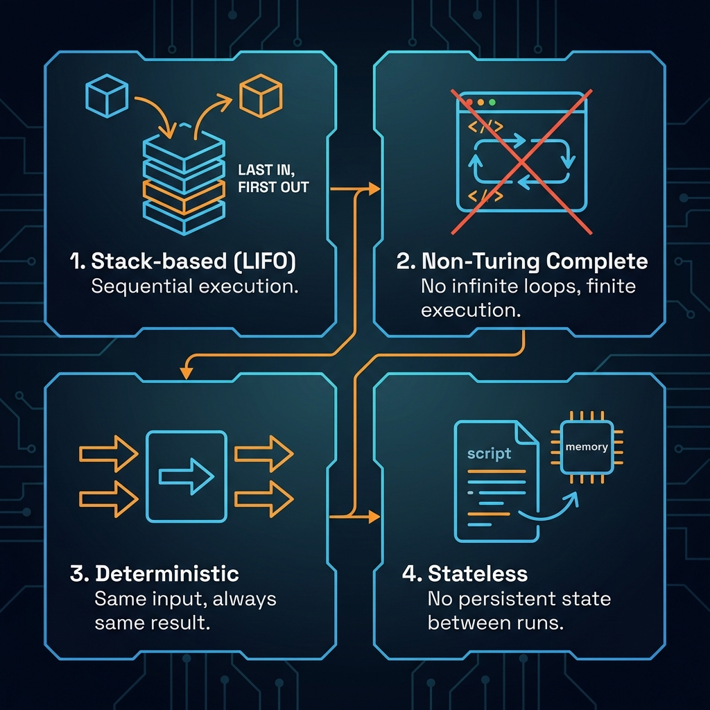
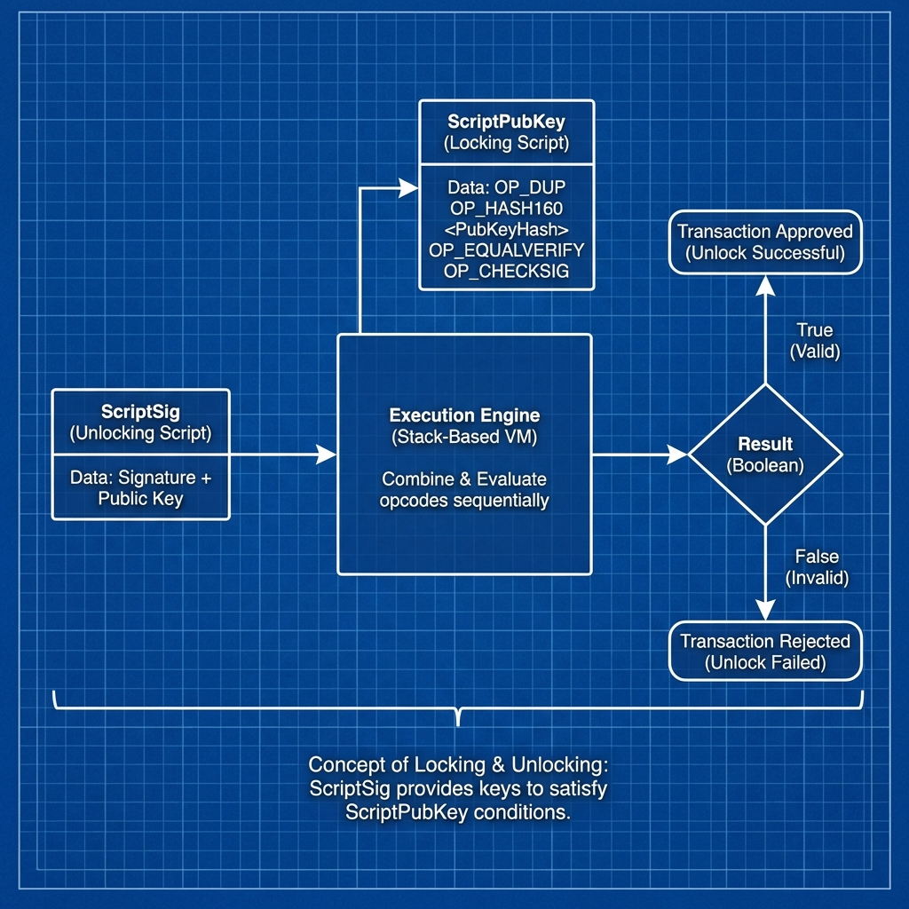
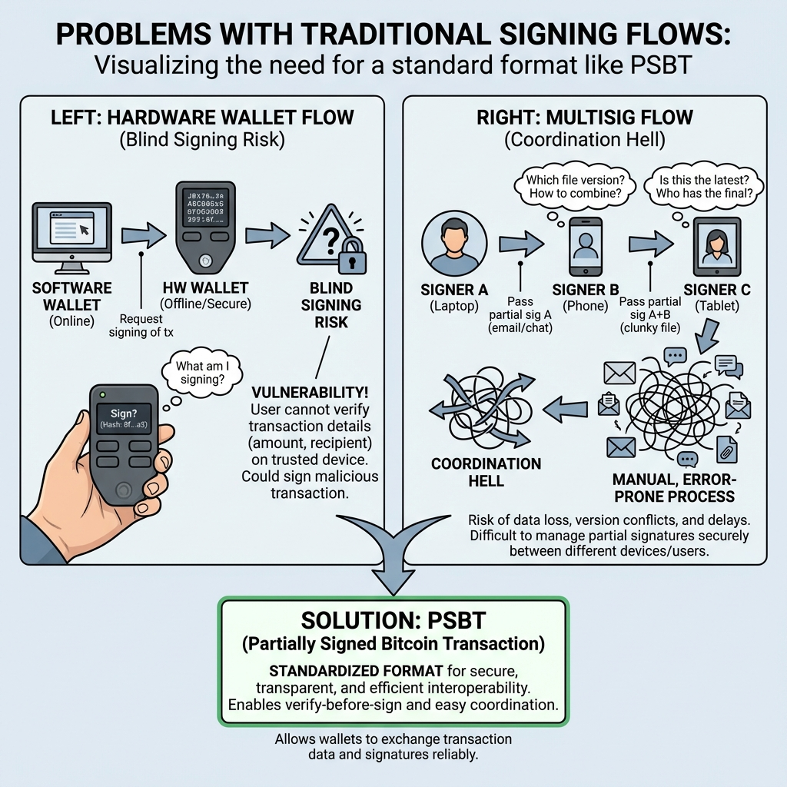
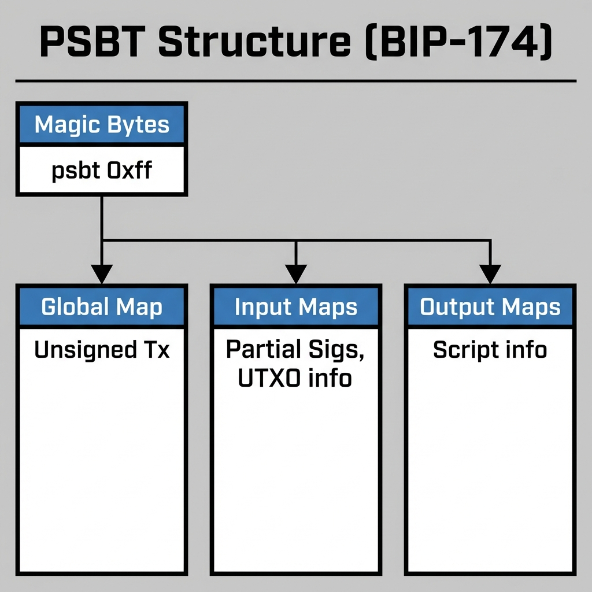
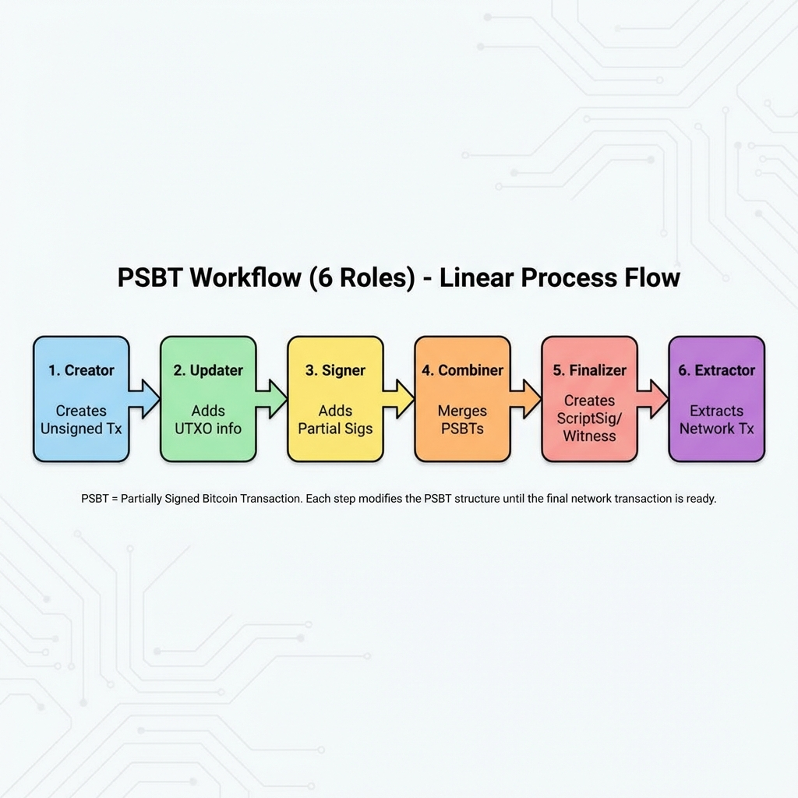

# Day 4: PSBT (部分签名交易) —— 现代化多方协同

> **学习时间**：4-6 小时（理论 1.5h + 实战 3-4h + 复习 0.5h）
> 
> **核心目标**：掌握 PSBT 标准与工作流，实现多签协作与冷钱包集成

---

## 🎯 今日学习目标

- [ ] 理解 Bitcoin Script 基础与脚本类型
- [ ] 掌握 PSBT 标准 (BIP-174) 的核心概念
- [ ] 理解 PSBT 六阶段工作流
- [ ] 实现多重签名 (Multisig) 交易
- [ ] 模拟冷钱包离线签名场景
- [ ] 使用 Go (`btcsuite`) 完成 PSBT 全流程

---

## 📚 理论课

### 1. Bitcoin Script 基础

#### 1.1 什么是 Bitcoin Script？

Bitcoin Script 是一种基于栈的、非图灵完备的脚本语言，用于定义花费条件。



#### 1.2 脚本执行模型



#### 1.3 常见脚本类型详解

| 类型       | 名称                           | 地址格式  | 说明                           |
| :--------- | :----------------------------- | :-------- | :----------------------------- |
| **P2PKH**  | Pay-to-Public-Key-Hash         | `1...`    | 经典地址，直接付款给公钥哈希   |
| **P2SH**   | Pay-to-Script-Hash             | `3...`    | 脚本哈希，支持复杂条件（多签） |
| **P2WPKH** | Pay-to-Witness-Public-Key-Hash | `bc1q...` | SegWit 原生，更小更便宜        |
| **P2WSH**  | Pay-to-Witness-Script-Hash     | `bc1q...` | SegWit 脚本哈希                |
| **P2TR**   | Pay-to-Taproot                 | `bc1p...` | Taproot，最新最隐私            |

**P2PKH 脚本示例：**

```
锁定脚本 (ScriptPubKey):
  OP_DUP OP_HASH160 <pubKeyHash> OP_EQUALVERIFY OP_CHECKSIG

解锁脚本 (ScriptSig):
  <signature> <publicKey>

执行过程 (栈操作):
  1. Push signature        栈: [sig]
  2. Push publicKey        栈: [sig, pubKey]
  3. OP_DUP               栈: [sig, pubKey, pubKey]
  4. OP_HASH160           栈: [sig, pubKey, hash(pubKey)]
  5. Push pubKeyHash      栈: [sig, pubKey, hash(pubKey), pubKeyHash]
  6. OP_EQUALVERIFY       栈: [sig, pubKey] (验证哈希匹配)
  7. OP_CHECKSIG          栈: [True/False] (验证签名)
```

**P2SH 脚本示例（2-of-3 多签）：**

```
赎回脚本 (Redeem Script):
  OP_2 <pubKey1> <pubKey2> <pubKey3> OP_3 OP_CHECKMULTISIG

锁定脚本 (ScriptPubKey):
  OP_HASH160 <hash(redeemScript)> OP_EQUAL

解锁脚本 (ScriptSig):
  OP_0 <sig1> <sig2> <redeemScript>
```

---

### 2. PSBT 标准 (BIP-174)

#### 2.1 为什么需要 PSBT？



#### 2.2 PSBT 数据结构



#### 2.3 PSBT 六阶段工作流



---

### 3. 多重签名 (Multisig)

#### 3.1 多签概述

│     ▼      ▼      ▼                                        │
│  ┌─────┐┌─────┐┌─────┐                                    │
│  │Key A││Key B││Key C│  任意 2 个签名 → 可花费            │
│  └─────┘└─────┘└─────┘                                    │
│                                                             │
└─────────────────────────────────────────────────────────────┘
```

#### 3.2 多签与 PSBT 结合

```
┌─────────────────────────────────────────────────────────────┐
│               多签 + PSBT 工作流程示例                       │
├─────────────────────────────────────────────────────────────┤
│                                                             │
│  场景: 2-of-3 多签转账                                      │
│                                                             │
│  Step 1: 协调者创建 PSBT                                    │
│  ┌──────────────┐                                          │
│  │  Coordinator │ ── 创建未签名 PSBT ──▶ [PSBT v0]        │
│  └──────────────┘                                          │
│                                                             │
│  Step 2: 分发给签名者                                       │
│        ┌──────────────────────────────┐                    │
│        │  [PSBT v0] 分发给所有签名者  │                    │
│        └──────┬─────────┬─────────┬───┘                    │
│               ▼         ▼         ▼                        │
│           ┌─────┐   ┌─────┐   ┌─────┐                     │
│           │Alice│   │ Bob │   │Carol│                     │
│           └──┬──┘   └──┬──┘   └─────┘                     │
│              │         │        (不签名)                   │
│              ▼         ▼                                   │
│         [PSBT v1] [PSBT v2]                               │
│         (含 Sig A)(含 Sig B)                               │
│              │         │                                   │
│              └────┬────┘                                   │
│                   ▼                                        │
│  Step 3: 合并签名 [PSBT v3] (含 Sig A + Sig B)            │
│                   │                                        │
│                   ▼                                        │
│  Step 4: Finalize + Extract                               │
│                   │                                        │
│                   ▼                                        │
│  Step 5: 广播交易 ──▶ Bitcoin Network                      │
│                                                             │
└─────────────────────────────────────────────────────────────┘
```

---

### 4. 冷钱包与 PSBT

#### 4.1 冷热分离架构

```
┌─────────────────────────────────────────────────────────────┐
│                    冷热分离架构                              │
├─────────────────────────────────────────────────────────────┤
│                                                             │
│  ┌─────────────────────────────────┐   Air Gap (物理隔离)  │
│  │        热钱包 (在线)             │        ║             │
│  │  • 查询余额                     │        ║             │
│  │  • 构造交易 (Creator)           │        ║             │
│  │  • 更新 PSBT (Updater)          │        ║             │
│  │  • 广播交易 (Extractor)         │        ║             │
│  │  • ⚠️ 不持有私钥                │        ║             │
│  └─────────────────────────────────┘        ║             │
│           │                                  ║             │
│           │ 通过 QR 码/U盘 传输 PSBT         ║             │
│           ▼                                  ║             │
│  ┌─────────────────────────────────┐        ║             │
│  │        冷钱包 (离线)             │        ║             │
│  │  • 🔐 持有私钥                   │        ║             │
│  │  • 签名交易 (Signer)            │        ║             │
│  │  • 验证交易详情                 │        ║             │
│  │  • ⚠️ 永不联网                  │        ║             │
│  └─────────────────────────────────┘                      │
│                                                             │
│  安全优势:                                                  │
│  • 私钥永不接触网络，免疫远程攻击                          │
│  • 即使热钱包被入侵，资金仍然安全                          │
│  • 冷钱包可验证交易内容，防止恶意交易                      │
│                                                             │
└─────────────────────────────────────────────────────────────┘
```

#### 4.2 PSBT 传输方式

| 方式      | 安全性 | 便利性 | 适用场景             |
| :-------- | :----- | :----- | :------------------- |
| **QR 码** | ⭐⭐⭐⭐⭐  | ⭐⭐⭐    | 硬件钱包、手机冷钱包 |
| **SD 卡** | ⭐⭐⭐⭐   | ⭐⭐⭐⭐   | 专业冷存储设备       |
| **U 盘**  | ⭐⭐⭐    | ⭐⭐⭐⭐⭐  | 临时使用（注意病毒） |
| **NFC**   | ⭐⭐⭐⭐   | ⭐⭐⭐⭐⭐  | 新型硬件钱包         |

> [!CAUTION]
> **安全提醒**
> 
> 使用 U 盘传输时，确保 U 盘仅用于传输 PSBT，不要在冷钱包机器上执行任何 U 盘中的程序。
> 最安全的方式是使用 QR 码，完全避免物理介质接触。

---

## 🔧 实战作业

### 作业 1: 环境准备

```bash
mkdir -p ~/blockchain-course/day04
cd ~/blockchain-course/day04
go mod init day04

# 安装 btcsuite 相关包
go get github.com/btcsuite/btcd
go get github.com/btcsuite/btcd/btcutil
go get github.com/btcsuite/btcd/btcutil/psbt
go get github.com/btcsuite/btcd/chaincfg
go get github.com/btcsuite/btcd/txscript
go get github.com/btcsuite/btcd/wire
go get github.com/btcsuite/btcd/btcec/v2
```

---

### 作业 2: 创建多签地址

创建 `multisig.go`:

```go
package main

import (
	"encoding/hex"
	"fmt"

	"github.com/btcsuite/btcd/btcec/v2"
	"github.com/btcsuite/btcd/btcutil"
	"github.com/btcsuite/btcd/chaincfg"
	"github.com/btcsuite/btcd/txscript"
)

// MultisigWallet 多签钱包
type MultisigWallet struct {
	M              int                    // 需要的签名数
	N              int                    // 总密钥数
	PublicKeys     []*btcec.PublicKey     // 公钥列表
	PrivateKeys    []*btcec.PrivateKey    // 私钥列表 (可能只有部分)
	RedeemScript   []byte                 // 赎回脚本
	Address        btcutil.Address        // 多签地址
	Network        *chaincfg.Params       // 网络参数
}

// NewMultisigWallet 创建新的多签钱包
func NewMultisigWallet(m, n int, network *chaincfg.Params) (*MultisigWallet, error) {
	if m > n || m < 1 || n < 1 || n > 15 {
		return nil, fmt.Errorf("无效的 M-of-N 配置: %d-of-%d", m, n)
	}

	wallet := &MultisigWallet{
		M:           m,
		N:           n,
		PublicKeys:  make([]*btcec.PublicKey, n),
		PrivateKeys: make([]*btcec.PrivateKey, n),
		Network:     network,
	}

	// 生成 N 个密钥对
	for i := 0; i < n; i++ {
		privKey, err := btcec.NewPrivateKey()
		if err != nil {
			return nil, fmt.Errorf("生成密钥失败: %v", err)
		}
		wallet.PrivateKeys[i] = privKey
		wallet.PublicKeys[i] = privKey.PubKey()
	}

	// 创建赎回脚本
	if err := wallet.createRedeemScript(); err != nil {
		return nil, err
	}

	// 生成 P2SH 地址
	if err := wallet.createAddress(); err != nil {
		return nil, err
	}

	return wallet, nil
}

// createRedeemScript 创建多签赎回脚本
func (w *MultisigWallet) createRedeemScript() error {
	builder := txscript.NewScriptBuilder()

	// OP_M
	builder.AddOp(txscript.OP_1 - 1 + byte(w.M))

	// 添加所有公钥
	for _, pubKey := range w.PublicKeys {
		builder.AddData(pubKey.SerializeCompressed())
	}

	// OP_N
	builder.AddOp(txscript.OP_1 - 1 + byte(w.N))

	// OP_CHECKMULTISIG
	builder.AddOp(txscript.OP_CHECKMULTISIG)

	script, err := builder.Script()
	if err != nil {
		return fmt.Errorf("创建赎回脚本失败: %v", err)
	}

	w.RedeemScript = script
	return nil
}

// createAddress 创建 P2SH 地址
func (w *MultisigWallet) createAddress() error {
	// 计算赎回脚本的 Hash160 (RIPEMD160(SHA256(script)))
	// 注意：P2SH 使用 Hash160，不是单独的 SHA256
	scriptHash := btcutil.Hash160(w.RedeemScript)

	// 创建 P2SH 地址
	addr, err := btcutil.NewAddressScriptHashFromHash(scriptHash, w.Network)
	if err != nil {
		return fmt.Errorf("创建地址失败: %v", err)
	}

	w.Address = addr
	return nil
}

// PrintInfo 打印钱包信息
func (w *MultisigWallet) PrintInfo() {
	fmt.Println("=== 多签钱包信息 ===")
	fmt.Printf("配置: %d-of-%d\n", w.M, w.N)
	fmt.Printf("地址: %s\n", w.Address.EncodeAddress())
	fmt.Printf("赎回脚本: %s\n", hex.EncodeToString(w.RedeemScript))
	fmt.Println("\n公钥列表:")
	for i, pubKey := range w.PublicKeys {
		fmt.Printf("  %d. %s\n", i+1, hex.EncodeToString(pubKey.SerializeCompressed()))
	}
}

func main() {
	// 使用测试网
	network := &chaincfg.TestNet3Params

	// 创建 2-of-3 多签钱包
	wallet, err := NewMultisigWallet(2, 3, network)
	if err != nil {
		fmt.Printf("创建钱包失败: %v\n", err)
		return
	}

	wallet.PrintInfo()

	fmt.Println("\n=== 解析赎回脚本 ===")
	disasm, err := txscript.DisasmString(wallet.RedeemScript)
	if err != nil {
		fmt.Printf("反汇编失败: %v\n", err)
		return
	}
	fmt.Printf("脚本: %s\n", disasm)
}
```

---

### 作业 3: PSBT 创建与签名

创建 `psbt_workflow.go`:

```go
package main

import (
	"bytes"
	"encoding/base64"
	"encoding/hex"
	"fmt"

	"github.com/btcsuite/btcd/btcec/v2"
	"github.com/btcsuite/btcd/btcutil"
	"github.com/btcsuite/btcd/btcutil/psbt"
	"github.com/btcsuite/btcd/chaincfg"
	"github.com/btcsuite/btcd/chaincfg/chainhash"
	"github.com/btcsuite/btcd/txscript"
	"github.com/btcsuite/btcd/wire"
)

// 模拟的 UTXO 信息
type MockUTXO struct {
	TxID         string
	Vout         uint32
	Value        int64
	ScriptPubKey []byte
}

// PSBTWorkflow 演示 PSBT 工作流
type PSBTWorkflow struct {
	Network     *chaincfg.Params
	PrivateKey  *btcec.PrivateKey
	PublicKey   *btcec.PublicKey
	Address     btcutil.Address
}

// NewPSBTWorkflow 创建工作流实例
func NewPSBTWorkflow(network *chaincfg.Params) (*PSBTWorkflow, error) {
	// 生成密钥对
	privKey, err := btcec.NewPrivateKey()
	if err != nil {
		return nil, err
	}

	pubKey := privKey.PubKey()

	// 创建 P2WPKH 地址
	pubKeyHash := btcutil.Hash160(pubKey.SerializeCompressed())
	addr, err := btcutil.NewAddressWitnessPubKeyHash(pubKeyHash, network)
	if err != nil {
		return nil, err
	}

	return &PSBTWorkflow{
		Network:    network,
		PrivateKey: privKey,
		PublicKey:  pubKey,
		Address:    addr,
	}, nil
}

// Step1_Creator 创建者：创建未签名交易
func (w *PSBTWorkflow) Step1_Creator(utxo MockUTXO, destAddr string, amount int64) (*psbt.Packet, error) {
	fmt.Println("\n=== Step 1: Creator (创建者) ===")

	// 解析 UTXO 的 TxID
	prevTxHash, err := chainhash.NewHashFromStr(utxo.TxID)
	if err != nil {
		return nil, fmt.Errorf("解析 TxID 失败: %v", err)
	}

	// 创建输入
	txIn := wire.NewTxIn(
		wire.NewOutPoint(prevTxHash, utxo.Vout),
		nil,
		nil,
	)
	txIn.Sequence = wire.MaxTxInSequenceNum

	// 解析目标地址
	destAddress, err := btcutil.DecodeAddress(destAddr, w.Network)
	if err != nil {
		return nil, fmt.Errorf("解析目标地址失败: %v", err)
	}

	// 创建输出脚本
	destScript, err := txscript.PayToAddrScript(destAddress)
	if err != nil {
		return nil, fmt.Errorf("创建输出脚本失败: %v", err)
	}

	// 创建输出
	txOut := wire.NewTxOut(amount, destScript)

	// 计算找零
	fee := int64(1000) // 假设手续费 1000 satoshis
	change := utxo.Value - amount - fee

	var txOuts []*wire.TxOut
	txOuts = append(txOuts, txOut)

	// 如果有找零，添加找零输出
	if change > 0 {
		changeScript, err := txscript.PayToAddrScript(w.Address)
		if err != nil {
			return nil, err
		}
		changeOut := wire.NewTxOut(change, changeScript)
		txOuts = append(txOuts, changeOut)
	}

	// 创建 PSBT
	packet, err := psbt.New(
		[]*wire.OutPoint{wire.NewOutPoint(prevTxHash, utxo.Vout)},
		txOuts,
		2, // 交易版本
		0, // Locktime
		[]uint32{wire.MaxTxInSequenceNum},
	)
	if err != nil {
		return nil, fmt.Errorf("创建 PSBT 失败: %v", err)
	}

	fmt.Printf("✓ 创建了包含 %d 个输入和 %d 个输出的 PSBT\n", len(packet.Inputs), len(packet.Outputs))
	fmt.Printf("  发送金额: %d satoshis\n", amount)
	fmt.Printf("  找零金额: %d satoshis\n", change)
	fmt.Printf("  手续费: %d satoshis\n", fee)

	return packet, nil
}

// Step2_Updater 更新者：添加签名所需信息
func (w *PSBTWorkflow) Step2_Updater(packet *psbt.Packet, utxo MockUTXO) error {
	fmt.Println("\n=== Step 2: Updater (更新者) ===")

	// 构造 Witness UTXO (对于 SegWit 输入)
	witnessUtxo := wire.NewTxOut(utxo.Value, utxo.ScriptPubKey)
	packet.Inputs[0].WitnessUtxo = witnessUtxo

	// 添加 BIP32 派生路径 (可选，用于硬件钱包)
	// packet.Inputs[0].Bip32Derivation = ...

	fmt.Printf("✓ 添加了 Witness UTXO (金额: %d satoshis)\n", utxo.Value)
	fmt.Printf("✓ PSBT 现在包含签名所需的所有信息\n")

	return nil
}

// Step3_Signer 签名者：对交易签名
func (w *PSBTWorkflow) Step3_Signer(packet *psbt.Packet) error {
	fmt.Println("\n=== Step 3: Signer (签名者) ===")

	// 获取 PSBT Updater
	updater, err := psbt.NewUpdater(packet)
	if err != nil {
		return fmt.Errorf("创建 Updater 失败: %v", err)
	}

	// 获取签名哈希
	prevOutputFetcher := txscript.NewCannedPrevOutputFetcher(
		packet.Inputs[0].WitnessUtxo.PkScript,
		packet.Inputs[0].WitnessUtxo.Value,
	)

	sigHashes := txscript.NewTxSigHashes(packet.UnsignedTx, prevOutputFetcher)

	// 生成签名
	sig, err := txscript.RawTxInWitnessSignature(
		packet.UnsignedTx,
		sigHashes,
		0, // 输入索引
		packet.Inputs[0].WitnessUtxo.Value,
		packet.Inputs[0].WitnessUtxo.PkScript,
		txscript.SigHashAll,
		w.PrivateKey,
	)
	if err != nil {
		return fmt.Errorf("签名失败: %v", err)
	}

	// 添加部分签名
	_, err = updater.Sign(
		0, // 输入索引
		sig,
		w.PublicKey.SerializeCompressed(),
		nil, // redeem script
		nil, // witness script
	)
	if err != nil {
		return fmt.Errorf("添加签名失败: %v", err)
	}

	fmt.Printf("✓ 输入 0 已签名\n")
	fmt.Printf("  签名: %s...\n", hex.EncodeToString(sig[:16]))
	fmt.Printf("  公钥: %s...\n", hex.EncodeToString(w.PublicKey.SerializeCompressed()[:16]))

	return nil
}

// Step4_Combiner 合并者：合并多个签名 (多签场景)
func (w *PSBTWorkflow) Step4_Combiner(packets ...*psbt.Packet) (*psbt.Packet, error) {
	fmt.Println("\n=== Step 4: Combiner (合并者) ===")

	if len(packets) < 2 {
		fmt.Println("⚠ 只有一个 PSBT，跳过合并步骤")
		return packets[0], nil
	}

	// 合并 PSBT
	combined, err := psbt.MergeAll(packets)
	if err != nil {
		return nil, fmt.Errorf("合并失败: %v", err)
	}

	fmt.Printf("✓ 合并了 %d 个 PSBT\n", len(packets))
	return combined, nil
}

// Step5_Finalizer 终结者：完成交易
func (w *PSBTWorkflow) Step5_Finalizer(packet *psbt.Packet) error {
	fmt.Println("\n=== Step 5: Finalizer (终结者) ===")

	// 检查所有输入是否都已签名
	for i := range packet.Inputs {
		if err := psbt.Finalize(packet, i); err != nil {
			return fmt.Errorf("终结输入 %d 失败: %v", i, err)
		}
	}

	fmt.Println("✓ 所有输入已终结")
	return nil
}

// Step6_Extractor 提取者：提取可广播交易
func (w *PSBTWorkflow) Step6_Extractor(packet *psbt.Packet) (*wire.MsgTx, error) {
	fmt.Println("\n=== Step 6: Extractor (提取者) ===")

	// 提取最终交易
	finalTx, err := psbt.Extract(packet)
	if err != nil {
		return nil, fmt.Errorf("提取交易失败: %v", err)
	}

	// 序列化交易
	var buf bytes.Buffer
	if err := finalTx.Serialize(&buf); err != nil {
		return nil, err
	}

	fmt.Println("✓ 提取了可广播的交易")
	fmt.Printf("  TxID: %s\n", finalTx.TxHash().String())
	fmt.Printf("  大小: %d bytes\n", buf.Len())
	fmt.Printf("  原始交易: %s\n", hex.EncodeToString(buf.Bytes()))

	return finalTx, nil
}

// SerializePSBT 序列化 PSBT 为 Base64
func SerializePSBT(packet *psbt.Packet) (string, error) {
	var buf bytes.Buffer
	if err := packet.Serialize(&buf); err != nil {
		return "", err
	}
	return base64.StdEncoding.EncodeToString(buf.Bytes()), nil
}

// DeserializePSBT 从 Base64 反序列化 PSBT
func DeserializePSBT(encoded string) (*psbt.Packet, error) {
	data, err := base64.StdEncoding.DecodeString(encoded)
	if err != nil {
		return nil, err
	}
	return psbt.NewFromRawBytes(bytes.NewReader(data), false)
}

func main() {
	network := &chaincfg.TestNet3Params

	// 创建工作流实例
	workflow, err := NewPSBTWorkflow(network)
	if err != nil {
		fmt.Printf("初始化失败: %v\n", err)
		return
	}

	fmt.Println("=== PSBT 工作流演示 ===")
	fmt.Printf("发送地址: %s\n", workflow.Address.EncodeAddress())

	// 模拟一个 UTXO
	// 创建发送地址的脚本
	addrScript, _ := txscript.PayToAddrScript(workflow.Address)

	mockUTXO := MockUTXO{
		TxID:         "0000000000000000000000000000000000000000000000000000000000000001",
		Vout:         0,
		Value:        100000, // 0.001 BTC
		ScriptPubKey: addrScript,
	}

	// 目标地址 (测试网)
	destAddr := "tb1qw508d6qejxtdg4y5r3zarvary0c5xw7kxpjzsx"
	sendAmount := int64(50000) // 0.0005 BTC

	// Step 1: Creator
	packet, err := workflow.Step1_Creator(mockUTXO, destAddr, sendAmount)
	if err != nil {
		fmt.Printf("Step 1 失败: %v\n", err)
		return
	}

	// 序列化 PSBT (可用于传输)
	psbtBase64, _ := SerializePSBT(packet)
	fmt.Printf("\n📦 PSBT (Base64): %s...\n", psbtBase64[:50])

	// Step 2: Updater
	if err := workflow.Step2_Updater(packet, mockUTXO); err != nil {
		fmt.Printf("Step 2 失败: %v\n", err)
		return
	}

	// Step 3: Signer
	if err := workflow.Step3_Signer(packet); err != nil {
		fmt.Printf("Step 3 失败: %v\n", err)
		return
	}

	// Step 4: Combiner (单签场景跳过)
	combined, err := workflow.Step4_Combiner(packet)
	if err != nil {
		fmt.Printf("Step 4 失败: %v\n", err)
		return
	}

	// Step 5: Finalizer
	if err := workflow.Step5_Finalizer(combined); err != nil {
		fmt.Printf("Step 5 失败: %v\n", err)
		return
	}

	// Step 6: Extractor
	finalTx, err := workflow.Step6_Extractor(combined)
	if err != nil {
		fmt.Printf("Step 6 失败: %v\n", err)
		return
	}

	fmt.Printf("\n🎉 完成! 交易 %s 已准备好广播\n", finalTx.TxHash().String())
}
```

---

### 作业 4: 冷钱包场景模拟

创建 `cold_wallet.go`:

```go
package main

import (
	"bytes"
	"encoding/base64"
	"encoding/hex"
	"fmt"
	"strings"

	"github.com/btcsuite/btcd/btcec/v2"
	"github.com/btcsuite/btcd/btcutil"
	"github.com/btcsuite/btcd/btcutil/psbt"
	"github.com/btcsuite/btcd/chaincfg"
	"github.com/btcsuite/btcd/chaincfg/chainhash"
	"github.com/btcsuite/btcd/txscript"
	"github.com/btcsuite/btcd/wire"
)

// HotWallet 热钱包 (在线，不持有私钥)
type HotWallet struct {
	Network   *chaincfg.Params
	PublicKey *btcec.PublicKey // 只有公钥
	Address   btcutil.Address
}

// ColdWallet 冷钱包 (离线，持有私钥)
type ColdWallet struct {
	Network    *chaincfg.Params
	PrivateKey *btcec.PrivateKey
	PublicKey  *btcec.PublicKey
	Address    btcutil.Address
}

// NewColdWallet 创建冷钱包
func NewColdWallet(network *chaincfg.Params) (*ColdWallet, error) {
	privKey, err := btcec.NewPrivateKey()
	if err != nil {
		return nil, err
	}

	pubKey := privKey.PubKey()
	pubKeyHash := btcutil.Hash160(pubKey.SerializeCompressed())
	addr, err := btcutil.NewAddressWitnessPubKeyHash(pubKeyHash, network)
	if err != nil {
		return nil, err
	}

	return &ColdWallet{
		Network:    network,
		PrivateKey: privKey,
		PublicKey:  pubKey,
		Address:    addr,
	}, nil
}

// GetHotWallet 从冷钱包导出热钱包 (只有公钥)
func (c *ColdWallet) GetHotWallet() *HotWallet {
	return &HotWallet{
		Network:   c.Network,
		PublicKey: c.PublicKey,
		Address:   c.Address,
	}
}

// CreatePSBT 热钱包创建 PSBT
func (h *HotWallet) CreatePSBT(utxoTxID string, utxoVout uint32, utxoValue int64, destAddr string, amount int64) (string, error) {
	fmt.Println("\n🌐 [热钱包] 创建 PSBT...")

	prevTxHash, err := chainhash.NewHashFromStr(utxoTxID)
	if err != nil {
		return "", err
	}

	destAddress, err := btcutil.DecodeAddress(destAddr, h.Network)
	if err != nil {
		return "", err
	}

	destScript, err := txscript.PayToAddrScript(destAddress)
	if err != nil {
		return "", err
	}

	fee := int64(500)
	change := utxoValue - amount - fee

	txOuts := []*wire.TxOut{
		wire.NewTxOut(amount, destScript),
	}

	if change > 0 {
		changeScript, _ := txscript.PayToAddrScript(h.Address)
		txOuts = append(txOuts, wire.NewTxOut(change, changeScript))
	}

	packet, err := psbt.New(
		[]*wire.OutPoint{wire.NewOutPoint(prevTxHash, utxoVout)},
		txOuts,
		2,
		0,
		[]uint32{wire.MaxTxInSequenceNum},
	)
	if err != nil {
		return "", err
	}

	// 添加 Witness UTXO
	addrScript, _ := txscript.PayToAddrScript(h.Address)
	packet.Inputs[0].WitnessUtxo = wire.NewTxOut(utxoValue, addrScript)

	// 序列化为 Base64
	var buf bytes.Buffer
	packet.Serialize(&buf)
	encoded := base64.StdEncoding.EncodeToString(buf.Bytes())

	fmt.Printf("✓ PSBT 已创建\n")
	fmt.Printf("  发送: %d satoshis\n", amount)
	fmt.Printf("  找零: %d satoshis\n", change)
	fmt.Printf("  手续费: %d satoshis\n", fee)

	return encoded, nil
}

// SignPSBT 冷钱包签名 PSBT
func (c *ColdWallet) SignPSBT(psbtBase64 string) (string, error) {
	fmt.Println("\n❄️  [冷钱包] 签名 PSBT...")

	// 解码 PSBT
	data, err := base64.StdEncoding.DecodeString(psbtBase64)
	if err != nil {
		return "", err
	}

	packet, err := psbt.NewFromRawBytes(bytes.NewReader(data), false)
	if err != nil {
		return "", err
	}

	// 验证交易信息
	fmt.Println("📋 交易验证:")
	for i, out := range packet.UnsignedTx.TxOut {
		fmt.Printf("  输出 %d: %d satoshis\n", i, out.Value)
	}

	// 签名
	prevOutputFetcher := txscript.NewCannedPrevOutputFetcher(
		packet.Inputs[0].WitnessUtxo.PkScript,
		packet.Inputs[0].WitnessUtxo.Value,
	)
	sigHashes := txscript.NewTxSigHashes(packet.UnsignedTx, prevOutputFetcher)

	sig, err := txscript.RawTxInWitnessSignature(
		packet.UnsignedTx,
		sigHashes,
		0,
		packet.Inputs[0].WitnessUtxo.Value,
		packet.Inputs[0].WitnessUtxo.PkScript,
		txscript.SigHashAll,
		c.PrivateKey,
	)
	if err != nil {
		return "", err
	}

	updater, _ := psbt.NewUpdater(packet)
	updater.Sign(0, sig, c.PublicKey.SerializeCompressed(), nil, nil)

	// 序列化签名后的 PSBT
	var buf bytes.Buffer
	packet.Serialize(&buf)
	signedBase64 := base64.StdEncoding.EncodeToString(buf.Bytes())

	fmt.Printf("✓ 签名完成\n")
	fmt.Printf("  签名: %s...\n", hex.EncodeToString(sig[:16]))

	return signedBase64, nil
}

// FinalizePSBT 热钱包终结并提取交易
func (h *HotWallet) FinalizePSBT(psbtBase64 string) (string, error) {
	fmt.Println("\n🌐 [热钱包] 终结并提取交易...")

	data, _ := base64.StdEncoding.DecodeString(psbtBase64)
	packet, _ := psbt.NewFromRawBytes(bytes.NewReader(data), false)

	// 终结
	if err := psbt.Finalize(packet, 0); err != nil {
		return "", err
	}

	// 提取
	finalTx, err := psbt.Extract(packet)
	if err != nil {
		return "", err
	}

	var buf bytes.Buffer
	finalTx.Serialize(&buf)
	rawTx := hex.EncodeToString(buf.Bytes())

	fmt.Printf("✓ 交易已提取\n")
	fmt.Printf("  TxID: %s\n", finalTx.TxHash().String())
	fmt.Printf("  大小: %d bytes\n", buf.Len())

	return rawTx, nil
}

func main() {
	network := &chaincfg.TestNet3Params

	fmt.Println("=== 冷热钱包分离场景演示 ===")
	fmt.Println("模拟安全的离线签名流程")

	// 1. 在离线环境创建冷钱包
	fmt.Println("\n[初始化] 在离线环境创建冷钱包...")
	coldWallet, _ := NewColdWallet(network)
	fmt.Printf("冷钱包地址: %s\n", coldWallet.Address.EncodeAddress())

	// 2. 导出公钥到热钱包
	fmt.Println("\n[初始化] 导出公钥到热钱包...")
	hotWallet := coldWallet.GetHotWallet()
	fmt.Printf("热钱包地址: %s (与冷钱包相同)\n", hotWallet.Address.EncodeAddress())

	// 3. 模拟交易流程
	fmt.Println("\n" + strings.Repeat("=", 50))
	fmt.Println("开始交易流程")
	fmt.Println(strings.Repeat("=", 50))

	// 模拟 UTXO
	utxoTxID := "0000000000000000000000000000000000000000000000000000000000000001"
	utxoVout := uint32(0)
	utxoValue := int64(100000)

	destAddr := "tb1qw508d6qejxtdg4y5r3zarvary0c5xw7kxpjzsx"
	sendAmount := int64(50000)

	// Step 1: 热钱包创建 PSBT
	unsignedPSBT, err := hotWallet.CreatePSBT(utxoTxID, utxoVout, utxoValue, destAddr, sendAmount)
	if err != nil {
		fmt.Printf("创建 PSBT 失败: %v\n", err)
		return
	}

	fmt.Println("\n📤 通过 QR 码/U盘 将 PSBT 传输到冷钱包")
	fmt.Printf("PSBT: %s...\n", unsignedPSBT[:50])

	// Step 2: 冷钱包签名
	signedPSBT, err := coldWallet.SignPSBT(unsignedPSBT)
	if err != nil {
		fmt.Printf("签名失败: %v\n", err)
		return
	}

	fmt.Println("\n📤 通过 QR 码/U盘 将签名后的 PSBT 传回热钱包")
	fmt.Printf("Signed PSBT: %s...\n", signedPSBT[:50])

	// Step 3: 热钱包终结并广播
	rawTx, err := hotWallet.FinalizePSBT(signedPSBT)
	if err != nil {
		fmt.Printf("终结失败: %v\n", err)
		return
	}

	fmt.Println("\n🎉 交易准备完成!")
	fmt.Printf("原始交易 (可广播): %s\n", rawTx)
	fmt.Println("\n⚠️ 注意: 这是演示，实际广播需要真实的 UTXO")
}

```

---

### 作业 5: 思考与挑战

#### 5.1 思考题

1. **PSBT 相比直接传递原始交易有什么优势？**
   提示：考虑安全性、可验证性、多方协作

2. **在 2-of-3 多签中，如果一个签名者的设备丢失，会发生什么？如何预防？**
   提示：考虑密钥备份、社交恢复

3. **为什么 PSBT 需要包含 UTXO 信息？签名者不能直接从区块链查询吗？**
   提示：考虑离线签名、硬件钱包场景

#### 5.2 挑战作业

实现一个完整的 2-of-3 多签 PSBT 流程：

```go
// 挑战：实现 2-of-3 多签 PSBT 完整流程
// 
// 要求：
// 1. 创建 3 个密钥对，生成 2-of-3 多签地址 (P2WSH)
// 2. 构造从多签地址转出的 PSBT
// 3. 模拟两个不同的签名者分别签名
// 4. 合并两个签名
// 5. 终结并提取最终交易
//
// 提示：
// - 使用 P2WSH (SegWit 脚本哈希) 而非 P2SH
// - 注意设置正确的 WitnessScript
// - 签名顺序需要与公钥在脚本中的顺序一致

type MultiSigPSBT struct {
    M          int
    N          int
    PrivKeys   []*btcec.PrivateKey
    PubKeys    []*btcec.PublicKey
    WitnessScript []byte
    Address    btcutil.Address
}

func (m *MultiSigPSBT) CreatePSBT() (*psbt.Packet, error) {
    // TODO: 实现
}

func (m *MultiSigPSBT) SignByIndex(packet *psbt.Packet, signerIndex int) error {
    // TODO: 使用指定索引的私钥签名
}

func (m *MultiSigPSBT) CombineAndFinalize(packets ...*psbt.Packet) (*wire.MsgTx, error) {
    // TODO: 合并签名，终结并提取交易
}
```

---

## 📋 今日 Checklist

- [ ] 理解 Bitcoin Script 基础与脚本类型
- [ ] 理解 PSBT 六阶段工作流
- [ ] 完成 `multisig.go`，创建多签地址
- [ ] 完成 `psbt_workflow.go`，实现完整 PSBT 流程
- [ ] 完成 `cold_wallet.go`，模拟冷热分离场景
- [ ] 完成思考题

---

## 📖 扩展阅读

1. **BIP-174 (PSBT)**: [github.com/bitcoin/bips/blob/master/bip-0174.mediawiki](https://github.com/bitcoin/bips/blob/master/bip-0174.mediawiki)
2. **Bitcoin Script**: [en.bitcoin.it/wiki/Script](https://en.bitcoin.it/wiki/Script)
3. **多签最佳实践**: [bitcoinops.org/en/topics/multisignature](https://bitcoinops.org/en/topics/multisignature/)
4. **PSBT 工具**: [github.com/nicklockwood/psbt](https://github.com/nicklockwood/psbt)

---

## 🔑 今日关键词

| 术语               | 解释                                                     |
| :----------------- | :------------------------------------------------------- |
| **PSBT**           | Partially Signed Bitcoin Transaction，部分签名比特币交易 |
| **BIP-174**        | PSBT 的标准定义                                          |
| **Multisig**       | 多重签名，需要多个密钥签名才能花费                       |
| **Redeem Script**  | 赎回脚本，定义 P2SH 的解锁条件                           |
| **Witness Script** | 见证脚本，SegWit 版本的赎回脚本                          |
| **Cold Wallet**    | 冷钱包，离线存储私钥                                     |
| **Hot Wallet**     | 热钱包，在线但不存储私钥                                 |
| **Air Gap**        | 气隙隔离，物理隔离网络连接                               |

---

> **明日预告**：Day 5 将学习 Bitcoin 时间锁（CLTV/CSV），实现定时支付和条件解锁场景。
