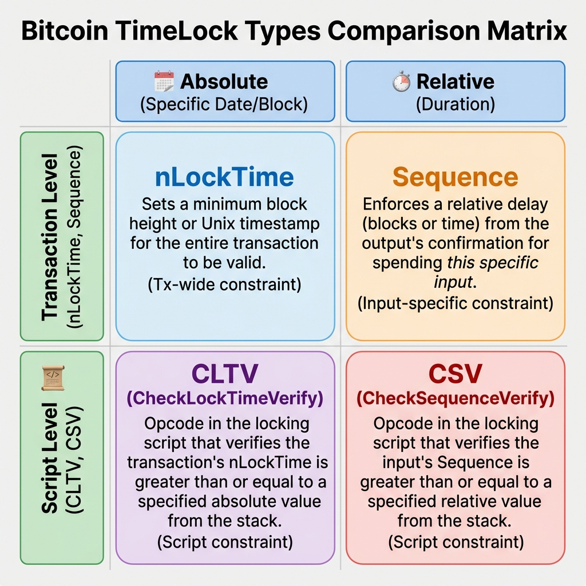
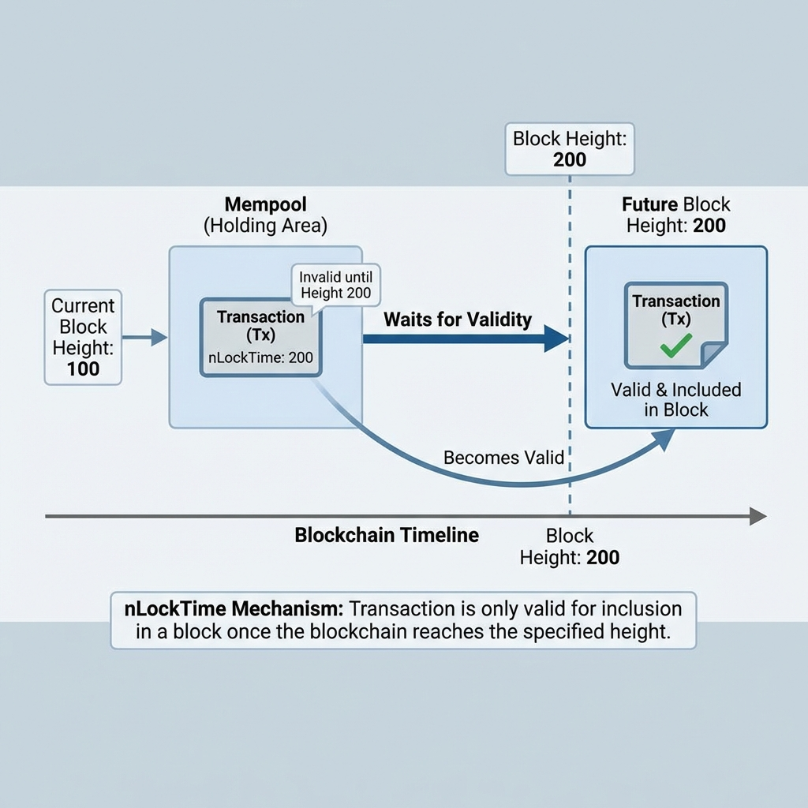
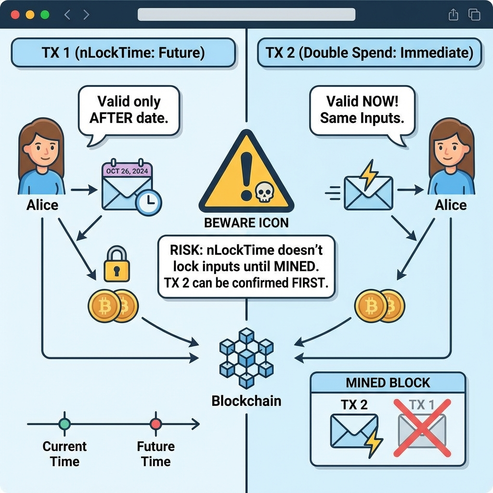
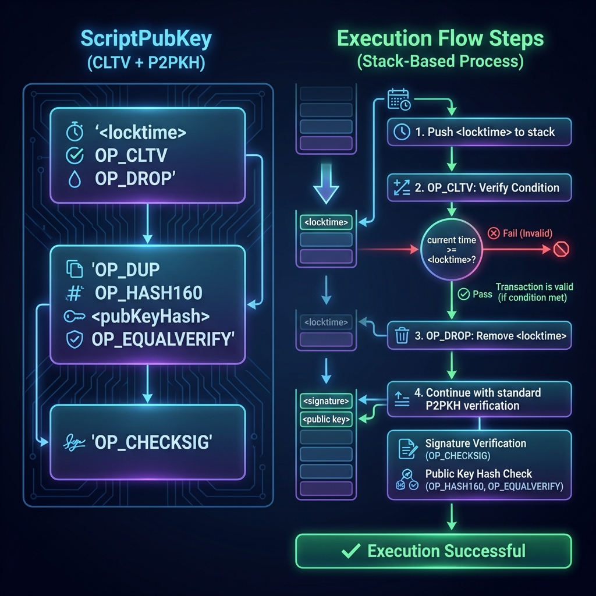
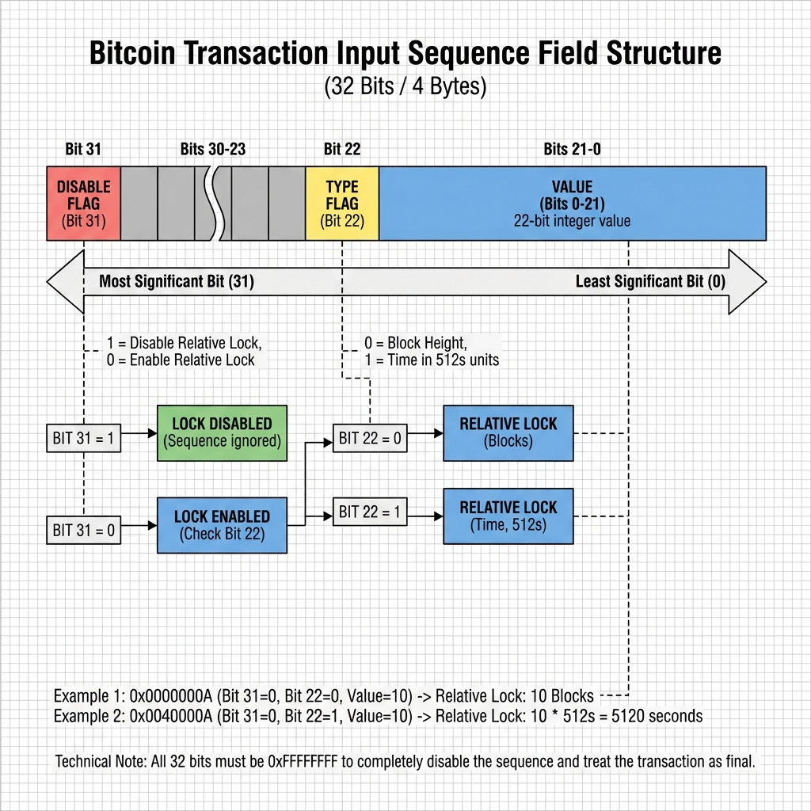
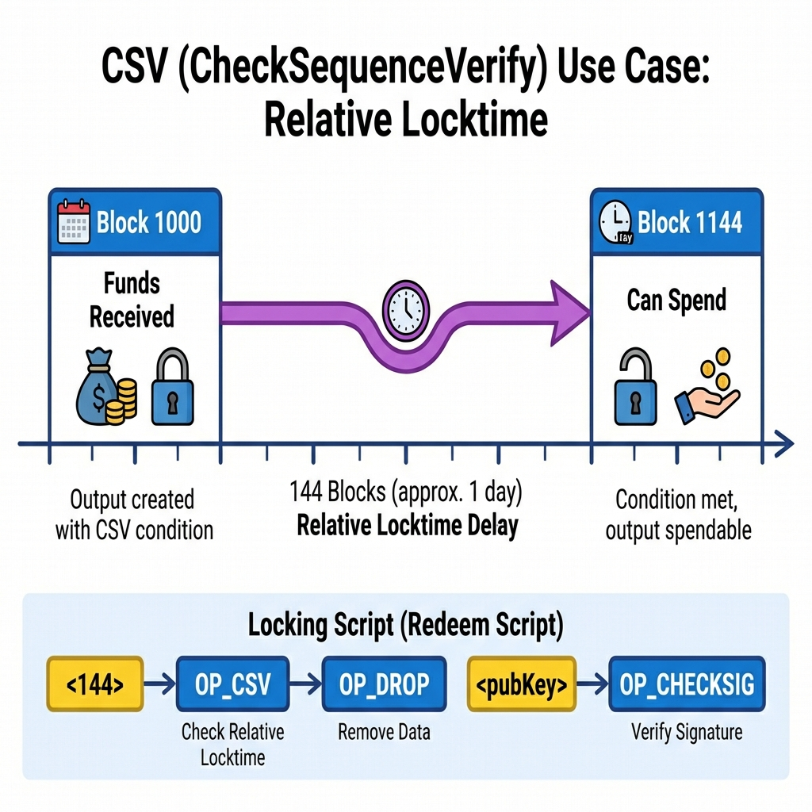

# Day 5: Bitcoin 时间锁 —— 高级条件控制

> **学习时间**：4-6 小时（理论 1.5h + 实战 3-4h + 复习 0.5h）
> 
> **核心目标**：掌握 Bitcoin 时间锁机制，实现定时支付与条件解锁

---

## 🎯 今日学习目标

- [ ] 理解 nLockTime 与 Sequence 字段的作用
- [ ] 掌握 CLTV (CheckLockTimeVerify) 绝对时间锁
- [ ] 掌握 CSV (CheckSequenceVerify) 相对时间锁
- [ ] 理解时间锁在闪电网络中的应用
- [ ] 使用 Go 构造带时间锁的交易
- [ ] 实现"可取消支付"场景

---

## 📚 理论课

### 1. 时间锁概述

#### 1.1 什么是时间锁？

时间锁是 Bitcoin 脚本中的条件控制机制，允许将资金锁定到未来某个时间点才能花费。


#### 1.2 时间锁类型总览

| 类型          | 级别     | 时间类型 | 作用位置      | 引入时间 |
| :------------ | :------- | :------- | :------------ | :------- |
| **nLockTime** | 交易级别 | 绝对     | 交易结构字段  | 创世区块 |
| **Sequence**  | 输入级别 | 相对     | 输入结构字段  | BIP-68   |
| **CLTV**      | 脚本级别 | 绝对     | 锁定脚本 (OP) | BIP-65   |
| **CSV**       | 脚本级别 | 相对     | 锁定脚本 (OP) | BIP-112  |



---

### 2. nLockTime —— 交易级绝对时间锁

#### 2.1 nLockTime 工作原理

```



#### 2.2 nLockTime 的局限性



---

### 3. CLTV —— 脚本级绝对时间锁

#### 3.1 OP_CHECKLOCKTIMEVERIFY (CLTV)

CLTV (BIP-65) 将时间锁条件写入锁定脚本，使其成为花费条件的一部分。



#### 3.2 CLTV 验证规则

```go
// CLTV 验证伪代码
func VerifyCLTV(locktime int64, tx *Transaction) bool {
    // 规则 1: 交易的 nLockTime 必须 >= 脚本中的 locktime
    if tx.nLockTime < locktime {
        return false
    }
    
    // 规则 2: 类型必须一致 (都是区块高度或都是时间戳)
    if (locktime < 500_000_000) != (tx.nLockTime < 500_000_000) {
        return false
    }
    
    // 规则 3: 输入的 Sequence 不能是 0xFFFFFFFF (表示禁用时间锁)
    if input.Sequence == 0xFFFFFFFF {
        return false
    }
    
    return true
}
```

---

### 4. Sequence 与 CSV —— 相对时间锁

#### 4.1 Sequence 字段详解



#### 4.2 OP_CHECKSEQUENCEVERIFY (CSV)


```

---

### 5. 时间锁实际应用

#### 5.1 应用场景总览

| 应用场景       | 使用的时间锁 | 说明                   |
| :------------- | :----------- | :--------------------- |
| **定时支付**   | CLTV         | 工资发放、遗产继承     |
| **延迟提款**   | CSV          | 冷钱包安全、防盗保护   |
| **支付通道**   | CLTV + CSV   | 闪电网络的基础设施     |
| **HTLC**       | CLTV         | 原子交换、跨链支付     |
| **可取消支付** | CLTV         | 定时转账但保留撤销权   |
| **多阶段解锁** | CLTV         | 众筹、托管、里程碑支付 |

#### 5.2 闪电网络中的时间锁


#### 5.3 遗产规划示例


---

## 🔧 实战作业

### 作业 1: 环境准备

```bash
mkdir -p ~/blockchain-course/day05
cd ~/blockchain-course/day05
go mod init day05

# 安装 btcsuite 相关包
go get github.com/btcsuite/btcd
go get github.com/btcsuite/btcd/btcutil
go get github.com/btcsuite/btcd/chaincfg
go get github.com/btcsuite/btcd/txscript
go get github.com/btcsuite/btcd/wire
go get github.com/btcsuite/btcd/btcec/v2
```

---

### 作业 2: 构造带 CLTV 的交易

创建 `cltv_transaction.go`:

```go
package main

import (
	"bytes"
	"encoding/hex"
	"fmt"
	"time"

	"github.com/btcsuite/btcd/btcec/v2"
	"github.com/btcsuite/btcd/btcutil"
	"github.com/btcsuite/btcd/chaincfg"
	"github.com/btcsuite/btcd/txscript"
	"github.com/btcsuite/btcd/wire"
)

// TimeLockType 时间锁类型
type TimeLockType int

const (
	LockByBlockHeight TimeLockType = iota // 按区块高度锁定
	LockByTimestamp                        // 按时间戳锁定
)

// CLTVScript 创建 CLTV 时间锁脚本
type CLTVScript struct {
	LockTime   int64
	LockType   TimeLockType
	PubKeyHash []byte
}

// NewCLTVByBlock 创建按区块高度锁定的脚本
func NewCLTVByBlock(blockHeight int64, pubKey *btcec.PublicKey) *CLTVScript {
	return &CLTVScript{
		LockTime:   blockHeight,
		LockType:   LockByBlockHeight,
		PubKeyHash: btcutil.Hash160(pubKey.SerializeCompressed()),
	}
}

// NewCLTVByTime 创建按时间戳锁定的脚本
func NewCLTVByTime(unlockTime time.Time, pubKey *btcec.PublicKey) *CLTVScript {
	return &CLTVScript{
		LockTime:   unlockTime.Unix(),
		LockType:   LockByTimestamp,
		PubKeyHash: btcutil.Hash160(pubKey.SerializeCompressed()),
	}
}

// BuildScript 构建锁定脚本
func (c *CLTVScript) BuildScript() ([]byte, error) {
	builder := txscript.NewScriptBuilder()

	// <locktime> OP_CLTV OP_DROP
	builder.AddInt64(c.LockTime)
	builder.AddOp(txscript.OP_CHECKLOCKTIMEVERIFY)
	builder.AddOp(txscript.OP_DROP)

	// OP_DUP OP_HASH160 <pubKeyHash> OP_EQUALVERIFY OP_CHECKSIG
	builder.AddOp(txscript.OP_DUP)
	builder.AddOp(txscript.OP_HASH160)
	builder.AddData(c.PubKeyHash)
	builder.AddOp(txscript.OP_EQUALVERIFY)
	builder.AddOp(txscript.OP_CHECKSIG)

	return builder.Script()
}

// PrintInfo 打印脚本信息
func (c *CLTVScript) PrintInfo() {
	fmt.Println("=== CLTV 时间锁脚本 ===")
	if c.LockType == LockByBlockHeight {
		fmt.Printf("锁定类型: 区块高度\n")
		fmt.Printf("解锁高度: %d\n", c.LockTime)
	} else {
		unlockTime := time.Unix(c.LockTime, 0)
		fmt.Printf("锁定类型: 时间戳\n")
		fmt.Printf("解锁时间: %s\n", unlockTime.Format("2006-01-02 15:04:05"))
	}
	fmt.Printf("公钥哈希: %x\n", c.PubKeyHash)
}

func main() {
	// 生成密钥对
	privKey, err := btcec.NewPrivateKey()
	if err != nil {
		fmt.Printf("生成密钥失败: %v\n", err)
		return
	}
	pubKey := privKey.PubKey()

	fmt.Println("=== CLTV 时间锁演示 ===\n")

	// 示例 1: 按区块高度锁定
	fmt.Println("--- 示例 1: 区块高度锁定 ---")
	cltvByBlock := NewCLTVByBlock(900000, pubKey)
	cltvByBlock.PrintInfo()

	script1, err := cltvByBlock.BuildScript()
	if err != nil {
		fmt.Printf("构建脚本失败: %v\n", err)
		return
	}

	disasm1, _ := txscript.DisasmString(script1)
	fmt.Printf("脚本: %s\n", disasm1)
	fmt.Printf("脚本 Hex: %s\n\n", hex.EncodeToString(script1))

	// 示例 2: 按时间戳锁定 (锁定到 2025-01-01)
	fmt.Println("--- 示例 2: 时间戳锁定 ---")
	unlockTime := time.Date(2025, 1, 1, 0, 0, 0, 0, time.UTC)
	cltvByTime := NewCLTVByTime(unlockTime, pubKey)
	cltvByTime.PrintInfo()

	script2, err := cltvByTime.BuildScript()
	if err != nil {
		fmt.Printf("构建脚本失败: %v\n", err)
		return
	}

	disasm2, _ := txscript.DisasmString(script2)
	fmt.Printf("脚本: %s\n", disasm2)
	fmt.Printf("脚本 Hex: %s\n\n", hex.EncodeToString(script2))

	// 创建 P2SH 地址
	fmt.Println("--- 创建 P2SH 地址 ---")
	scriptHash := btcutil.Hash160(script1)
	addr, err := btcutil.NewAddressScriptHashFromHash(scriptHash, &chaincfg.TestNet3Params)
	if err != nil {
		fmt.Printf("创建地址失败: %v\n", err)
		return
	}
	fmt.Printf("P2SH 地址: %s\n", addr.EncodeAddress())
}
```

---

### 作业 3: 构造带 CSV 的交易

创建 `csv_transaction.go`:

```go
package main

import (
	"encoding/hex"
	"fmt"

	"github.com/btcsuite/btcd/btcec/v2"
	"github.com/btcsuite/btcd/btcutil"
	"github.com/btcsuite/btcd/chaincfg"
	"github.com/btcsuite/btcd/txscript"
)

const (
	// Sequence 标志位
	SequenceLocktimeDisableFlag = 1 << 31 // 禁用相对时间锁
	SequenceLocktimeTypeFlag    = 1 << 22 // 时间类型 (0=block, 1=time)
	SequenceLocktimeMask        = 0x0000FFFF // 值掩码

	// 时间单位 (512 秒)
	SequenceTimeGranularity = 512
)

// CSVScript 创建 CSV 相对时间锁脚本
type CSVScript struct {
	Blocks     uint32 // 锁定的区块数
	PubKeyHash []byte
}

// NewCSVByBlocks 创建按区块数锁定的脚本
func NewCSVByBlocks(blocks uint32, pubKey *btcec.PublicKey) *CSVScript {
	return &CSVScript{
		Blocks:     blocks,
		PubKeyHash: btcutil.Hash160(pubKey.SerializeCompressed()),
	}
}

// BuildScript 构建锁定脚本
func (c *CSVScript) BuildScript() ([]byte, error) {
	builder := txscript.NewScriptBuilder()

	// <blocks> OP_CSV OP_DROP
	builder.AddInt64(int64(c.Blocks))
	builder.AddOp(txscript.OP_CHECKSEQUENCEVERIFY)
	builder.AddOp(txscript.OP_DROP)

	// <pubKey> OP_CHECKSIG (简化版)
	// 实际应用中应使用完整的 P2PKH
	builder.AddOp(txscript.OP_DUP)
	builder.AddOp(txscript.OP_HASH160)
	builder.AddData(c.PubKeyHash)
	builder.AddOp(txscript.OP_EQUALVERIFY)
	builder.AddOp(txscript.OP_CHECKSIG)

	return builder.Script()
}

// GetSequenceValue 获取对应的 Sequence 值
func (c *CSVScript) GetSequenceValue() uint32 {
	// 按区块数锁定，不设置 TypeFlag
	return c.Blocks & SequenceLocktimeMask
}

// PrintInfo 打印脚本信息
func (c *CSVScript) PrintInfo() {
	fmt.Println("=== CSV 相对时间锁脚本 ===")
	fmt.Printf("锁定区块数: %d (约 %.1f 小时)\n", c.Blocks, float64(c.Blocks)*10/60)
	fmt.Printf("Sequence 值: 0x%08X\n", c.GetSequenceValue())
	fmt.Printf("公钥哈希: %x\n", c.PubKeyHash)
}

func main() {
	// 生成密钥对
	privKey, err := btcec.NewPrivateKey()
	if err != nil {
		fmt.Printf("生成密钥失败: %v\n", err)
		return
	}
	pubKey := privKey.PubKey()

	fmt.Println("=== CSV 相对时间锁演示 ===\n")

	// 示例: 锁定 144 个区块 (约 1 天)
	fmt.Println("--- 示例: 144 区块锁定 (约 1 天) ---")
	csv := NewCSVByBlocks(144, pubKey)
	csv.PrintInfo()

	script, err := csv.BuildScript()
	if err != nil {
		fmt.Printf("构建脚本失败: %v\n", err)
		return
	}

	disasm, _ := txscript.DisasmString(script)
	fmt.Printf("\n脚本: %s\n", disasm)
	fmt.Printf("脚本 Hex: %s\n\n", hex.EncodeToString(script))

	// 创建 P2SH 地址
	scriptHash := btcutil.Hash160(script)
	addr, err := btcutil.NewAddressScriptHashFromHash(scriptHash, &chaincfg.TestNet3Params)
	if err != nil {
		fmt.Printf("创建地址失败: %v\n", err)
		return
	}
	fmt.Printf("P2SH 地址: %s\n", addr.EncodeAddress())

	// 说明
	fmt.Println("\n=== 使用说明 ===")
	fmt.Println("1. 向上述 P2SH 地址发送 BTC")
	fmt.Println("2. 等待 144 个区块确认 (约 1 天)")
	fmt.Println("3. 使用正确的 Sequence 值构造花费交易")
	fmt.Printf("4. 花费交易的输入 Sequence 必须 >= %d\n", csv.GetSequenceValue())
}
```

---

### 作业 4: 可取消支付实现

创建 `cancellable_payment.go`:

```go
package main

import (
	"encoding/hex"
	"fmt"
	"time"

	"github.com/btcsuite/btcd/btcec/v2"
	"github.com/btcsuite/btcd/btcutil"
	"github.com/btcsuite/btcd/chaincfg"
	"github.com/btcsuite/btcd/txscript"
)

// CancellablePayment 可取消支付
// 场景：发送者在 24 小时内可取消，超时后接收者可领取
type CancellablePayment struct {
	SenderPubKey   *btcec.PublicKey
	ReceiverPubKey *btcec.PublicKey
	TimeoutBlocks  int64 // 超时区块数 (144 ≈ 24 小时)
	Network        *chaincfg.Params
}

// NewCancellablePayment 创建可取消支付
func NewCancellablePayment(
	sender, receiver *btcec.PublicKey,
	timeoutBlocks int64,
	network *chaincfg.Params,
) *CancellablePayment {
	return &CancellablePayment{
		SenderPubKey:   sender,
		ReceiverPubKey: receiver,
		TimeoutBlocks:  timeoutBlocks,
		Network:        network,
	}
}

// BuildScript 构建条件支付脚本
func (cp *CancellablePayment) BuildScript() ([]byte, error) {
	builder := txscript.NewScriptBuilder()

	// IF
	//   # 接收者路径：等待超时后可领取
	//   <timeout> OP_CSV OP_DROP
	//   <receiver_pubkey> OP_CHECKSIG
	// ELSE
	//   # 发送者路径：随时可取消
	//   <sender_pubkey> OP_CHECKSIG
	// ENDIF

	builder.AddOp(txscript.OP_IF)

	// 接收者路径 - 需要等待超时
	builder.AddInt64(cp.TimeoutBlocks)
	builder.AddOp(txscript.OP_CHECKSEQUENCEVERIFY)
	builder.AddOp(txscript.OP_DROP)
	builder.AddData(cp.ReceiverPubKey.SerializeCompressed())
	builder.AddOp(txscript.OP_CHECKSIG)

	builder.AddOp(txscript.OP_ELSE)

	// 发送者路径 - 随时可取消
	builder.AddData(cp.SenderPubKey.SerializeCompressed())
	builder.AddOp(txscript.OP_CHECKSIG)

	builder.AddOp(txscript.OP_ENDIF)

	return builder.Script()
}

// GetP2SHAddress 获取 P2SH 地址
func (cp *CancellablePayment) GetP2SHAddress() (btcutil.Address, error) {
	script, err := cp.BuildScript()
	if err != nil {
		return nil, err
	}

	scriptHash := btcutil.Hash160(script)
	return btcutil.NewAddressScriptHashFromHash(scriptHash, cp.Network)
}

// PrintInfo 打印详细信息
func (cp *CancellablePayment) PrintInfo() {
	fmt.Println("=== 可取消支付详情 ===")
	fmt.Printf("发送者公钥: %x...\n", cp.SenderPubKey.SerializeCompressed()[:8])
	fmt.Printf("接收者公钥: %x...\n", cp.ReceiverPubKey.SerializeCompressed()[:8])
	fmt.Printf("超时区块: %d (约 %.1f 小时)\n", cp.TimeoutBlocks, float64(cp.TimeoutBlocks)*10/60)

	script, err := cp.BuildScript()
	if err != nil {
		fmt.Printf("构建脚本失败: %v\n", err)
		return
	}

	disasm, _ := txscript.DisasmString(script)
	fmt.Printf("\n脚本:\n%s\n", disasm)
	fmt.Printf("\n脚本 Hex: %s\n", hex.EncodeToString(script))

	addr, err := cp.GetP2SHAddress()
	if err != nil {
		fmt.Printf("获取地址失败: %v\n", err)
		return
	}
	fmt.Printf("\nP2SH 地址: %s\n", addr.EncodeAddress())
}

func main() {
	// 生成发送者密钥
	senderPriv, _ := btcec.NewPrivateKey()
	senderPub := senderPriv.PubKey()

	// 生成接收者密钥
	receiverPriv, _ := btcec.NewPrivateKey()
	receiverPub := receiverPriv.PubKey()

	fmt.Println("╔══════════════════════════════════════════════════╗")
	fmt.Println("║          可取消支付场景演示                        ║")
	fmt.Println("╚══════════════════════════════════════════════════╝")
	fmt.Println()

	// 创建 24 小时可取消支付 (144 区块)
	payment := NewCancellablePayment(
		senderPub,
		receiverPub,
		144, // 约 24 小时
		&chaincfg.TestNet3Params,
	)

	payment.PrintInfo()

	fmt.Println("\n=== 使用流程 ===")
	fmt.Println()
	fmt.Println("1. 发送者向 P2SH 地址发送 BTC")
	fmt.Println()
	fmt.Println("2. 在 24 小时内：")
	fmt.Println("   • 发送者可随时取消（使用 ELSE 分支）")
	fmt.Println("   • 解锁脚本: <sender_sig> OP_FALSE <redeemScript>")
	fmt.Println()
	fmt.Println("3. 24 小时后：")
	fmt.Println("   • 接收者可领取（使用 IF 分支）")
	fmt.Println("   • 解锁脚本: <receiver_sig> OP_TRUE <redeemScript>")
	fmt.Println("   • 交易的 Sequence 必须 >= 144")

	fmt.Println("\n=== 关键点 ===")
	fmt.Printf("当前时间: %s\n", time.Now().Format("2006-01-02 15:04:05"))
	fmt.Println("• 发送者取消不需要时间锁，随时可执行")
	fmt.Println("• 接收者必须等待 144 个区块确认后才能领取")
	fmt.Println("• 一旦任一方花费，另一方无法再操作")
}
```

---

### 作业 5: 综合时间锁工具

创建 `timelock_utils.go`:

```go
package main

import (
	"fmt"
	"time"
)

// 常量定义
const (
	BlockTimeSeconds     = 600           // 比特币平均出块时间
	TimestampThreshold   = 500_000_000   // 时间戳阈值
	BlocksPerHour        = 6             // 每小时区块数
	BlocksPerDay         = 144           // 每天区块数
	BlocksPerWeek        = 1008          // 每周区块数
	BlocksPerMonth       = 4320          // 每月区块数 (30天)
	BlocksPerYear        = 52560         // 每年区块数
)

// TimeLockHelper 时间锁辅助工具
type TimeLockHelper struct{}

// BlocksToTimeString 将区块数转换为可读时间
func (h *TimeLockHelper) BlocksToTimeString(blocks int64) string {
	totalMinutes := blocks * 10

	if blocks < BlocksPerHour {
		return fmt.Sprintf("约 %d 分钟", totalMinutes)
	}

	hours := float64(blocks) / float64(BlocksPerHour)
	if blocks < BlocksPerDay {
		return fmt.Sprintf("约 %.1f 小时", hours)
	}

	days := float64(blocks) / float64(BlocksPerDay)
	if blocks < BlocksPerWeek {
		return fmt.Sprintf("约 %.1f 天", days)
	}

	weeks := float64(blocks) / float64(BlocksPerWeek)
	if blocks < BlocksPerMonth {
		return fmt.Sprintf("约 %.1f 周", weeks)
	}

	months := float64(blocks) / float64(BlocksPerMonth)
	return fmt.Sprintf("约 %.1f 月", months)
}

// TimeToBlocks 将时间转换为区块数
func (h *TimeLockHelper) TimeToBlocks(d time.Duration) int64 {
	minutes := int64(d.Minutes())
	return minutes / 10
}

// ParseLockTimeValue 解析 locktime 值
func (h *TimeLockHelper) ParseLockTimeValue(locktime int64) string {
	if locktime < TimestampThreshold {
		return fmt.Sprintf("区块高度 %d", locktime)
	}
	t := time.Unix(locktime, 0)
	return fmt.Sprintf("时间戳 %s", t.Format("2006-01-02 15:04:05"))
}

// ParseSequenceValue 解析 sequence 值
func (h *TimeLockHelper) ParseSequenceValue(sequence uint32) string {
	// 检查是否禁用
	if sequence&(1<<31) != 0 {
		return "相对时间锁已禁用"
	}

	// 检查类型
	isTimeType := sequence&(1<<22) != 0
	value := sequence & 0xFFFF

	if isTimeType {
		seconds := int64(value) * 512
		duration := time.Duration(seconds) * time.Second
		return fmt.Sprintf("时间类型: %d 单位 = %v", value, duration)
	}
	return fmt.Sprintf("区块类型: %d 区块 = %s", value, h.BlocksToTimeString(int64(value)))
}

func main() {
	helper := &TimeLockHelper{}

	fmt.Println("╔══════════════════════════════════════════════════╗")
	fmt.Println("║             时间锁工具演示                         ║")
	fmt.Println("╚══════════════════════════════════════════════════╝")

	fmt.Println("\n=== 区块数转时间 ===")
	blocks := []int64{1, 6, 144, 1008, 4320, 52560}
	for _, b := range blocks {
		fmt.Printf("%6d 区块 = %s\n", b, helper.BlocksToTimeString(b))
	}

	fmt.Println("\n=== 时间转区块数 ===")
	durations := []time.Duration{
		1 * time.Hour,
		24 * time.Hour,
		7 * 24 * time.Hour,
		30 * 24 * time.Hour,
	}
	for _, d := range durations {
		fmt.Printf("%v = %d 区块\n", d, helper.TimeToBlocks(d))
	}

	fmt.Println("\n=== 常用时间锁配置 ===")
	fmt.Println("┌─────────────────┬────────────┬────────────────────┐")
	fmt.Println("│ 场景            │ 区块数     │ 时间               │")
	fmt.Println("├─────────────────┼────────────┼────────────────────┤")
	fmt.Printf("│ 1 小时确认      │ %10d │ %-18s │\n", BlocksPerHour, "6 区块")
	fmt.Printf("│ 24 小时延迟     │ %10d │ %-18s │\n", BlocksPerDay, "144 区块")
	fmt.Printf("│ 1 周冷静期      │ %10d │ %-18s │\n", BlocksPerWeek, "1008 区块")
	fmt.Printf("│ 1 月锁定        │ %10d │ %-18s │\n", BlocksPerMonth, "4320 区块")
	fmt.Printf("│ 1 年遗产锁      │ %10d │ %-18s │\n", BlocksPerYear, "52560 区块")
	fmt.Println("└─────────────────┴────────────┴────────────────────┘")

	fmt.Println("\n=== 解析 LockTime 值 ===")
	locktimes := []int64{800000, 900000, 1704067200, 1735689600}
	for _, lt := range locktimes {
		fmt.Printf("%d → %s\n", lt, helper.ParseLockTimeValue(lt))
	}

	fmt.Println("\n=== 解析 Sequence 值 ===")
	sequences := []uint32{144, 0x00400090, 0xFFFFFFFF, 0x80000000}
	for _, seq := range sequences {
		fmt.Printf("0x%08X → %s\n", seq, helper.ParseSequenceValue(seq))
	}
}
```

---

## 📝 复习要点

### 关键概念检查清单

- [ ] nLockTime 和 CLTV 的区别是什么？
- [ ] 什么情况下使用绝对时间锁，什么情况下使用相对时间锁？
- [ ] Sequence 字段的 bit 结构是怎样的？
- [ ] CSV 的时间单位为什么是 512 秒？
- [ ] HTLC 中如何结合使用哈希锁和时间锁？
- [ ] 如何设计一个"遗产继承"脚本？

### 常见错误与陷阱

> [!CAUTION]
> **注意事项**
> 
> 1. **时间类型混用**：CLTV 的 locktime 和交易的 nLockTime 类型必须一致
> 2. **Sequence 禁用**：Sequence = 0xFFFFFFFF 会禁用 CLTV
> 3. **时间粒度**：CSV 的时间单位是 512 秒，不是 1 秒
> 4. **区块时间波动**：10 分钟只是平均值，实际可能有较大偏差

### 进阶思考

1. **为什么闪电网络需要时间锁？**
   - 确保在对手方不响应时可以取回资金
   - HTLC 需要时间窗口让原像传播

2. **Taproot 如何改进时间锁隐私？**
   - 使用 Tapscript 可以隐藏未使用的分支
   - 正常花费路径看起来像普通交易

3. **时间锁在 DeFi 中的应用？**
   - 虽然 Bitcoin 没有复杂 DeFi，但时间锁是跨链原子交换的基础

---

## 🔗 延伸阅读

- [BIP-65: OP_CHECKLOCKTIMEVERIFY](https://github.com/bitcoin/bips/blob/master/bip-0065.mediawiki)
- [BIP-68: Relative lock-time using consensus-enforced sequence numbers](https://github.com/bitcoin/bips/blob/master/bip-0068.mediawiki)
- [BIP-112: OP_CHECKSEQUENCEVERIFY](https://github.com/bitcoin/bips/blob/master/bip-0112.mediawiki)
- [Lightning Network BOLT Specifications](https://github.com/lightning/bolts)

---

**Day 5 完成！** 🎉

明天我们将学习 **Bitcoin 支付系统开发**，包括节点 RPC 集成、交易监听和 Reorg 处理。
