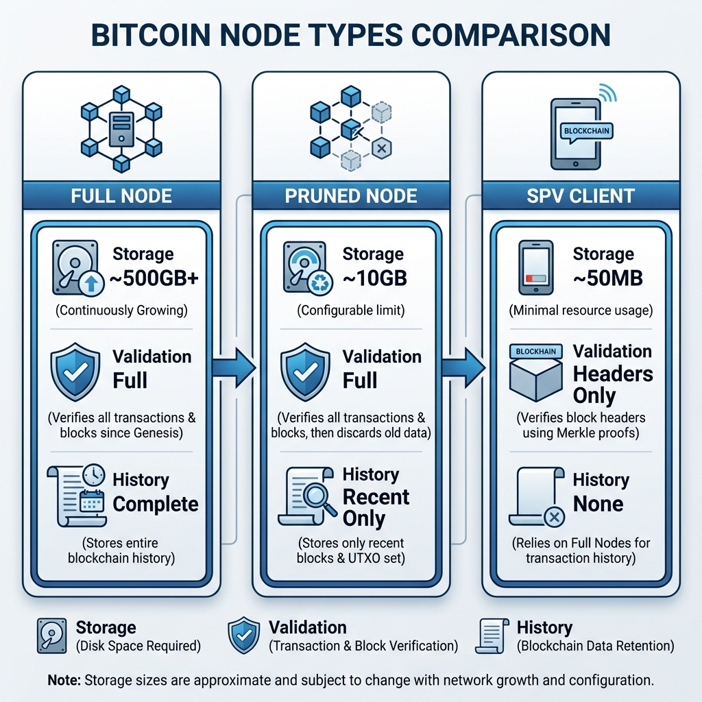
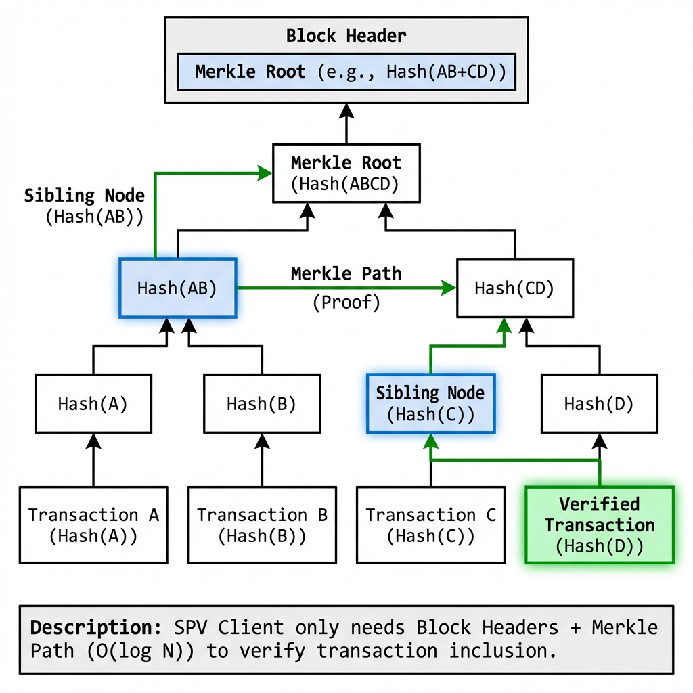
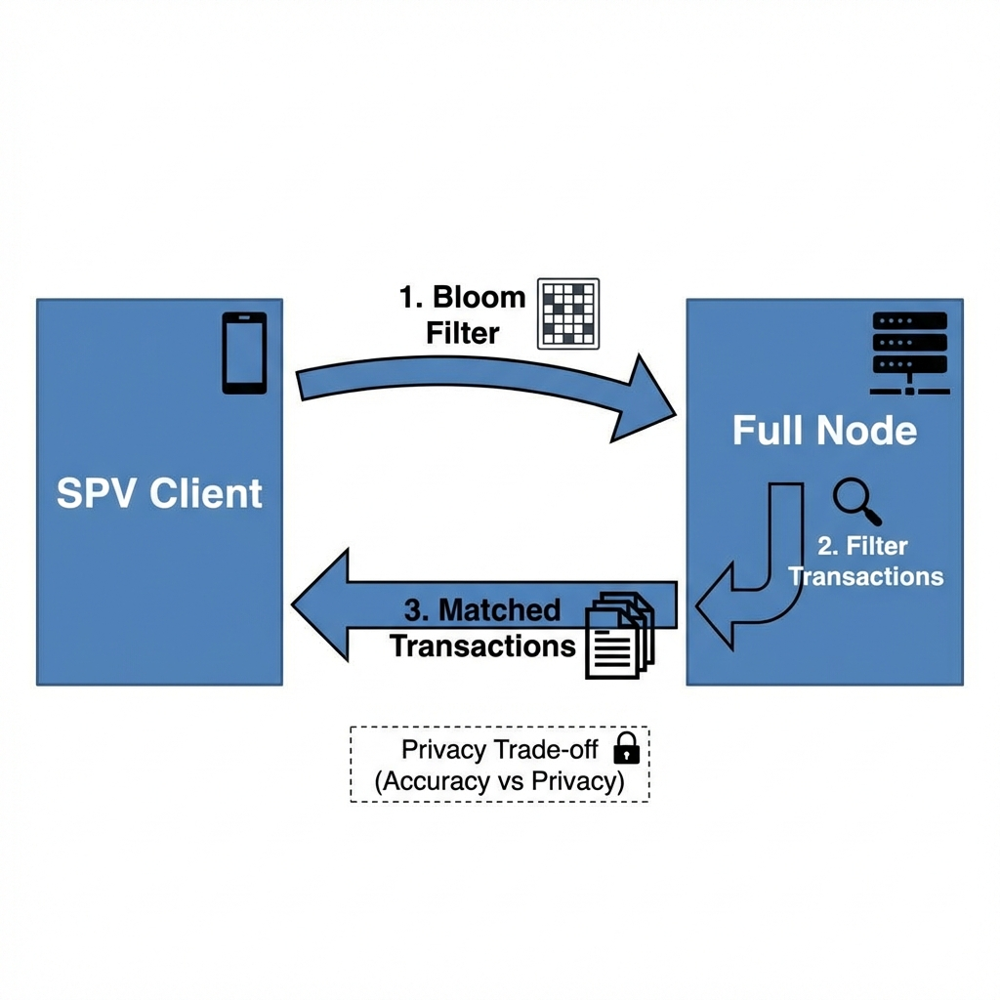
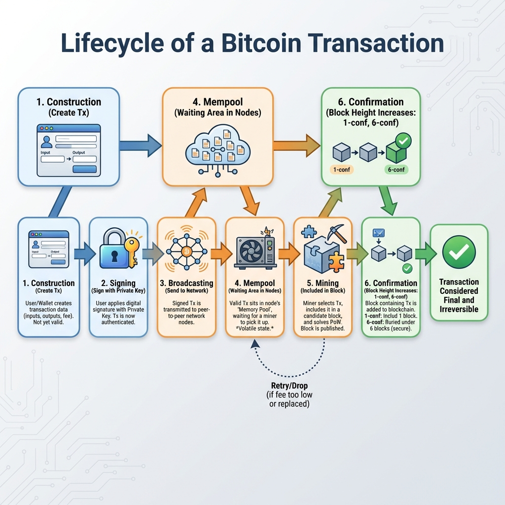
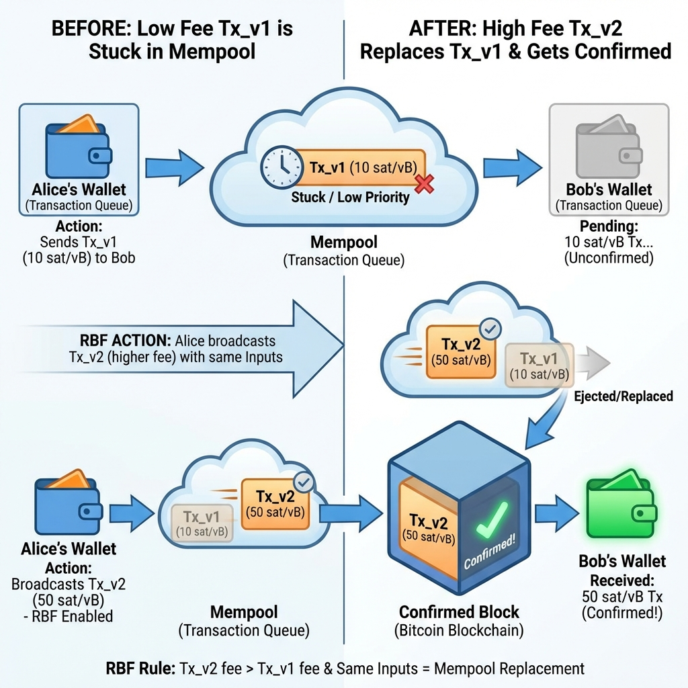
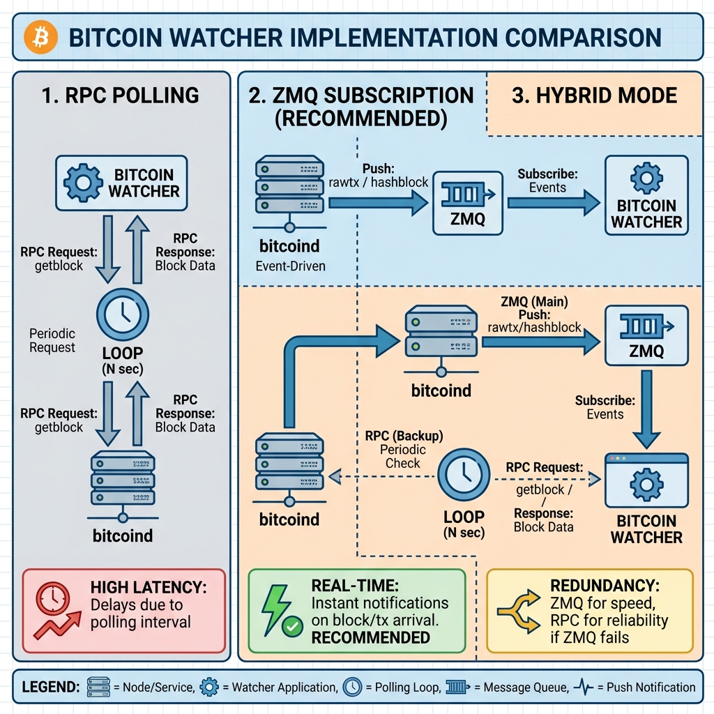
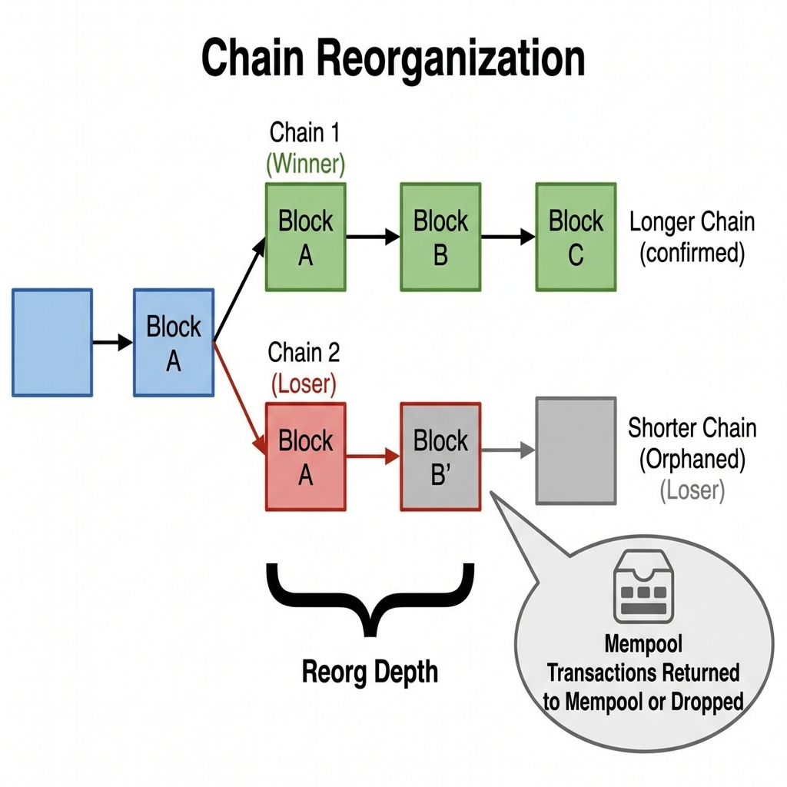
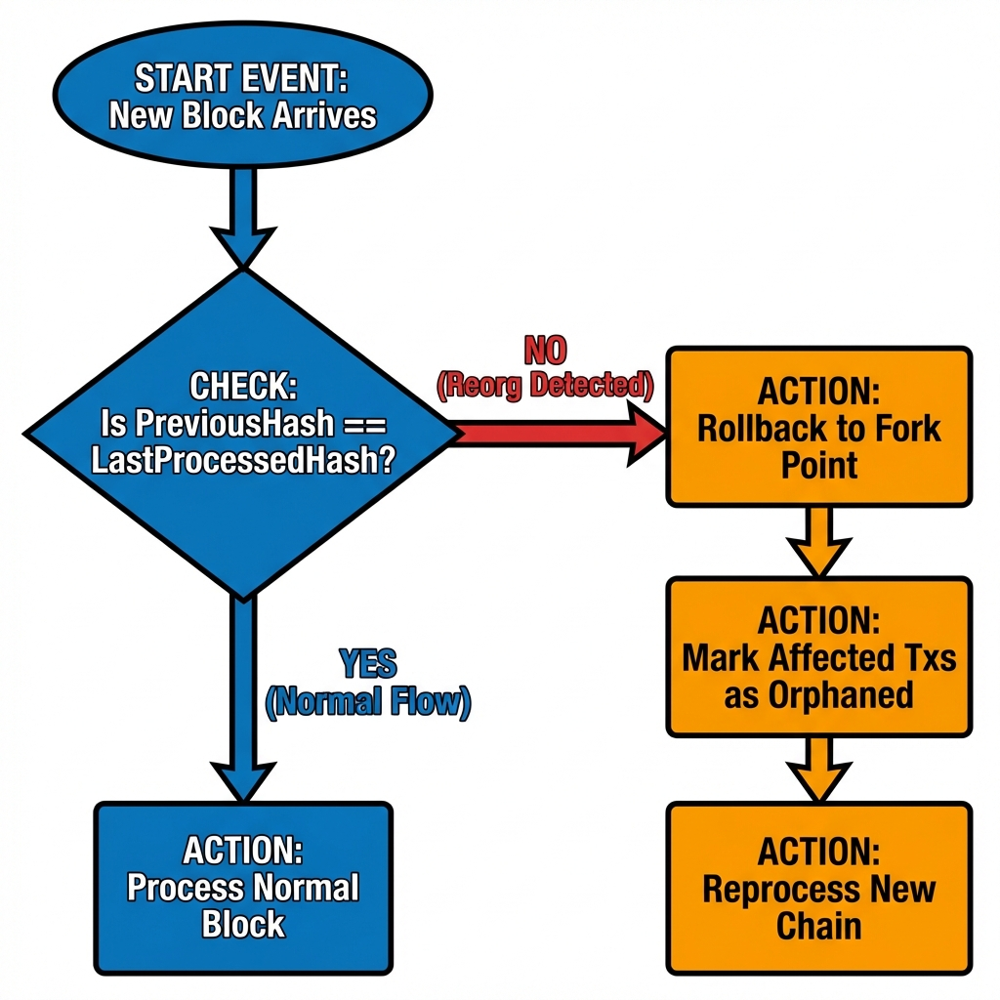
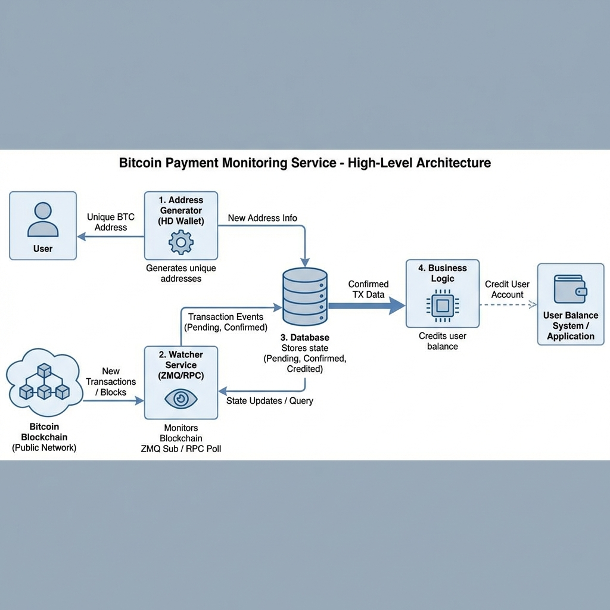
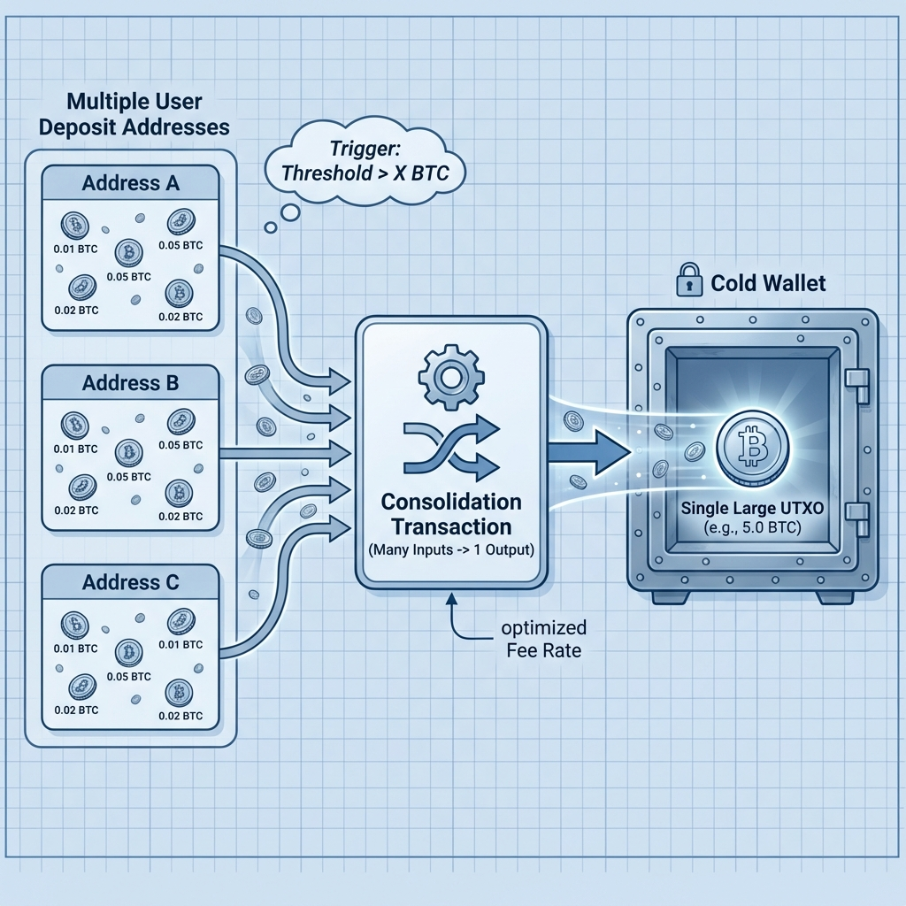

# Day 6: Bitcoin 支付系统开发

> **学习时间**：4-6 小时（理论 1.5h + 实战 3-4h + 复习 0.5h）
> 
> **核心目标**：掌握 Bitcoin 支付系统开发，实现交易监听与 Reorg 处理

---

## 🎯 今日学习目标

- [ ] 理解 Bitcoin 节点 API（Bitcoin Core RPC, Btcd）
- [ ] 掌握 SPV 钱包的轻客户端原理
- [ ] 理解交易广播与确认机制（Mempool, RBF）
- [ ] 设计支付场景：收款监听与归集策略
- [ ] 实现 Watcher 架构：RPC 轮询 vs ZMQ 订阅
- [ ] 处理区块重组（Reorg）与幂等充值逻辑

---

## 📚 理论课

### 1. Bitcoin 节点与 API

#### 1.1 节点类型对比



#### 1.2 主流节点实现

| 节点实现                    | 语言   | 特点                 | 适用场景     |
| :-------------------------- | :----- | :------------------- | :----------- |
| **Bitcoin Core (bitcoind)** | C++    | 官方实现，最稳定     | 生产环境首选 |
| **btcd**                    | Go     | 纯 Go 实现，易于集成 | Go 后端开发  |
| **libbitcoin**              | C++    | 模块化设计           | 高性能索引   |
| **Electrum Server**         | Python | 为钱包优化的索引服务 | 钱包后端     |

#### 1.3 Bitcoin Core RPC 接口

**常用 RPC 方法分类**:

| 分类           | 方法                   | 描述                                |
| :------------- | :--------------------- | :---------------------------------- |
| **区块链查询** | `getblockchaininfo`    | 获取链状态 (高度、难度、同步进度等) |
|                | `getblock`             | 获取区块详情                        |
|                | `getblockhash`         | 根据高度获取区块哈希                |
|                | `getbestblockhash`     | 获取最新区块哈希                    |
| **交易相关**   | `getrawtransaction`    | 获取原始交易 (hex 格式)             |
|                | `decoderawtransaction` | 解码交易为 JSON                     |
|                | `sendrawtransaction`   | 广播已签名交易                      |
|                | `gettxout`             | 获取指定 UTXO                       |
| **钱包相关**   | `listunspent`          | 列出未花费输出                      |
|                | `importaddress`        | 导入监控地址 (watch-only)           |
|                | `listtransactions`     | 列出交易历史                        |
| **内存池**     | `getmempoolinfo`       | 内存池状态 (大小、费率等)           |
|                | `getrawmempool`        | 获取内存池中所有交易 ID             |


---

### 2. SPV 钱包原理

#### 2.1 SPV (Simplified Payment Verification)



#### 2.2 Bloom Filter（布隆过滤器）



---

### 3. 交易广播与确认

#### 3.1 交易生命周期



#### 3.2 Mempool（内存池）


#### 3.3 RBF (Replace-By-Fee)



安全考虑：
⚠️ 0-conf 交易如果启用了 RBF，可能被替换（双花攻击）

---

### 4. Watcher 架构设计

#### 4.1 监听架构对比



#### 4.2 ZMQ 配置

```ini
# bitcoin.conf
zmqpubhashtx=tcp://127.0.0.1:28332
zmqpubhashblock=tcp://127.0.0.1:28332
zmqpubrawtx=tcp://127.0.0.1:28333
zmqpubrawblock=tcp://127.0.0.1:28333
```

---

### 5. Reorg（区块重组）处理

#### 5.1 什么是 Reorg？



#### 5.2 Reorg 处理策略



---

### 6. 支付场景设计

#### 6.1 收款监听流程



#### 6.2 归集策略



---

## 🔧 实战作业

### 作业 1: 环境准备

```bash
mkdir -p ~/blockchain-course/day06
cd ~/blockchain-course/day06
go mod init day06

# 安装依赖
go get github.com/btcsuite/btcd/rpcclient
go get github.com/btcsuite/btcd/chaincfg
go get github.com/btcsuite/btcd/btcjson
go get github.com/btcsuite/btcd/wire
go get github.com/pebbe/zmq4  # ZMQ 客户端
```

---

### 作业 2: Bitcoin RPC 客户端

创建 `rpc_client.go`:

```go
package main

import (
	"fmt"
	"log"

	"github.com/btcsuite/btcd/btcjson"
	"github.com/btcsuite/btcd/chaincfg/chainhash"
	"github.com/btcsuite/btcd/rpcclient"
)

// BitcoinClient 封装 Bitcoin RPC 客户端
type BitcoinClient struct {
	client *rpcclient.Client
}

// NewBitcoinClient 创建新的 Bitcoin 客户端
func NewBitcoinClient(host, user, pass string) (*BitcoinClient, error) {
	connCfg := &rpcclient.ConnConfig{
		Host:         host,
		User:         user,
		Pass:         pass,
		HTTPPostMode: true,
		DisableTLS:   true,
	}

	client, err := rpcclient.New(connCfg, nil)
	if err != nil {
		return nil, fmt.Errorf("创建 RPC 客户端失败: %w", err)
	}

	return &BitcoinClient{client: client}, nil
}

// GetBlockchainInfo 获取区块链信息
func (bc *BitcoinClient) GetBlockchainInfo() (*btcjson.GetBlockChainInfoResult, error) {
	return bc.client.GetBlockChainInfo()
}

// GetBlockCount 获取当前区块高度
func (bc *BitcoinClient) GetBlockCount() (int64, error) {
	return bc.client.GetBlockCount()
}

// GetBlockHash 根据高度获取区块哈希
func (bc *BitcoinClient) GetBlockHash(height int64) (*chainhash.Hash, error) {
	return bc.client.GetBlockHash(height)
}

// GetBlock 获取区块详情
func (bc *BitcoinClient) GetBlock(hash *chainhash.Hash) (*btcjson.GetBlockVerboseResult, error) {
	return bc.client.GetBlockVerbose(hash)
}

// GetRawMempool 获取内存池交易
func (bc *BitcoinClient) GetRawMempool() ([]*chainhash.Hash, error) {
	return bc.client.GetRawMempool()
}

// Close 关闭连接
func (bc *BitcoinClient) Close() {
	bc.client.Shutdown()
}

func main() {
	// 连接到 Bitcoin 节点 (使用你的配置)
	client, err := NewBitcoinClient(
		"localhost:8332",
		"rpcuser",
		"rpcpassword",
	)
	if err != nil {
		log.Fatalf("连接失败: %v", err)
	}
	defer client.Close()

	// 获取区块链信息
	info, err := client.GetBlockchainInfo()
	if err != nil {
		log.Printf("获取区块链信息失败: %v", err)
	} else {
		fmt.Println("=== 区块链信息 ===")
		fmt.Printf("链: %s\n", info.Chain)
		fmt.Printf("区块数: %d\n", info.Blocks)
		fmt.Printf("最佳区块哈希: %s\n", info.BestBlockHash)
		fmt.Printf("验证进度: %.2f%%\n", info.VerificationProgress*100)
	}

	// 获取最新区块
	height, err := client.GetBlockCount()
	if err != nil {
		log.Printf("获取区块高度失败: %v", err)
	} else {
		fmt.Printf("\n当前区块高度: %d\n", height)

		hash, _ := client.GetBlockHash(height)
		block, _ := client.GetBlock(hash)
		if block != nil {
			fmt.Printf("最新区块交易数: %d\n", len(block.Tx))
		}
	}

	// 获取内存池状态
	mempool, err := client.GetRawMempool()
	if err != nil {
		log.Printf("获取内存池失败: %v", err)
	} else {
		fmt.Printf("\n内存池交易数: %d\n", len(mempool))
	}
}
```

---

### 作业 3: Deposit Watcher 实现

创建 `deposit_watcher.go`:

```go
package main

import (
	"context"
	"fmt"
	"log"
	"sync"
	"time"

	"github.com/btcsuite/btcd/chaincfg/chainhash"
	"github.com/btcsuite/btcd/rpcclient"
)

// DepositStatus 充值状态
type DepositStatus string

const (
	StatusPending   DepositStatus = "pending"   // 0-conf
	StatusConfirmed DepositStatus = "confirmed" // 达到确认阈值
	StatusCredited  DepositStatus = "credited"  // 已入账
	StatusOrphaned  DepositStatus = "orphaned"  // Reorg 被孤立
)

// Deposit 充值记录
type Deposit struct {
	TxID          string
	Address       string
	Amount        int64 // satoshis
	BlockHash     string
	BlockHeight   int64
	Confirmations int64
	Status        DepositStatus
	CreatedAt     time.Time
	UpdatedAt     time.Time
}

// DepositWatcher 充值监控器
type DepositWatcher struct {
	client            *rpcclient.Client
	watchAddresses    map[string]bool
	deposits          map[string]*Deposit
	mu                sync.RWMutex
	confirmThreshold  int64
	lastProcessedHash string
	pollInterval      time.Duration
}

// NewDepositWatcher 创建充值监控器
func NewDepositWatcher(client *rpcclient.Client, threshold int64) *DepositWatcher {
	return &DepositWatcher{
		client:           client,
		watchAddresses:   make(map[string]bool),
		deposits:         make(map[string]*Deposit),
		confirmThreshold: threshold,
		pollInterval:     10 * time.Second,
	}
}

// AddWatchAddress 添加监控地址
func (w *DepositWatcher) AddWatchAddress(addr string) {
	w.mu.Lock()
	defer w.mu.Unlock()
	w.watchAddresses[addr] = true
	log.Printf("添加监控地址: %s", addr)
}

// Start 启动监控
func (w *DepositWatcher) Start(ctx context.Context) {
	log.Println("启动充值监控器...")

	ticker := time.NewTicker(w.pollInterval)
	defer ticker.Stop()

	for {
		select {
		case <-ctx.Done():
			log.Println("停止充值监控器")
			return
		case <-ticker.C:
			w.checkNewBlocks()
			w.updateConfirmations()
		}
	}
}

// checkNewBlocks 检查新区块
func (w *DepositWatcher) checkNewBlocks() {
	bestHash, err := w.client.GetBestBlockHash()
	if err != nil {
		log.Printf("获取最新区块失败: %v", err)
		return
	}

	if bestHash.String() == w.lastProcessedHash {
		return // 没有新区块
	}

	// 检测 Reorg
	if w.lastProcessedHash != "" {
		if err := w.detectReorg(bestHash); err != nil {
			log.Printf("Reorg 检测失败: %v", err)
		}
	}

	w.processBlock(bestHash)
	w.lastProcessedHash = bestHash.String()
}

// detectReorg 检测区块重组
func (w *DepositWatcher) detectReorg(newBest *chainhash.Hash) error {
	block, err := w.client.GetBlockVerbose(newBest)
	if err != nil {
		return err
	}

	// 简单检测：如果最新区块的父哈希不是我们记录的最后处理的哈希
	// 且高度相同或更低，可能发生了 Reorg
	if block.PreviousHash != w.lastProcessedHash {
		log.Printf("⚠️ 检测到可能的 Reorg，新区块父哈希: %s", block.PreviousHash)
		w.handleReorg(block.Height)
	}

	return nil
}

// handleReorg 处理区块重组
func (w *DepositWatcher) handleReorg(reorgHeight int64) {
	w.mu.Lock()
	defer w.mu.Unlock()

	for txid, deposit := range w.deposits {
		if deposit.BlockHeight >= reorgHeight && deposit.Status != StatusCredited {
			log.Printf("🔄 Reorg: 回滚交易 %s (高度 %d)", txid, deposit.BlockHeight)
			deposit.Status = StatusOrphaned
			deposit.UpdatedAt = time.Now()
		}
	}
}

// processBlock 处理区块中的交易
func (w *DepositWatcher) processBlock(blockHash *chainhash.Hash) {
	block, err := w.client.GetBlockVerbose(blockHash)
	if err != nil {
		log.Printf("获取区块失败: %v", err)
		return
	}

	log.Printf("处理区块 %d (%s), 交易数: %d",
		block.Height, blockHash.String()[:16], len(block.Tx))

	for _, txid := range block.Tx {
		w.checkTransaction(txid, block.Hash, block.Height)
	}
}

// checkTransaction 检查交易是否涉及监控地址
func (w *DepositWatcher) checkTransaction(txid, blockHash string, height int64) {
	// 这里需要调用 getrawtransaction 获取交易详情
	// 检查输出是否发送到监控地址
	// 简化示例：
	w.mu.RLock()
	_, exists := w.deposits[txid]
	w.mu.RUnlock()

	if exists {
		// 更新确认信息
		w.mu.Lock()
		w.deposits[txid].BlockHash = blockHash
		w.deposits[txid].BlockHeight = height
		w.deposits[txid].Confirmations = 1
		w.deposits[txid].UpdatedAt = time.Now()
		w.mu.Unlock()
	}
}

// updateConfirmations 更新确认数
func (w *DepositWatcher) updateConfirmations() {
	currentHeight, err := w.client.GetBlockCount()
	if err != nil {
		return
	}

	w.mu.Lock()
	defer w.mu.Unlock()

	for txid, deposit := range w.deposits {
		if deposit.Status == StatusOrphaned || deposit.Status == StatusCredited {
			continue
		}

		if deposit.BlockHeight > 0 {
			confs := currentHeight - deposit.BlockHeight + 1
			deposit.Confirmations = confs

			if confs >= w.confirmThreshold && deposit.Status == StatusPending {
				deposit.Status = StatusConfirmed
				log.Printf("✅ 交易确认: %s (确认数: %d)", txid, confs)
				// 触发业务逻辑
				w.onDepositConfirmed(deposit)
			}
		}
	}
}

// onDepositConfirmed 充值确认回调
func (w *DepositWatcher) onDepositConfirmed(deposit *Deposit) {
	log.Printf("💰 充值到账: 地址=%s, 金额=%d sats, TxID=%s",
		deposit.Address, deposit.Amount, deposit.TxID)
	// 这里调用业务层处理充值
}

// RecordDeposit 记录新充值（0-conf）
func (w *DepositWatcher) RecordDeposit(txid, address string, amount int64) {
	w.mu.Lock()
	defer w.mu.Unlock()

	if _, exists := w.deposits[txid]; exists {
		return // 已存在
	}

	deposit := &Deposit{
		TxID:          txid,
		Address:       address,
		Amount:        amount,
		Status:        StatusPending,
		Confirmations: 0,
		CreatedAt:     time.Now(),
		UpdatedAt:     time.Now(),
	}

	w.deposits[txid] = deposit
	log.Printf("📥 检测到新充值: %s → %s, %d sats", txid[:16], address, amount)
}

// GetDeposits 获取所有充值记录
func (w *DepositWatcher) GetDeposits() []*Deposit {
	w.mu.RLock()
	defer w.mu.RUnlock()

	deposits := make([]*Deposit, 0, len(w.deposits))
	for _, d := range w.deposits {
		deposits = append(deposits, d)
	}
	return deposits
}

func main() {
	fmt.Println("=== Deposit Watcher Demo ===")
	fmt.Println("这是一个充值监控器的框架示例")
	fmt.Println("实际使用时需要连接到 Bitcoin 节点")

	// 示例：创建监控器
	// client, _ := rpcclient.New(...)
	// watcher := NewDepositWatcher(client, 6)
	// watcher.AddWatchAddress("bc1q...")
	// watcher.Start(context.Background())
}
```

---

### 作业 4: 幂等充值处理

创建 `idempotent_deposit.go`:

```go
package main

import (
	"context"
	"database/sql"
	"errors"
	"fmt"
	"log"
	"time"
)

// 幂等性充值处理器
// 确保同一笔充值不会被重复处理

// DepositRecord 数据库记录
type DepositRecord struct {
	ID            int64
	TxID          string
	Vout          int
	Address       string
	Amount        int64
	BlockHash     string
	BlockHeight   int64
	Confirmations int64
	Status        string
	ProcessedAt   sql.NullTime
	CreatedAt     time.Time
	UpdatedAt     time.Time
}

// DepositProcessor 幂等充值处理器
type DepositProcessor struct {
	db               *sql.DB
	confirmThreshold int64
}

// ProcessDeposit 幂等处理充值
func (p *DepositProcessor) ProcessDeposit(ctx context.Context, txid string, vout int, address string, amount int64) error {
	// 1. 尝试插入记录（利用唯一索引保证幂等）
	_, err := p.db.ExecContext(ctx, `
		INSERT INTO deposits (txid, vout, address, amount, status, created_at, updated_at)
		VALUES (?, ?, ?, ?, 'pending', NOW(), NOW())
		ON DUPLICATE KEY UPDATE updated_at = NOW()
	`, txid, vout, address, amount)

	if err != nil {
		return fmt.Errorf("记录充值失败: %w", err)
	}

	log.Printf("充值记录已创建/更新: %s:%d", txid, vout)
	return nil
}

// UpdateConfirmation 更新确认状态
func (p *DepositProcessor) UpdateConfirmation(ctx context.Context, txid string, blockHash string, blockHeight, confirmations int64) error {
	result, err := p.db.ExecContext(ctx, `
		UPDATE deposits
		SET block_hash = ?, block_height = ?, confirmations = ?,
		    status = CASE 
		        WHEN ? >= ? AND status = 'pending' THEN 'confirmed'
		        ELSE status
		    END,
		    updated_at = NOW()
		WHERE txid = ? AND status NOT IN ('credited', 'orphaned')
	`, blockHash, blockHeight, confirmations, confirmations, p.confirmThreshold, txid)

	if err != nil {
		return err
	}

	affected, _ := result.RowsAffected()
	if affected > 0 {
		log.Printf("更新确认数: %s, confs=%d", txid, confirmations)
	}

	return nil
}

// CreditDeposit 执行入账（幂等）
func (p *DepositProcessor) CreditDeposit(ctx context.Context, txid string) error {
	tx, err := p.db.BeginTx(ctx, nil)
	if err != nil {
		return err
	}
	defer tx.Rollback()

	// 1. 获取并锁定记录
	var record DepositRecord
	err = tx.QueryRowContext(ctx, `
		SELECT id, txid, address, amount, status 
		FROM deposits 
		WHERE txid = ? 
		FOR UPDATE
	`, txid).Scan(&record.ID, &record.TxID, &record.Address, &record.Amount, &record.Status)

	if err != nil {
		return fmt.Errorf("查询充值记录失败: %w", err)
	}

	// 2. 幂等检查：已处理则跳过
	if record.Status == "credited" {
		log.Printf("充值已处理，跳过: %s", txid)
		return nil
	}

	if record.Status != "confirmed" {
		return errors.New("充值未确认，无法入账")
	}

	// 3. 执行业务逻辑（如增加用户余额）
	// 这里应该调用业务层
	log.Printf("执行入账: 地址=%s, 金额=%d sats", record.Address, record.Amount)

	// 4. 更新状态
	_, err = tx.ExecContext(ctx, `
		UPDATE deposits 
		SET status = 'credited', processed_at = NOW(), updated_at = NOW()
		WHERE id = ?
	`, record.ID)

	if err != nil {
		return err
	}

	return tx.Commit()
}

// HandleReorg 处理 Reorg
func (p *DepositProcessor) HandleReorg(ctx context.Context, reorgHeight int64) error {
	result, err := p.db.ExecContext(ctx, `
		UPDATE deposits
		SET status = 'orphaned', updated_at = NOW()
		WHERE block_height >= ? AND status NOT IN ('credited')
	`, reorgHeight)

	if err != nil {
		return err
	}

	affected, _ := result.RowsAffected()
	log.Printf("Reorg 处理: 标记 %d 条记录为 orphaned", affected)

	return nil
}

func main() {
	fmt.Println("=== 幂等充值处理示例 ===")

	// SQL Schema
	schema := `
CREATE TABLE deposits (
    id BIGINT AUTO_INCREMENT PRIMARY KEY,
    txid VARCHAR(64) NOT NULL,
    vout INT NOT NULL DEFAULT 0,
    address VARCHAR(100) NOT NULL,
    amount BIGINT NOT NULL,
    block_hash VARCHAR(64),
    block_height BIGINT,
    confirmations INT DEFAULT 0,
    status ENUM('pending', 'confirmed', 'credited', 'orphaned') DEFAULT 'pending',
    processed_at DATETIME,
    created_at DATETIME NOT NULL,
    updated_at DATETIME NOT NULL,
    
    UNIQUE KEY uk_txid_vout (txid, vout),
    INDEX idx_status (status),
    INDEX idx_address (address),
    INDEX idx_block_height (block_height)
) ENGINE=InnoDB DEFAULT CHARSET=utf8mb4;
`
	fmt.Println("数据库 Schema:")
	fmt.Println(schema)

	fmt.Println("\n关键设计点:")
	fmt.Println("1. txid + vout 唯一索引保证幂等")
	fmt.Println("2. status 状态机控制流程")
	fmt.Println("3. FOR UPDATE 行锁防止并发")
	fmt.Println("4. block_height 用于 Reorg 回滚")
}
```

---

### 作业 5: ZMQ 监听器

创建 `zmq_listener.go`:

```go
package main

import (
	"encoding/hex"
	"fmt"
	"log"
	"os"
	"os/signal"
	"syscall"

	"github.com/btcsuite/btcd/wire"
)

// ZMQListener ZMQ 监听器接口
type ZMQListener struct {
	hashBlockEndpoint string
	hashTxEndpoint    string
	rawBlockEndpoint  string
	rawTxEndpoint     string
}

// NewZMQListener 创建 ZMQ 监听器
func NewZMQListener() *ZMQListener {
	return &ZMQListener{
		hashBlockEndpoint: "tcp://127.0.0.1:28332",
		hashTxEndpoint:    "tcp://127.0.0.1:28332",
		rawBlockEndpoint:  "tcp://127.0.0.1:28333",
		rawTxEndpoint:     "tcp://127.0.0.1:28333",
	}
}

// 注意：实际使用需要安装 ZMQ 库
// go get github.com/pebbe/zmq4
//
// 以下是伪代码示例，展示处理逻辑

func (z *ZMQListener) StartHashBlockListener() {
	log.Printf("启动 HashBlock 监听: %s", z.hashBlockEndpoint)

	// subscriber, _ := zmq4.NewSocket(zmq4.SUB)
	// subscriber.Connect(z.hashBlockEndpoint)
	// subscriber.SetSubscribe("hashblock")
	//
	// for {
	//     msg, _ := subscriber.RecvMessageBytes(0)
	//     topic := string(msg[0])
	//     blockHash := hex.EncodeToString(msg[1])
	//     log.Printf("新区块: %s", blockHash)
	// }
}

func (z *ZMQListener) StartRawTxListener() {
	log.Printf("启动 RawTx 监听: %s", z.rawTxEndpoint)

	// subscriber, _ := zmq4.NewSocket(zmq4.SUB)
	// subscriber.Connect(z.rawTxEndpoint)
	// subscriber.SetSubscribe("rawtx")
	//
	// for {
	//     msg, _ := subscriber.RecvMessageBytes(0)
	//     rawTx := msg[1]
	//     tx := wire.NewMsgTx(wire.TxVersion)
	//     tx.Deserialize(bytes.NewReader(rawTx))
	//     z.processTx(tx)
	// }
}

func (z *ZMQListener) processTx(tx *wire.MsgTx) {
	txid := tx.TxHash().String()
	log.Printf("收到交易: %s", txid)

	for i, out := range tx.TxOut {
		log.Printf("  输出 %d: %d sats", i, out.Value)
		// 解析脚本，检查是否发送到监控地址
	}
}

func main() {
	fmt.Println("=== ZMQ 监听器示例 ===")
	fmt.Println()
	fmt.Println("Bitcoin Core 配置 (bitcoin.conf):")
	fmt.Println("```")
	fmt.Println("zmqpubhashtx=tcp://127.0.0.1:28332")
	fmt.Println("zmqpubhashblock=tcp://127.0.0.1:28332")
	fmt.Println("zmqpubrawtx=tcp://127.0.0.1:28333")
	fmt.Println("zmqpubrawblock=tcp://127.0.0.1:28333")
	fmt.Println("```")
	fmt.Println()

	fmt.Println("ZMQ Topic 说明:")
	fmt.Println("• hashblock - 新区块哈希 (32 bytes)")
	fmt.Println("• hashtx    - 新交易哈希 (32 bytes)")
	fmt.Println("• rawblock  - 完整区块数据")
	fmt.Println("• rawtx     - 完整交易数据")
	fmt.Println()

	fmt.Println("安装 ZMQ Go 库:")
	fmt.Println("  go get github.com/pebbe/zmq4")
	fmt.Println()
	fmt.Println("注意: 需要先安装系统 ZMQ 库:")
	fmt.Println("  macOS: brew install zeromq")
	fmt.Println("  Ubuntu: apt install libzmq3-dev")

	// 等待中断信号
	sigChan := make(chan os.Signal, 1)
	signal.Notify(sigChan, syscall.SIGINT, syscall.SIGTERM)
	<-sigChan
}
```

---

## 📝 复习要点

### 关键概念检查清单

- [ ] Bitcoin Core RPC 和 btcd 的区别是什么？
- [ ] SPV 客户端如何验证交易？Merkle Proof 的作用？
- [ ] 什么是 RBF？它对 0-conf 交易有什么影响？
- [ ] RPC 轮询和 ZMQ 订阅各有什么优缺点？
- [ ] 什么是 Reorg？如何在系统中处理？
- [ ] 如何保证充值处理的幂等性？

### 常见错误与陷阱

> [!CAUTION]
> **注意事项**
> 
> 1. **0-conf 风险**：未确认交易可能被双花或 RBF 替换
> 2. **Reorg 处理**：必须监控区块链重组，及时回滚
> 3. **幂等性**：同一笔交易可能被多次处理，必须防止重复入账
> 4. **节点同步**：确保节点完全同步后再启动服务

### 进阶思考

1. **如何优化大规模地址监控？**
   - 使用 Electrum Server 或自建索引
   - 按地址前缀分片

2. **如何处理手续费不足的交易？**
   - 监控 Mempool 状态
   - 实现 CPFP (Child Pays For Parent)

3. **如何设计高可用的 Watcher 服务？**
   - 多节点冗余
   - 断点续传
   - 健康检查

---

## 🔗 延伸阅读

- [Bitcoin Core RPC 文档](https://developer.bitcoin.org/reference/rpc/)
- [btcd JSON-RPC API](https://github.com/btcsuite/btcd/blob/master/docs/json_rpc_api.md)
- [BIP-37: Bloom Filtering](https://github.com/bitcoin/bips/blob/master/bip-0037.mediawiki)
- [BIP-157/158: Compact Block Filters](https://github.com/bitcoin/bips/blob/master/bip-0157.mediawiki)
- [Bitcoin ZMQ 文档](https://github.com/bitcoin/bitcoin/blob/master/doc/zmq.md)

---

**Day 6 完成！** 🎉

明天我们将进行 **Week 1 复习与 Mini Project**，构建完整的 Bitcoin 收款监听服务。
