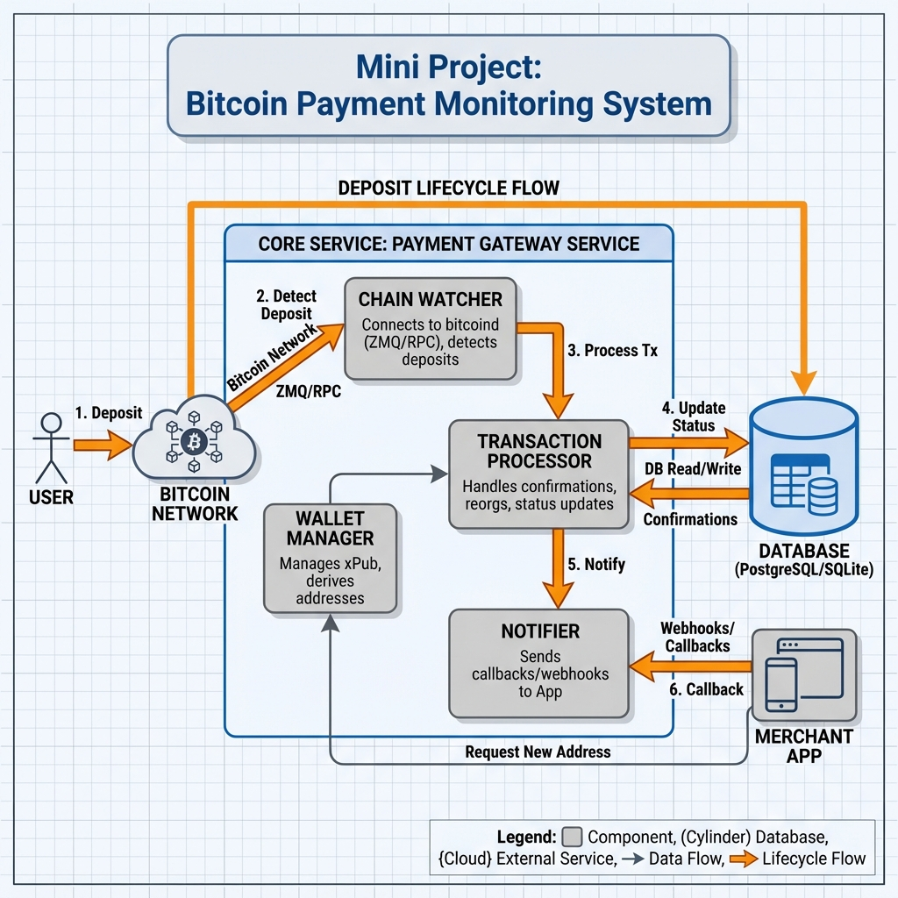
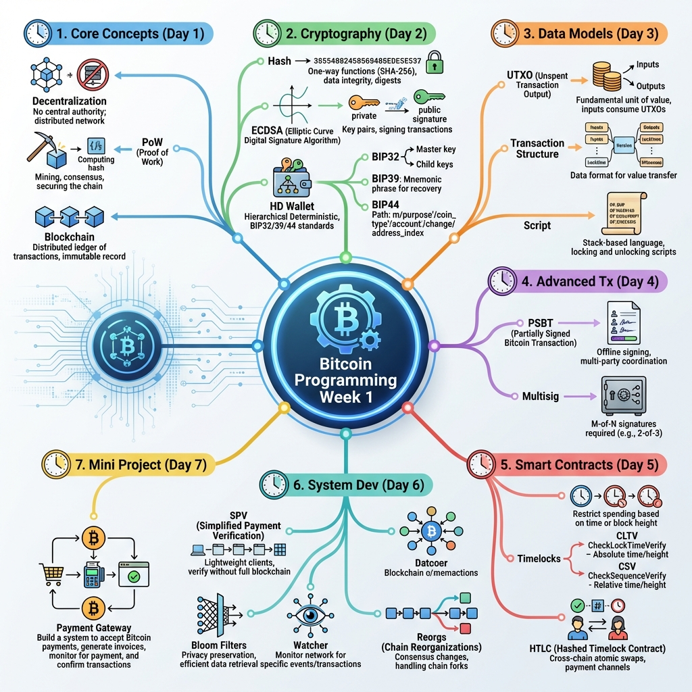

# Day 7: Week 1 复习与 Mini Project

> **学习时间**：4-6 小时（复习 1h + 项目开发 3-4h + 测试 1h）
> 
> **核心目标**：整合 Week 1 所学知识，构建完整的 Bitcoin 收款监听服务

---

## 🎯 今日学习目标

- [ ] 回顾 Week 1 Bitcoin 技术栈核心知识点
- [ ] 完成 Mini Project：Bitcoin 收款监听服务
- [ ] 使用 Bitcoin Regtest 模式编写 E2E 测试
- [ ] 验证 Reorg 处理机制的正确性

---

## 📚 Week 1 知识点复习

### 知识图谱

```
Week 1: Bitcoin 核心技术栈
│
├── Day 1: 区块链基础
│   ├── 分布式账本 vs 中心化数据库
│   ├── 四大特性：不可篡改、去中心化、透明、抗审查
│   ├── PoW vs PoS 共识机制
│   └── 状态机模型：S(t+1) = Apply(S(t), Block(t))
│
├── Day 2: 密码学与钱包
│   ├── ECDSA 非对称加密
│   ├── SHA-256 / RIPEMD-160 哈希
│   ├── BIP-39 助记词标准
│   └── BIP-32/44 HD 钱包派生
│
├── Day 3: UTXO 模型
│   ├── UTXO vs Account 模型对比
│   ├── 交易结构：Inputs → Outputs
│   ├── Coin Selection 算法
│   └── 余额计算 = Σ(未花费 UTXO)
│
├── Day 4: PSBT 多方协同
│   ├── Script 类型：P2PKH, P2SH, SegWit, Taproot
│   ├── PSBT 工作流：Create → Update → Sign → Combine → Finalize
│   ├── 多重签名 (2-of-3)
│   └── 冷钱包集成场景
│
├── Day 5: 时间锁
│   ├── 绝对时间锁：nLockTime, CLTV
│   ├── 相对时间锁：Sequence, CSV
│   ├── 应用：定时支付、闪电网络基础
│   └── 多阶段解锁设计
│
└── Day 6: 支付系统开发
    ├── Bitcoin Core RPC / btcd
    ├── SPV 轻客户端原理
    ├── Mempool 与 RBF
    ├── Watcher 架构：RPC 轮询 vs ZMQ
    └── Reorg 处理策略
```

---

### 核心概念速查表

| 概念        | 要点                       | 关联代码/工具            |
| :---------- | :------------------------- | :----------------------- |
| **区块头**  | 80 bytes，包含 Merkle Root | `sha256(sha256(header))` |
| **UTXO**    | 未花费交易输出，余额来源   | `listunspent` RPC        |
| **HD 钱包** | 一个种子派生无限地址       | `m/44'/0'/0'/0/n`        |
| **PSBT**    | 部分签名交易，多方协作     | BIP-174                  |
| **时间锁**  | 限制资金花费时间           | CLTV/CSV                 |
| **Reorg**   | 区块链重组，交易可能被回滚 | `getbestblockhash`       |

---

### 复习自测题

> [!TIP]
> **在开始 Mini Project 之前，确保你能回答以下问题**

1. **UTXO 模型**：如何计算一个地址的余额？为什么没有"账户余额"字段？

2. **HD 钱包**：为什么交易所要为每个用户生成独立的收款地址？

3. **确认数**：为什么大额交易需要等待 6 个确认？

4. **Reorg 处理**：如果一笔已经 3 确认的充值被 Reorg 了，系统应该如何处理？

5. **幂等性**：如何保证同一笔充值不会被重复入账？

---

## 🏗️ Mini Project: Bitcoin 收款监听服务

### 项目架构





---

### 项目结构

```bash
mkdir -p ~/blockchain-course/day07
cd ~/blockchain-course/day07
go mod init bitcoin-payment-monitor

# 项目结构
.
├── main.go                 # 入口
├── wallet/
│   └── hd_wallet.go       # HD 钱包管理
├── watcher/
│   └── block_watcher.go   # 区块监听
├── processor/
│   └── deposit_processor.go # 充值处理
├── storage/
│   └── database.go        # 数据库层
├── types/
│   └── models.go          # 数据模型
└── e2e/
    └── regtest_test.go    # E2E 测试
```

---

### 实现代码

#### 1. 数据模型 (`types/models.go`)

```go
package types

import "time"

// DepositStatus 充值状态
type DepositStatus string

const (
    StatusPending   DepositStatus = "pending"   // 0-conf，等待确认
    StatusConfirmed DepositStatus = "confirmed" // 达到确认阈值
    StatusCredited  DepositStatus = "credited"  // 已入账
    StatusOrphaned  DepositStatus = "orphaned"  // Reorg 被孤立
)

// Deposit 充值记录
type Deposit struct {
    ID            int64         `json:"id"`
    TxID          string        `json:"txid"`
    Vout          int           `json:"vout"`
    Address       string        `json:"address"`
    UserID        string        `json:"user_id"`
    Amount        int64         `json:"amount"` // satoshis
    BlockHash     string        `json:"block_hash"`
    BlockHeight   int64         `json:"block_height"`
    Confirmations int64         `json:"confirmations"`
    Status        DepositStatus `json:"status"`
    CreatedAt     time.Time     `json:"created_at"`
    UpdatedAt     time.Time     `json:"updated_at"`
}

// WatchAddress 监控地址
type WatchAddress struct {
    Address    string    `json:"address"`
    UserID     string    `json:"user_id"`
    DerivePath string    `json:"derive_path"` // e.g., m/84'/0'/0'/0/5
    CreatedAt  time.Time `json:"created_at"`
}

// BlockRecord 区块记录（用于 Reorg 检测）
type BlockRecord struct {
    Height    int64     `json:"height"`
    Hash      string    `json:"hash"`
    PrevHash  string    `json:"prev_hash"`
    CreatedAt time.Time `json:"created_at"`
}

// Config 服务配置
type Config struct {
    RPCHost           string
    RPCUser           string
    RPCPass           string
    ConfirmThreshold  int64  // 确认阈值
    MasterPubKey      string // HD 钱包主公钥
    Network           string // mainnet/testnet/regtest
    PollIntervalSecs  int
}
```

---

#### 2. 数据库层 (`storage/database.go`)

```go
package storage

import (
    "database/sql"
    "fmt"
    "time"
    
    "bitcoin-payment-monitor/types"
    _ "github.com/mattn/go-sqlite3"
)

// Database 数据库操作
type Database struct {
    db *sql.DB
}

// NewDatabase 创建数据库连接
func NewDatabase(dbPath string) (*Database, error) {
    db, err := sql.Open("sqlite3", dbPath)
    if err != nil {
        return nil, err
    }
    
    d := &Database{db: db}
    if err := d.initSchema(); err != nil {
        return nil, err
    }
    
    return d, nil
}

// initSchema 初始化数据库表
func (d *Database) initSchema() error {
    schema := `
    CREATE TABLE IF NOT EXISTS deposits (
        id INTEGER PRIMARY KEY AUTOINCREMENT,
        txid TEXT NOT NULL,
        vout INTEGER NOT NULL,
        address TEXT NOT NULL,
        user_id TEXT NOT NULL,
        amount INTEGER NOT NULL,
        block_hash TEXT,
        block_height INTEGER DEFAULT 0,
        confirmations INTEGER DEFAULT 0,
        status TEXT DEFAULT 'pending',
        created_at DATETIME NOT NULL,
        updated_at DATETIME NOT NULL,
        UNIQUE(txid, vout)
    );
    
    CREATE TABLE IF NOT EXISTS watch_addresses (
        address TEXT PRIMARY KEY,
        user_id TEXT NOT NULL,
        derive_path TEXT NOT NULL,
        created_at DATETIME NOT NULL
    );
    
    CREATE TABLE IF NOT EXISTS blocks (
        height INTEGER PRIMARY KEY,
        hash TEXT NOT NULL UNIQUE,
        prev_hash TEXT NOT NULL,
        created_at DATETIME NOT NULL
    );
    
    CREATE INDEX IF NOT EXISTS idx_deposits_status ON deposits(status);
    CREATE INDEX IF NOT EXISTS idx_deposits_address ON deposits(address);
    CREATE INDEX IF NOT EXISTS idx_deposits_block_height ON deposits(block_height);
    `
    _, err := d.db.Exec(schema)
    return err
}

// InsertDeposit 插入充值记录（幂等）
func (d *Database) InsertDeposit(deposit *types.Deposit) error {
    _, err := d.db.Exec(`
        INSERT OR IGNORE INTO deposits 
        (txid, vout, address, user_id, amount, block_hash, block_height, 
         confirmations, status, created_at, updated_at)
        VALUES (?, ?, ?, ?, ?, ?, ?, ?, ?, ?, ?)
    `, deposit.TxID, deposit.Vout, deposit.Address, deposit.UserID,
       deposit.Amount, deposit.BlockHash, deposit.BlockHeight,
       deposit.Confirmations, deposit.Status, deposit.CreatedAt, deposit.UpdatedAt)
    return err
}

// UpdateDepositConfirmation 更新确认数
func (d *Database) UpdateDepositConfirmation(txid string, vout int, 
    blockHash string, blockHeight, confirmations int64, status types.DepositStatus) error {
    _, err := d.db.Exec(`
        UPDATE deposits 
        SET block_hash = ?, block_height = ?, confirmations = ?, 
            status = ?, updated_at = ?
        WHERE txid = ? AND vout = ? AND status NOT IN ('credited', 'orphaned')
    `, blockHash, blockHeight, confirmations, status, time.Now(), txid, vout)
    return err
}

// MarkDepositsOrphaned 标记 Reorg 孤立的充值
func (d *Database) MarkDepositsOrphaned(fromHeight int64) (int64, error) {
    result, err := d.db.Exec(`
        UPDATE deposits 
        SET status = 'orphaned', updated_at = ?
        WHERE block_height >= ? AND status NOT IN ('credited')
    `, time.Now(), fromHeight)
    if err != nil {
        return 0, err
    }
    return result.RowsAffected()
}

// GetPendingDeposits 获取待处理的充值
func (d *Database) GetPendingDeposits() ([]*types.Deposit, error) {
    rows, err := d.db.Query(`
        SELECT id, txid, vout, address, user_id, amount, block_hash, 
               block_height, confirmations, status, created_at, updated_at
        FROM deposits 
        WHERE status IN ('pending', 'confirmed')
    `)
    if err != nil {
        return nil, err
    }
    defer rows.Close()
    
    var deposits []*types.Deposit
    for rows.Next() {
        d := &types.Deposit{}
        err := rows.Scan(&d.ID, &d.TxID, &d.Vout, &d.Address, &d.UserID,
            &d.Amount, &d.BlockHash, &d.BlockHeight, &d.Confirmations,
            &d.Status, &d.CreatedAt, &d.UpdatedAt)
        if err != nil {
            return nil, err
        }
        deposits = append(deposits, d)
    }
    return deposits, nil
}

// GetWatchAddresses 获取所有监控地址
func (d *Database) GetWatchAddresses() (map[string]*types.WatchAddress, error) {
    rows, err := d.db.Query(`
        SELECT address, user_id, derive_path, created_at 
        FROM watch_addresses
    `)
    if err != nil {
        return nil, err
    }
    defer rows.Close()
    
    addresses := make(map[string]*types.WatchAddress)
    for rows.Next() {
        a := &types.WatchAddress{}
        if err := rows.Scan(&a.Address, &a.UserID, &a.DerivePath, &a.CreatedAt); err != nil {
            return nil, err
        }
        addresses[a.Address] = a
    }
    return addresses, nil
}

// InsertWatchAddress 插入监控地址
func (d *Database) InsertWatchAddress(addr *types.WatchAddress) error {
    _, err := d.db.Exec(`
        INSERT OR IGNORE INTO watch_addresses 
        (address, user_id, derive_path, created_at)
        VALUES (?, ?, ?, ?)
    `, addr.Address, addr.UserID, addr.DerivePath, addr.CreatedAt)
    return err
}

// GetLatestBlock 获取最新记录的区块
func (d *Database) GetLatestBlock() (*types.BlockRecord, error) {
    row := d.db.QueryRow(`
        SELECT height, hash, prev_hash, created_at 
        FROM blocks ORDER BY height DESC LIMIT 1
    `)
    
    block := &types.BlockRecord{}
    err := row.Scan(&block.Height, &block.Hash, &block.PrevHash, &block.CreatedAt)
    if err == sql.ErrNoRows {
        return nil, nil
    }
    return block, err
}

// InsertBlock 插入区块记录
func (d *Database) InsertBlock(block *types.BlockRecord) error {
    _, err := d.db.Exec(`
        INSERT OR REPLACE INTO blocks (height, hash, prev_hash, created_at)
        VALUES (?, ?, ?, ?)
    `, block.Height, block.Hash, block.PrevHash, block.CreatedAt)
    return err
}

// DeleteBlocksFrom 删除指定高度之后的区块（Reorg 回滚）
func (d *Database) DeleteBlocksFrom(height int64) error {
    _, err := d.db.Exec(`DELETE FROM blocks WHERE height >= ?`, height)
    return err
}

// Close 关闭数据库
func (d *Database) Close() error {
    return d.db.Close()
}
```

---

#### 3. HD 钱包管理 (`wallet/hd_wallet.go`)

```go
package wallet

import (
    "fmt"
    "time"
    
    "bitcoin-payment-monitor/storage"
    "bitcoin-payment-monitor/types"
    
    "github.com/btcsuite/btcd/btcutil/hdkeychain"
    "github.com/btcsuite/btcd/chaincfg"
    "github.com/btcsuite/btcd/btcutil"
)

// HDWalletManager HD 钱包管理器
type HDWalletManager struct {
    masterKey  *hdkeychain.ExtendedKey
    chainParams *chaincfg.Params
    db         *storage.Database
    nextIndex  uint32
}

// NewHDWalletManager 创建 HD 钱包管理器
func NewHDWalletManager(masterXPub string, network string, db *storage.Database) (*HDWalletManager, error) {
    // 选择网络参数
    var params *chaincfg.Params
    switch network {
    case "mainnet":
        params = &chaincfg.MainNetParams
    case "testnet":
        params = &chaincfg.TestNet3Params
    case "regtest":
        params = &chaincfg.RegressionNetParams
    default:
        return nil, fmt.Errorf("未知网络: %s", network)
    }
    
    // 解析主公钥
    masterKey, err := hdkeychain.NewKeyFromString(masterXPub)
    if err != nil {
        return nil, fmt.Errorf("解析主公钥失败: %w", err)
    }
    
    return &HDWalletManager{
        masterKey:   masterKey,
        chainParams: params,
        db:          db,
        nextIndex:   0,
    }, nil
}

// DeriveAddress 派生新地址
// derivePath: 相对路径，如 "0/5" 表示外部地址第 5 个
func (m *HDWalletManager) DeriveAddress(accountIndex, addressIndex uint32) (string, string, error) {
    // 派生路径: m/84'/0'/account'/0/index (BIP-84 Native SegWit)
    // 由于我们使用的是 account 级别的 xpub，直接派生 /0/index
    
    // 派生外部链 (0 = external, 1 = internal/change)
    externalKey, err := m.masterKey.Derive(0)
    if err != nil {
        return "", "", err
    }
    
    // 派生地址索引
    addressKey, err := externalKey.Derive(addressIndex)
    if err != nil {
        return "", "", err
    }
    
    // 生成 P2WPKH 地址 (bc1q...)
    pubKey, err := addressKey.ECPubKey()
    if err != nil {
        return "", "", err
    }
    
    pubKeyHash := btcutil.Hash160(pubKey.SerializeCompressed())
    addr, err := btcutil.NewAddressWitnessPubKeyHash(pubKeyHash, m.chainParams)
    if err != nil {
        return "", "", err
    }
    
    derivePath := fmt.Sprintf("m/84'/0'/0'/0/%d", addressIndex)
    return addr.EncodeAddress(), derivePath, nil
}

// GenerateAddressForUser 为用户生成收款地址
func (m *HDWalletManager) GenerateAddressForUser(userID string) (*types.WatchAddress, error) {
    // 获取下一个索引
    index := m.nextIndex
    m.nextIndex++
    
    // 派生地址
    address, derivePath, err := m.DeriveAddress(0, index)
    if err != nil {
        return nil, err
    }
    
    // 保存到数据库
    watchAddr := &types.WatchAddress{
        Address:    address,
        UserID:     userID,
        DerivePath: derivePath,
        CreatedAt:  time.Now(),
    }
    
    if err := m.db.InsertWatchAddress(watchAddr); err != nil {
        return nil, err
    }
    
    return watchAddr, nil
}
```

---

#### 4. 区块监听器 (`watcher/block_watcher.go`)

```go
package watcher

import (
    "context"
    "fmt"
    "log"
    "time"
    
    "bitcoin-payment-monitor/storage"
    "bitcoin-payment-monitor/types"
    
    "github.com/btcsuite/btcd/btcjson"
    "github.com/btcsuite/btcd/chaincfg/chainhash"
    "github.com/btcsuite/btcd/rpcclient"
    "github.com/btcsuite/btcd/txscript"
    "github.com/btcsuite/btcd/chaincfg"
)

// BlockWatcher 区块监听器
type BlockWatcher struct {
    client           *rpcclient.Client
    db               *storage.Database
    watchAddresses   map[string]*types.WatchAddress
    confirmThreshold int64
    pollInterval     time.Duration
    chainParams      *chaincfg.Params
    onDepositCb      func(*types.Deposit)
}

// NewBlockWatcher 创建区块监听器
func NewBlockWatcher(config *types.Config, db *storage.Database) (*BlockWatcher, error) {
    // 创建 RPC 客户端
    connCfg := &rpcclient.ConnConfig{
        Host:         config.RPCHost,
        User:         config.RPCUser,
        Pass:         config.RPCPass,
        HTTPPostMode: true,
        DisableTLS:   true,
    }
    
    client, err := rpcclient.New(connCfg, nil)
    if err != nil {
        return nil, err
    }
    
    // 选择网络参数
    var params *chaincfg.Params
    switch config.Network {
    case "mainnet":
        params = &chaincfg.MainNetParams
    case "testnet":
        params = &chaincfg.TestNet3Params
    case "regtest":
        params = &chaincfg.RegressionNetParams
    default:
        params = &chaincfg.RegressionNetParams
    }
    
    return &BlockWatcher{
        client:           client,
        db:               db,
        watchAddresses:   make(map[string]*types.WatchAddress),
        confirmThreshold: config.ConfirmThreshold,
        pollInterval:     time.Duration(config.PollIntervalSecs) * time.Second,
        chainParams:      params,
    }, nil
}

// LoadWatchAddresses 加载监控地址
func (w *BlockWatcher) LoadWatchAddresses() error {
    addresses, err := w.db.GetWatchAddresses()
    if err != nil {
        return err
    }
    w.watchAddresses = addresses
    log.Printf("已加载 %d 个监控地址", len(addresses))
    return nil
}

// SetDepositCallback 设置充值回调
func (w *BlockWatcher) SetDepositCallback(cb func(*types.Deposit)) {
    w.onDepositCb = cb
}

// Start 启动监听
func (w *BlockWatcher) Start(ctx context.Context) {
    log.Println("区块监听器启动...")
    
    ticker := time.NewTicker(w.pollInterval)
    defer ticker.Stop()
    
    for {
        select {
        case <-ctx.Done():
            log.Println("区块监听器停止")
            return
        case <-ticker.C:
            if err := w.poll(); err != nil {
                log.Printf("轮询错误: %v", err)
            }
        }
    }
}

// poll 轮询新区块
func (w *BlockWatcher) poll() error {
    // 获取链上最新区块
    bestHash, err := w.client.GetBestBlockHash()
    if err != nil {
        return err
    }
    
    bestBlock, err := w.client.GetBlockVerbose(bestHash)
    if err != nil {
        return err
    }
    
    // 获取本地最新区块
    localBest, err := w.db.GetLatestBlock()
    if err != nil {
        return err
    }
    
    // 首次运行，从当前区块开始
    if localBest == nil {
        return w.processBlock(bestBlock)
    }
    
    // 检测 Reorg
    if bestBlock.Height <= localBest.Height && bestBlock.Hash != localBest.Hash {
        log.Printf("⚠️ 检测到 Reorg: 本地高度=%d, 链上高度=%d", 
            localBest.Height, bestBlock.Height)
        return w.handleReorg(bestBlock.Height)
    }
    
    // 处理新区块
    if bestBlock.Height > localBest.Height {
        // 回填缺失的区块
        for h := localBest.Height + 1; h <= bestBlock.Height; h++ {
            hash, err := w.client.GetBlockHash(h)
            if err != nil {
                return err
            }
            block, err := w.client.GetBlockVerbose(hash)
            if err != nil {
                return err
            }
            if err := w.processBlock(block); err != nil {
                return err
            }
        }
    }
    
    // 更新确认数
    return w.updateConfirmations(bestBlock.Height)
}

// processBlock 处理区块
func (w *BlockWatcher) processBlock(block *btcjson.GetBlockVerboseResult) error {
    log.Printf("处理区块 %d (%s...)", block.Height, block.Hash[:16])
    
    // 保存区块记录
    blockRecord := &types.BlockRecord{
        Height:    block.Height,
        Hash:      block.Hash,
        PrevHash:  block.PreviousHash,
        CreatedAt: time.Now(),
    }
    if err := w.db.InsertBlock(blockRecord); err != nil {
        return err
    }
    
    // 扫描区块中的交易
    for _, txid := range block.Tx {
        if err := w.scanTransaction(txid, block.Hash, block.Height); err != nil {
            log.Printf("扫描交易失败 %s: %v", txid, err)
        }
    }
    
    return nil
}

// scanTransaction 扫描交易
func (w *BlockWatcher) scanTransaction(txid, blockHash string, blockHeight int64) error {
    hash, err := chainhash.NewHashFromStr(txid)
    if err != nil {
        return err
    }
    
    rawTx, err := w.client.GetRawTransaction(hash)
    if err != nil {
        return err
    }
    
    // 检查每个输出
    for vout, txOut := range rawTx.MsgTx().TxOut {
        // 解析输出脚本
        _, addresses, _, err := txscript.ExtractPkScriptAddrs(
            txOut.PkScript, w.chainParams)
        if err != nil || len(addresses) == 0 {
            continue
        }
        
        addr := addresses[0].EncodeAddress()
        
        // 检查是否是我们监控的地址
        if watchAddr, exists := w.watchAddresses[addr]; exists {
            log.Printf("💰 检测到充值: %s → %s, 金额: %d sats", 
                txid[:16], addr, txOut.Value)
            
            deposit := &types.Deposit{
                TxID:          txid,
                Vout:          vout,
                Address:       addr,
                UserID:        watchAddr.UserID,
                Amount:        txOut.Value,
                BlockHash:     blockHash,
                BlockHeight:   blockHeight,
                Confirmations: 1,
                Status:        types.StatusPending,
                CreatedAt:     time.Now(),
                UpdatedAt:     time.Now(),
            }
            
            if err := w.db.InsertDeposit(deposit); err != nil {
                log.Printf("保存充值记录失败: %v", err)
            }
            
            if w.onDepositCb != nil {
                w.onDepositCb(deposit)
            }
        }
    }
    
    return nil
}

// updateConfirmations 更新确认数
func (w *BlockWatcher) updateConfirmations(currentHeight int64) error {
    deposits, err := w.db.GetPendingDeposits()
    if err != nil {
        return err
    }
    
    for _, d := range deposits {
        if d.BlockHeight <= 0 {
            continue
        }
        
        confs := currentHeight - d.BlockHeight + 1
        var status types.DepositStatus
        
        if confs >= w.confirmThreshold {
            status = types.StatusConfirmed
            log.Printf("✅ 充值确认: %s (确认数: %d)", d.TxID[:16], confs)
        } else {
            status = types.StatusPending
        }
        
        if err := w.db.UpdateDepositConfirmation(
            d.TxID, d.Vout, d.BlockHash, d.BlockHeight, confs, status); err != nil {
            log.Printf("更新确认数失败: %v", err)
        }
    }
    
    return nil
}

// handleReorg 处理区块重组
func (w *BlockWatcher) handleReorg(reorgHeight int64) error {
    log.Printf("🔄 处理 Reorg: 从高度 %d 回滚", reorgHeight)
    
    // 标记受影响的充值为 orphaned
    affected, err := w.db.MarkDepositsOrphaned(reorgHeight)
    if err != nil {
        return err
    }
    log.Printf("   → 标记 %d 条充值记录为 orphaned", affected)
    
    // 删除区块记录
    if err := w.db.DeleteBlocksFrom(reorgHeight); err != nil {
        return err
    }
    
    return nil
}

// Close 关闭监听器
func (w *BlockWatcher) Close() {
    w.client.Shutdown()
}
```

---

#### 5. 主程序 (`main.go`)

```go
package main

import (
    "context"
    "flag"
    "fmt"
    "log"
    "os"
    "os/signal"
    "syscall"
    
    "bitcoin-payment-monitor/storage"
    "bitcoin-payment-monitor/types"
    "bitcoin-payment-monitor/wallet"
    "bitcoin-payment-monitor/watcher"
)

var (
    rpcHost  = flag.String("rpc", "localhost:18443", "Bitcoin RPC host:port")
    rpcUser  = flag.String("user", "rpcuser", "RPC username")
    rpcPass  = flag.String("pass", "rpcpassword", "RPC password")
    network  = flag.String("network", "regtest", "Network: mainnet/testnet/regtest")
    dbPath   = flag.String("db", "payments.db", "SQLite database path")
    confirms = flag.Int64("confirms", 6, "Confirmation threshold")
)

func main() {
    flag.Parse()
    
    log.Println("=== Bitcoin Payment Monitor ===")
    
    // 初始化数据库
    db, err := storage.NewDatabase(*dbPath)
    if err != nil {
        log.Fatalf("数据库初始化失败: %v", err)
    }
    defer db.Close()
    
    // 配置
    config := &types.Config{
        RPCHost:          *rpcHost,
        RPCUser:          *rpcUser,
        RPCPass:          *rpcPass,
        ConfirmThreshold: *confirms,
        Network:          *network,
        PollIntervalSecs: 10,
    }
    
    // 创建区块监听器
    blockWatcher, err := watcher.NewBlockWatcher(config, db)
    if err != nil {
        log.Fatalf("创建监听器失败: %v", err)
    }
    defer blockWatcher.Close()
    
    // 加载监控地址
    if err := blockWatcher.LoadWatchAddresses(); err != nil {
        log.Fatalf("加载监控地址失败: %v", err)
    }
    
    // 设置充值回调
    blockWatcher.SetDepositCallback(func(d *types.Deposit) {
        log.Printf("📥 新充值通知: 用户=%s, 金额=%d sats, TxID=%s",
            d.UserID, d.Amount, d.TxID[:16])
        // 这里可以发送 webhook 通知等
    })
    
    // 启动监听
    ctx, cancel := context.WithCancel(context.Background())
    go blockWatcher.Start(ctx)
    
    // 等待中断信号
    sigChan := make(chan os.Signal, 1)
    signal.Notify(sigChan, syscall.SIGINT, syscall.SIGTERM)
    <-sigChan
    
    log.Println("收到中断信号，正在关闭...")
    cancel()
    log.Println("服务已停止")
}
```

---

### E2E 测试 (Bitcoin Regtest)

#### 测试环境准备

```bash
# 1. 启动 Bitcoin Regtest 节点
bitcoind -regtest -daemon \
    -rpcuser=rpcuser \
    -rpcpassword=rpcpassword \
    -rpcport=18443 \
    -fallbackfee=0.0001

# 2. 创建钱包（如果需要）
bitcoin-cli -regtest -rpcuser=rpcuser -rpcpassword=rpcpassword createwallet "test"

# 3. 生成一些区块（获取测试币）
bitcoin-cli -regtest -rpcuser=rpcuser -rpcpassword=rpcpassword generatetoaddress 101 $(bitcoin-cli -regtest -rpcuser=rpcuser -rpcpassword=rpcpassword getnewaddress)
```

#### E2E 测试代码 (`e2e/regtest_test.go`)

```go
package e2e

import (
    "context"
    "testing"
    "time"
    
    "bitcoin-payment-monitor/storage"
    "bitcoin-payment-monitor/types"
    "bitcoin-payment-monitor/watcher"
    
    "github.com/btcsuite/btcd/rpcclient"
)

// TestDepositFlow 测试正常充值流程
func TestDepositFlow(t *testing.T) {
    // 初始化
    db, _ := storage.NewDatabase(":memory:")
    defer db.Close()
    
    config := &types.Config{
        RPCHost:          "localhost:18443",
        RPCUser:          "rpcuser",
        RPCPass:          "rpcpassword",
        ConfirmThreshold: 3,
        Network:          "regtest",
        PollIntervalSecs: 1,
    }
    
    w, err := watcher.NewBlockWatcher(config, db)
    if err != nil {
        t.Fatalf("创建 watcher 失败: %v", err)
    }
    defer w.Close()
    
    // 添加测试地址
    testAddr := &types.WatchAddress{
        Address:   "bcrt1q...", // 替换为实际测试地址
        UserID:    "user_001",
        DerivePath: "m/84'/0'/0'/0/0",
        CreatedAt: time.Now(),
    }
    db.InsertWatchAddress(testAddr)
    w.LoadWatchAddresses()
    
    // 启动监听
    ctx, cancel := context.WithTimeout(context.Background(), 30*time.Second)
    defer cancel()
    
    go w.Start(ctx)
    
    // 发送测试交易
    // bitcoin-cli -regtest sendtoaddress <testAddr> 0.1
    
    // 生成确认区块
    // bitcoin-cli -regtest generatetoaddress 3 <miner_address>
    
    // 验证充值记录
    time.Sleep(5 * time.Second)
    deposits, _ := db.GetPendingDeposits()
    
    if len(deposits) == 0 {
        t.Log("警告: 未检测到充值（请确保已发送测试交易）")
    }
    
    for _, d := range deposits {
        t.Logf("充值: TxID=%s, Amount=%d, Confirmations=%d, Status=%s",
            d.TxID[:16], d.Amount, d.Confirmations, d.Status)
    }
}

// TestReorgHandling 测试 Reorg 处理
func TestReorgHandling(t *testing.T) {
    db, _ := storage.NewDatabase(":memory:")
    defer db.Close()
    
    // 插入模拟充值记录
    deposit := &types.Deposit{
        TxID:        "abc123...",
        Vout:        0,
        Address:     "bcrt1q...",
        UserID:      "user_001",
        Amount:      10000000,
        BlockHeight: 100,
        Status:      types.StatusPending,
        CreatedAt:   time.Now(),
        UpdatedAt:   time.Now(),
    }
    db.InsertDeposit(deposit)
    
    // 模拟 Reorg: 从高度 99 回滚
    affected, err := db.MarkDepositsOrphaned(99)
    if err != nil {
        t.Fatalf("Reorg 处理失败: %v", err)
    }
    
    if affected != 1 {
        t.Errorf("预期回滚 1 条记录，实际 %d", affected)
    }
    
    // 验证状态更新
    deposits, _ := db.GetPendingDeposits()
    if len(deposits) != 0 {
        t.Error("Reorg 后不应有 pending 状态的充值")
    }
    
    t.Log("✅ Reorg 处理测试通过")
}

// TestConfirmationThreshold 测试确认阈值
func TestConfirmationThreshold(t *testing.T) {
    db, _ := storage.NewDatabase(":memory:")
    defer db.Close()
    
    // 测试不同确认数的状态变化
    testCases := []struct {
        currentHeight int64
        depositHeight int64
        threshold     int64
        expectStatus  types.DepositStatus
    }{
        {100, 100, 3, types.StatusPending},   // 1 确认
        {101, 100, 3, types.StatusPending},   // 2 确认
        {102, 100, 3, types.StatusConfirmed}, // 3 确认
        {105, 100, 6, types.StatusPending},   // 6 确认阈值，只有 6 确认，刚好达标
        {105, 100, 6, types.StatusConfirmed}, // 6 确认
    }
    
    for i, tc := range testCases {
        confs := tc.currentHeight - tc.depositHeight + 1
        var status types.DepositStatus
        if confs >= tc.threshold {
            status = types.StatusConfirmed
        } else {
            status = types.StatusPending
        }
        
        if status != tc.expectStatus {
            t.Errorf("测试 %d: 预期状态 %s, 实际 %s (确认数: %d)",
                i, tc.expectStatus, status, confs)
        }
    }
    
    t.Log("✅ 确认阈值测试通过")
}
```

运行测试：

```bash
go test -v ./e2e/...
```

---

## 📋 项目验收清单

### 功能验收

- [ ] HD 钱包可以为用户派生唯一收款地址
- [ ] 区块监听器能实时检测新区块
- [ ] 充值交易能被正确识别并记录
- [ ] 确认数能随区块增加而更新
- [ ] 达到确认阈值时状态正确变为 confirmed
- [ ] Reorg 发生时，受影响的充值被标记为 orphaned

### E2E 测试验收

- [ ] 正常充值流程测试通过
- [ ] Reorg 回滚场景测试通过
- [ ] 多确认阈值切换测试通过

### 代码质量

- [ ] 充值处理具备幂等性
- [ ] 数据库表设计合理，有适当索引
- [ ] 错误处理完善
- [ ] 日志记录清晰

---

## 📝 Week 1 总结

### 掌握的核心技能

| 技能领域       | 具体能力                             |
| :------------- | :----------------------------------- |
| **区块链基础** | 理解分布式账本、共识机制、状态机模型 |
| **密码学**     | 使用 Go 生成地址、理解 HD 钱包派生   |
| **UTXO 模型**  | 理解交易结构、实现 Coin Selection    |
| **PSBT**       | 构造多签交易、冷钱包集成             |
| **时间锁**     | 实现 CLTV/CSV 条件支付               |
| **支付系统**   | 实现充值监听、Reorg 处理、幂等入账   |

### 后续学习方向

```
Week 2 预告:
├── Day 8-10: 闪电网络 Layer 2 与 LND 开发
│   └── 即时支付、支付通道、HTLC
└── Day 11-14: 以太坊基础与 Foundry
    └── Account 模型、Go 客户端、合约开发
```

---

## 🔗 延伸阅读

- [btcsuite 官方文档](https://github.com/btcsuite/btcd)
- [Bitcoin Core RPC 文档](https://developer.bitcoin.org/reference/rpc/)
- [BIP-32: HD 钱包](https://github.com/bitcoin/bips/blob/master/bip-0032.mediawiki)
- [BIP-84: Native SegWit 派生路径](https://github.com/bitcoin/bips/blob/master/bip-0084.mediawiki)

---

**Week 1 完成！** 🎉

恭喜你完成了区块链开发的第一周学习！你已经掌握了 Bitcoin 技术栈的核心知识，并构建了一个完整的收款监听服务。下周我们将探索闪电网络和以太坊生态。
