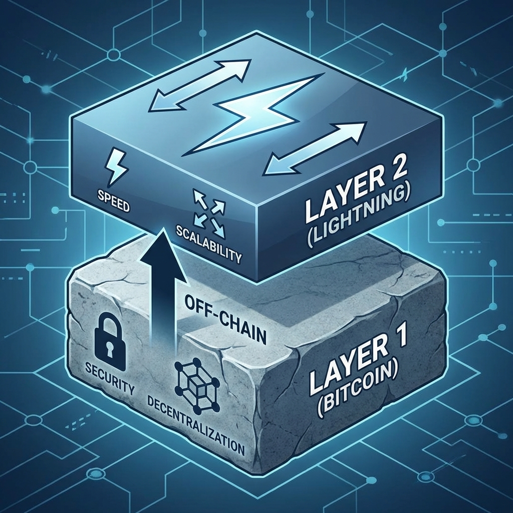
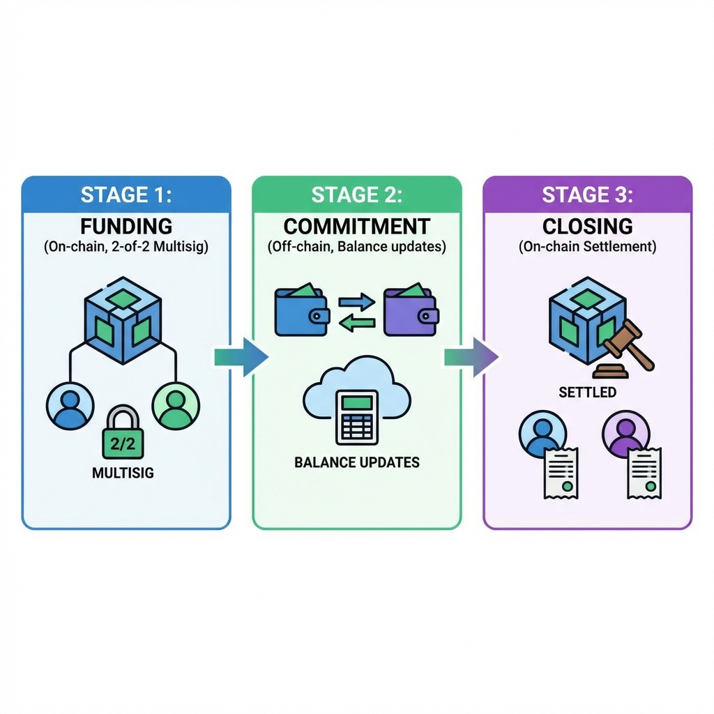
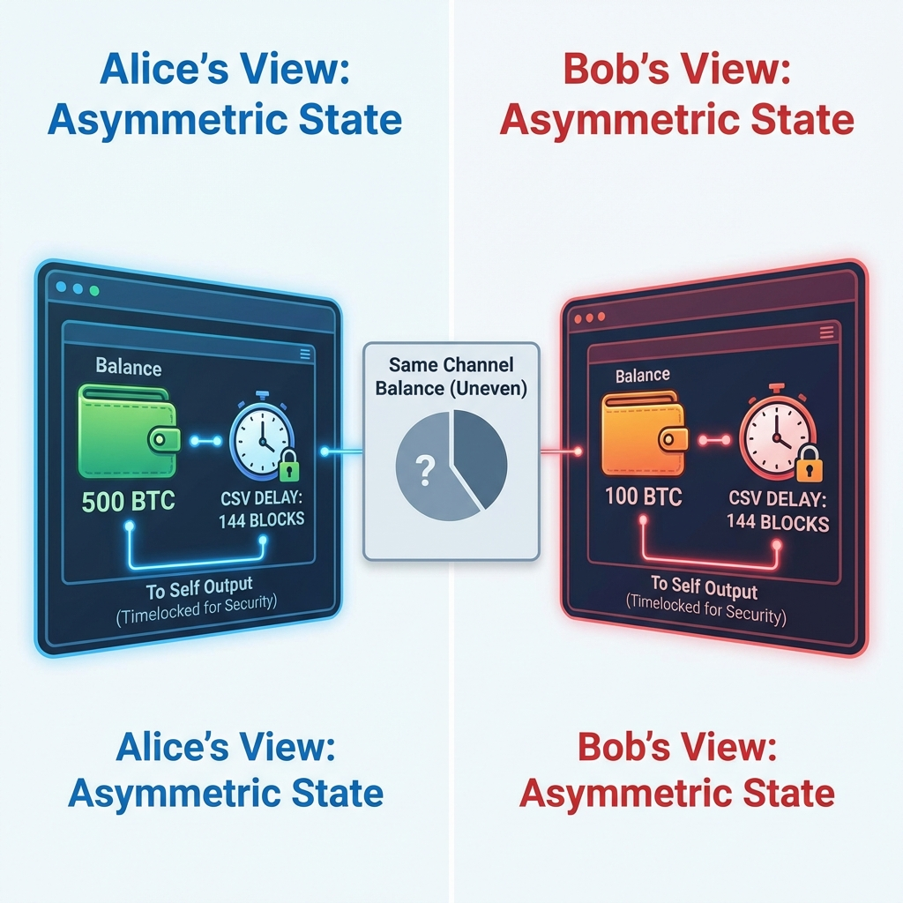
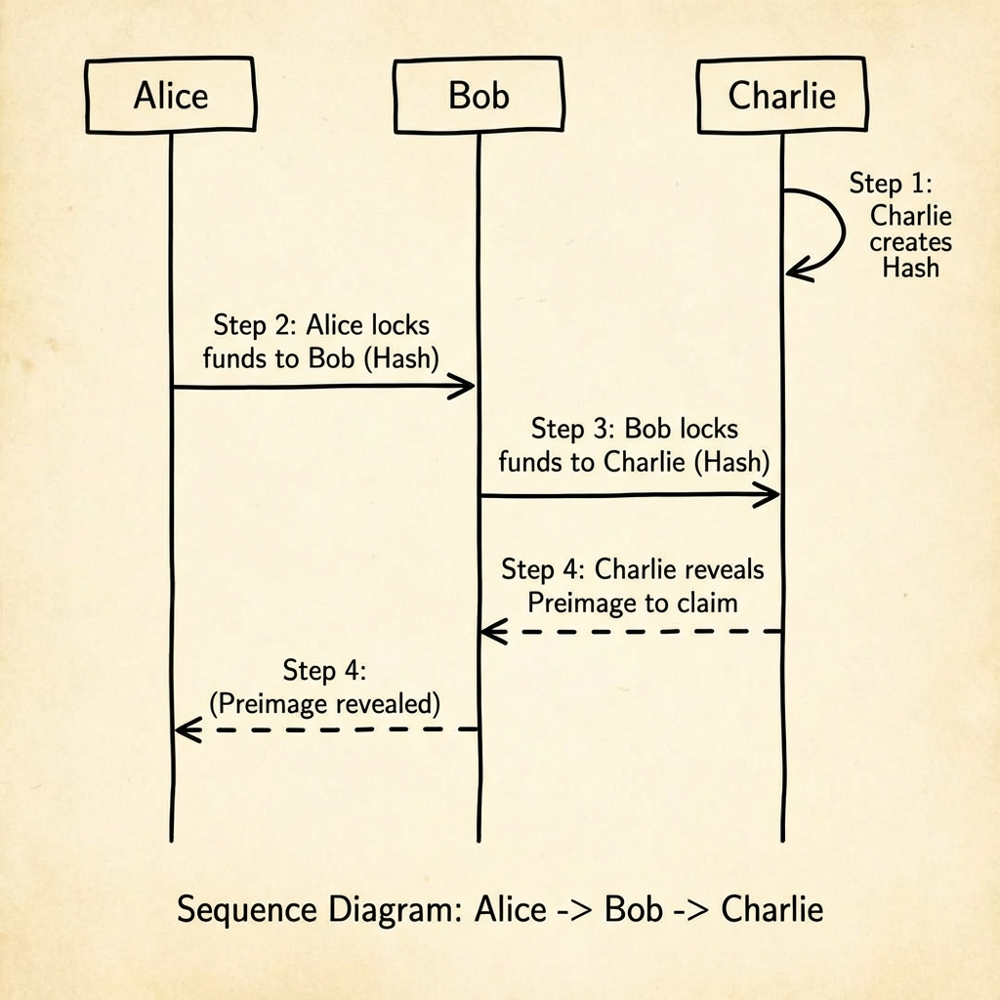
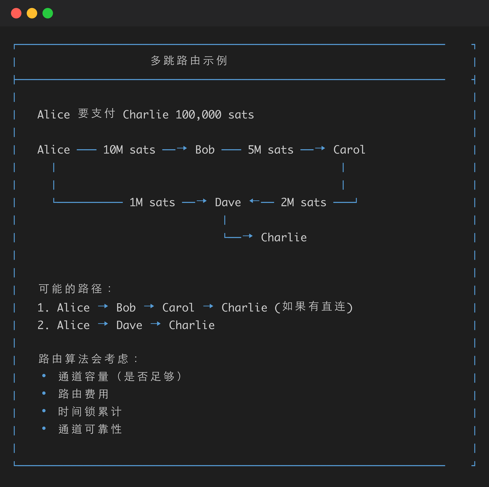
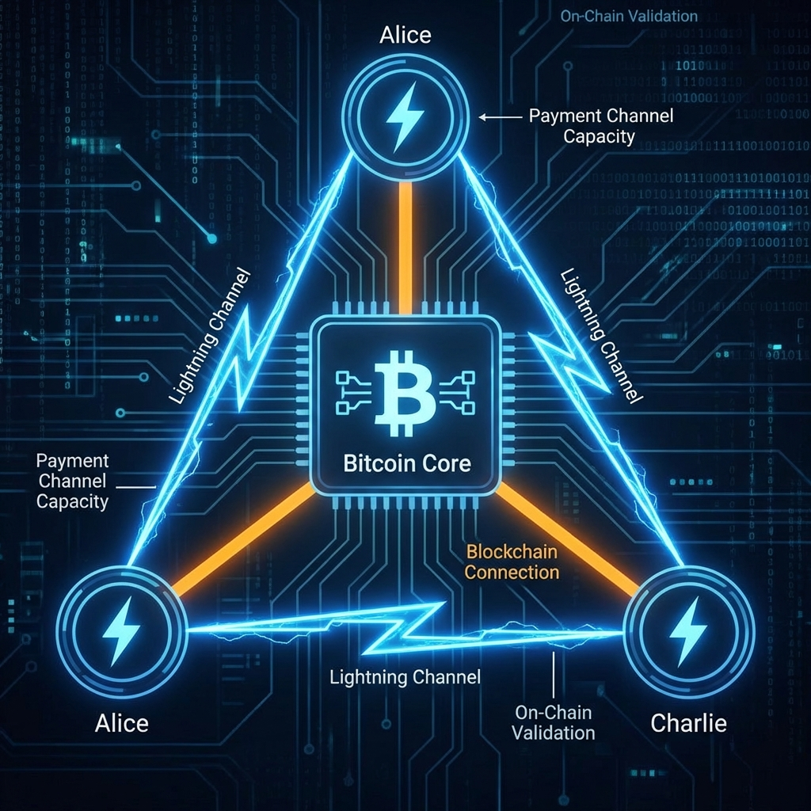
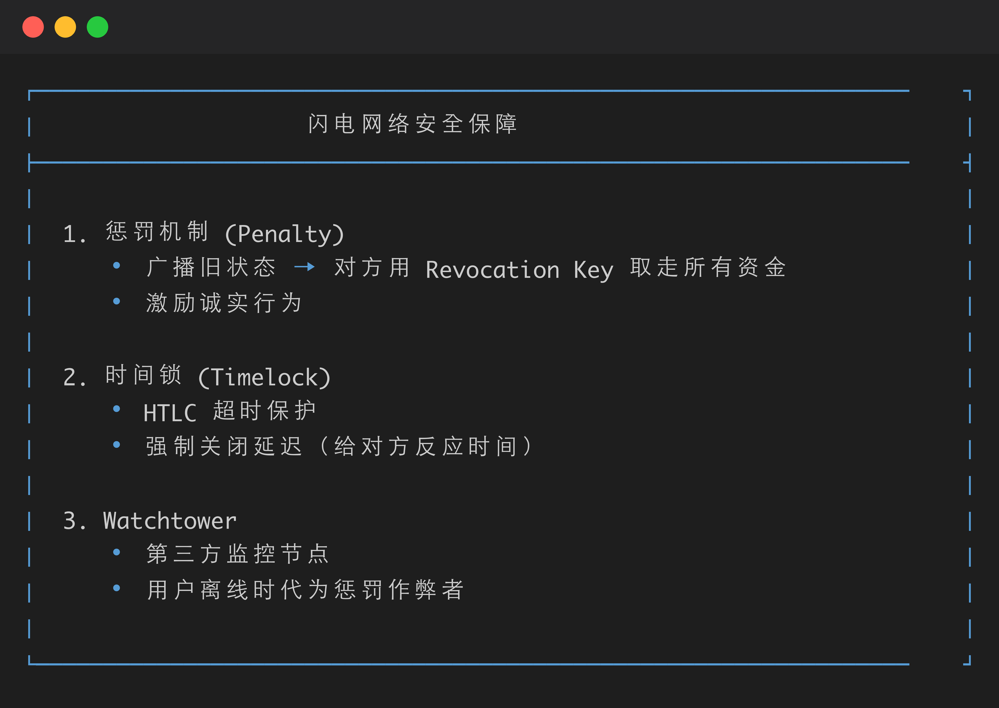

# Day 8: 闪电网络 — Layer 2 支付通道

> **学习时间**：4-6 小时（理论 1.5h + 实战 3-4h + 复习 0.5h）
>
> **核心目标**：理解闪电网络的设计原理，掌握支付通道和 HTLC 的工作机制

---

## 🎯 今日学习目标

- [ ] 理解 Layer 2 扩容方案的设计思路
- [ ] 掌握支付通道的生命周期（Funding → Commitment → Closing）
- [ ] 理解 HTLC（哈希时间锁合约）的工作原理
- [ ] 使用 Polar 搭建本地闪电网络测试环境
- [ ] 完成开通道、支付、关通道的完整流程

---

## 📚 理论课：闪电网络核心概念

### 为什么需要 Layer 2？

#### Bitcoin 链上扩容的局限性

| 指标         | Bitcoin 主网    | 闪电网络     |
| ------------ | --------------- | ------------ |
| **TPS**      | ~7 交易/秒      | 理论上百万级 |
| **确认时间** | ~10 分钟        | 毫秒级       |
| **交易费用** | $1-50（波动大） | < $0.01      |
| **隐私性**   | 链上公开        | 链下私密     |



---

### 支付通道（Payment Channel）

#### 核心思想

> **把频繁的小额交易放到链下，只在开通道和关通道时上链。**

就像你和朋友开一个"记账本"：
1. 双方各存一笔钱到共同账户（开通道）
2. 每次交易，更新记账本的余额（链下）
3. 最终结算时，按最新余额分钱（关通道）

---

#### 支付通道生命周期



---

#### Commitment Transaction 详解



---

### HTLC（哈希时间锁合约）

#### 为什么需要 HTLC？

> **问题**：Alice 和 Charlie 没有直接通道，但 Alice → Bob → Charlie 各有通道。如何实现 Alice 付款给 Charlie？

```
Alice ←───通道───→ Bob ←───通道───→ Charlie
              
问题：Bob 可能收了 Alice 的钱但不转给 Charlie
```

**解决方案**：HTLC（Hash Time-Locked Contract）

---

#### HTLC 工作原理



---

#### HTLC 脚本示例

```bitcoin
# HTLC 输出脚本 (简化版)
OP_IF
    # Hash Lock 分支：接收方用 preimage 解锁
    OP_SHA256 <payment_hash> OP_EQUALVERIFY
    <receiver_pubkey>
OP_ELSE
    # Time Lock 分支：超时后发送方取回
    <timeout> OP_CHECKLOCKTIMEVERIFY OP_DROP
    <sender_pubkey>
OP_ENDIF
OP_CHECKSIG
```

---

### BOLT 协议标准

闪电网络的协议规范由 **BOLT**（Basis of Lightning Technology）定义：

| BOLT        | 描述                      |
| ----------- | ------------------------- |
| **BOLT 1**  | 基础协议与消息格式        |
| **BOLT 2**  | 通道管理（开/关/更新）    |
| **BOLT 3**  | Bitcoin 交易与脚本格式    |
| **BOLT 4**  | 洋葱路由（Onion Routing） |
| **BOLT 7**  | P2P 节点与通道发现        |
| **BOLT 11** | 发票（Invoice）格式       |

---

#### BOLT-11 发票格式

```
lnbc1500n1pnxxxxxxxxxxxxxxxxxxxxxxxxxxxxxxxxxxxxxxxxxxxxxxxxxxxxxx
└─┬──┘└┬┘└─────────────────────┬─────────────────────────────────┘
  │   │                        │
  │   │                        └── 签名与数据
  │   └── 金额: 1500 satoshis
  └── 前缀: lnbc (mainnet), lntb (testnet), lnbcrt (regtest)
```

**发票包含的信息**：
- Payment Hash（支付哈希）
- 金额（可选）
- 过期时间
- 描述
- 路由提示
- 节点公钥

---

### 闪电网络路由



---

### 洋葱路由（Onion Routing）

> **隐私保护**：中间节点只知道上一跳和下一跳，不知道源和目的


---

## 🛠️ 实战作业

### 作业 1：搭建 Polar 测试环境

#### 1.1 安装 Polar

Polar 是一个可视化的闪电网络本地测试工具，支持 LND、CLN、Eclair 等实现。

```bash
# macOS
brew install --cask polar

# 或者从官网下载
# https://lightningpolar.com/
```

#### 1.2 创建测试网络

1. 打开 Polar，点击 "Create Network"
2. 选择 3 个 LND 节点（Alice, Bob, Charlie）
3. 选择 1 个 Bitcoin Core 后端
4. 点击 "Create Network"



#### 1.3 启动网络

1. 点击 "Start" 启动所有节点
2. 等待 Bitcoin Core 同步完成
3. 为每个节点获取测试币（点击节点 → "Deposit" → "Mine"）

---

### 作业 2：开通道与支付

#### 2.1 开通道

在 Polar 中：

1. 选择 Alice 节点
2. 点击 "Open Channel"
3. 选择 Bob 作为对等节点
4. 设置通道容量：1,000,000 sats
5. 点击 "Open Channel"，然后挖几个区块确认

```
Alice ─── 1M sats ───→ Bob
```

重复步骤，让 Bob 和 Charlie 开通道：

```
Alice ─── 1M sats ───→ Bob ─── 1M sats ───→ Charlie
```

#### 2.2 创建发票

1. 选择 Charlie 节点
2. 点击 "Create Invoice"
3. 输入金额：10,000 sats
4. 添加描述："Test payment"
5. 复制生成的发票（lnbcrt...）

#### 2.3 支付发票

1. 选择 Alice 节点
2. 点击 "Pay Invoice"
3. 粘贴 Charlie 的发票
4. 确认支付

**观察**：
- Alice 通道余额减少
- Bob 作为中间节点，两边通道余额变化（收入侧增加，支出侧减少）
- Charlie 通道余额增加

---

### 作业 3：使用 lncli 命令行操作

#### 3.1 进入节点终端

在 Polar 中，右键点击 Alice → "Launch Terminal"

#### 3.2 常用命令

```bash
# 查看节点信息
lncli getinfo

# 查看钱包余额
lncli walletbalance

# 查看通道列表
lncli listchannels

# 查看待处理通道
lncli pendingchannels

# 创建发票
lncli addinvoice --amt 50000 --memo "Test invoice"

# 解码发票
lncli decodepayreq <invoice>

# 支付发票
lncli payinvoice <invoice>

# 查看支付历史
lncli listpayments

# 查看收款历史
lncli listinvoices
```

#### 3.3 命令行开通道

```bash
# 获取 Bob 的节点 pubkey
# 在 Bob 终端执行: lncli getinfo

# 在 Alice 终端连接 Bob
lncli connect <bob_pubkey>@<bob_host>:<bob_port>

# 开通道 (500,000 sats)
lncli openchannel --node_key <bob_pubkey> --local_amt 500000

# 挖矿确认 (在比特币终端)
bitcoin-cli -generate 6
```

---

### 作业 4：关闭通道

#### 4.1 协作关闭（推荐）

```bash
# 获取通道点 (channel point)
lncli listchannels
# 输出类似: "channel_point": "txid:output_index"

# 协作关闭
lncli closechannel --channel_point <txid:index>

# 挖矿确认
bitcoin-cli -generate 6
```

#### 4.2 强制关闭

```bash
# 强制关闭（对方离线时使用）
lncli closechannel --channel_point <txid:index> --force

# 需要等待时间锁过期
# 在 regtest 中可以通过挖矿加速
bitcoin-cli -generate 144
```

---

### 作业 5：多跳支付实验

#### 5.1 网络拓扑

确保以下通道已建立：

```
Alice ←─── 500k sats ───→ Bob ←─── 500k sats ───→ Charlie
```

#### 5.2 执行多跳支付

1. Charlie 创建 100k sats 的发票
2. Alice 支付该发票
3. 观察路由：Alice → Bob → Charlie

```bash
# Charlie 创建发票
lncli addinvoice --amt 100000 --memo "Multi-hop test"

# Alice 支付 (会自动路由)
lncli payinvoice lnbcrt1m...

# 查看路由详情
lncli trackpayment <payment_hash>
```

#### 5.3 观察通道余额变化

| 通道        | 支付前 Alice 侧 | 支付后 Alice 侧           |
| ----------- | --------------- | ------------------------- |
| Alice-Bob   | 500,000         | 399,900 (扣除金额+路由费) |
| Bob-Charlie | 250,000         | 349,900                   |

---

## 📝 知识点总结

### 核心概念速查

| 概念              | 说明                   | 关键点                  |
| ----------------- | ---------------------- | ----------------------- |
| **支付通道**      | 双方锁定资金的链下协议 | 2-of-2 多签             |
| **Funding Tx**    | 开通道交易，资金锁入   | 上链                    |
| **Commitment Tx** | 状态更新交易           | 链下保存                |
| **HTLC**          | 哈希时间锁合约         | 原子性多跳支付          |
| **Preimage**      | HTLC 的秘密值          | SHA256(preimage) = hash |
| **BOLT-11**       | 发票格式标准           | lnbc/lntb/lnbcrt 前缀   |
| **强制关闭**      | 单方广播关闭           | 需等待时间锁            |

### 安全机制



---

## ✅ 今日检查清单

- [ ] 理解了支付通道的三个阶段（Funding/Commitment/Closing）
- [ ] 理解了 HTLC 如何实现免信任的多跳支付
- [ ] 成功使用 Polar 搭建了 3 节点测试网络
- [ ] 完成了开通道、支付发票、关通道的完整流程
- [ ] 使用 lncli 执行了基本的闪电网络操作

---

## 🔗 参考资源

### 官方文档
- [BOLT 规范](https://github.com/lightning/bolts)
- [LND 文档](https://docs.lightning.engineering/)
- [Polar 官网](https://lightningpolar.com/)

### 推荐阅读
- [Mastering the Lightning Network](https://github.com/lnbook/lnbook) - 免费开源书籍
- [Lightning Network In-Depth](https://lightning.engineering/posts/2018-05-30-routing-paper/) - 路由算法详解

### 视频教程
- [But how does bitcoin actually work?](https://www.youtube.com/watch?v=bBC-nXj3Ng4) - 3Blue1Brown

---

## 📌 明日预告

**Day 9: LND 开发 (Go)**
- LND 架构与 gRPC API
- Macaroon 鉴权机制
- 使用 Go 编写 LND 客户端
- 实现发票生成与支付监听
