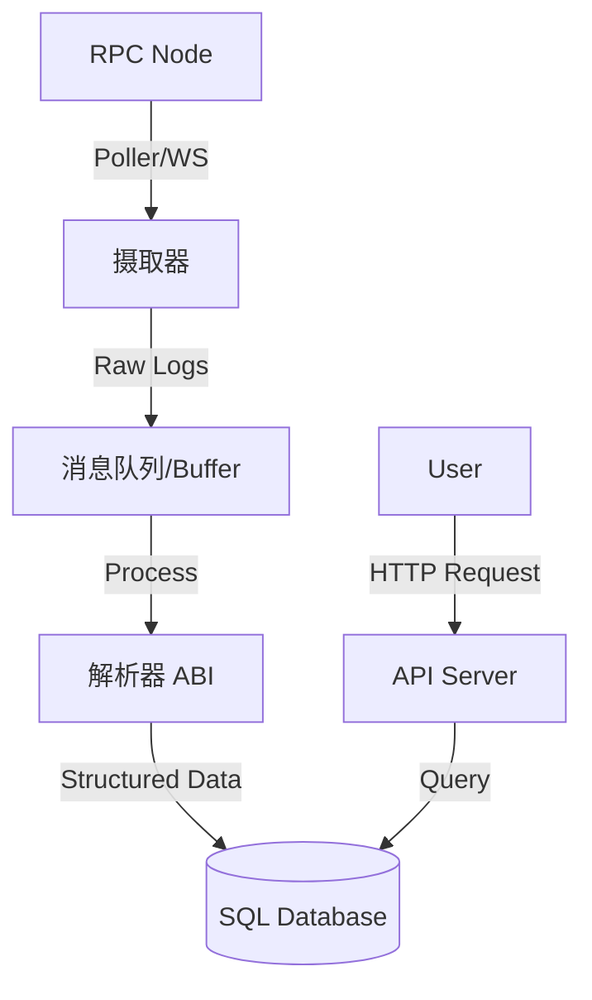

# Day 18: 高性能事件监听与 Custom Indexer (Part 1)

> **学习时间**：4-6 小时（理论 2h + 实战 3h + 复习 1h）
>
> **核心目标**：理解为什么生产环境需要 Custom Indexer，掌握区块扫描（Scanning）、链重组（Reorg）处理的核心算法。

---

## 🎯 今日学习目标

- [ ] 理解 `eth_getLogs` 的性能瓶颈与限制
- [ ] 掌握 Polling（轮询）vs Websocket 的优缺点
- [ ] **核心难点**：深入理解 Chain Reorganization (Reorg) 及其对索引的影响
- [ ] 设计一个支持断点续传与 Reorg 恢复的 Indexer 架构
- [ ] 设计存储 Event 的数据库 Schema

---

## 📚 理论课：构建生产级 Indexer

### 1. 为什么要自己写 Indexer？

对于简单的 dApp，前端直连 RPC (`eth_getLogs`) 可能够用。但对于复杂业务，存在严重瓶颈：

| 问题           | 描述                                                                  | 解决方案                                 |
| :------------- | :-------------------------------------------------------------------- | :--------------------------------------- |
| **查询速度慢** | RPC 节点需遍历底层数据库，查询历史日志通常耗时数秒。                  | 将数据同步到 SQL/Redis，实现毫秒级查询。 |
| **RPC 限制**   | Infura/Alchemy 限制 `blockRange` (如 1000) 和 `responseSize`。        | 增量同步，本地积累全量数据。             |
| **数据聚合**   | 难以在链上做 `JOIN`、排序、复杂过滤（如"查询某用户过去30天交易额"）。 | SQL 擅长此类复杂 AP 查询。               |
| **数据安全性** | 链上状态可能回滚 (Reorg)，前端可能显示错误状态。                      | 后端处理 Reorg，提供 Finalized 数据。    |
| **通知推送**   | 需要监听特定事件并发邮件/短信。                                       | Indexer 实时捕获并触发 Webhook。         |

### 2. 核心架构设计

一个标准的 EVM Indexer 包含以下组件：



### 3. 处理 Chain Reorg (链重组)

这是 Indexer 最棘手的部分。

**什么是 Reorg？**
区块链在达成最终一致性前，可能会发生分叉。节点 A 认为最新区块是 X，节点 B 认为是 Y。最终最长链胜出，另一条链上的交易被丢弃（回滚）。

**处理策略**：

1.  **延迟确认 (Lagging)**:
    - 只索引 N 个区块之前的块（如 Ethereum 等待 12-64 块，Polygon 等待 100+ 块）。
    - **优点**：简单，几乎碰不到 Reorg。
    - **缺点**：实时性差，用户体验不好。

2.  **乐观索引 + 回滚 (Optimistic + Revert)**:
    - 实时索引最新块。
    - 记录每个块的 `ParentHash`。
    - 每次处理新块时，检查 `NewBlock.ParentHash == LastIndexedBlock.Hash`。
    - **不匹配**？说明发生了 Reorg。
    - 触发回滚流程：从 DB 中删除分叉链的数据，直到找到公共祖先，然后重新索引新链。

---

## 🛠️ 实战作业

### 作业 1: 数据库设计

本项目我们将索引 `Day13` 的 ERC20 代币转账事件 `Transfer`。

**SQL Schema (PostgreSQL 推荐)**:

```sql
-- 记录同步进度的游标表
CREATE TABLE indexer_cursor (
    id VARCHAR(50) PRIMARY KEY, -- 例如 'erc20_transfer'
    last_block_number BIGINT NOT NULL,
    last_block_hash VARCHAR(66) NOT NULL,
    updated_at TIMESTAMP DEFAULT CURRENT_TIMESTAMP
);

-- 转账事件表
CREATE TABLE transfers (
    id SERIAL PRIMARY KEY,
    tx_hash VARCHAR(66) NOT NULL,
    log_index INT NOT NULL,        -- 同一笔交易中的日志序号
    block_number BIGINT NOT NULL,
    block_hash VARCHAR(66) NOT NULL,
    block_timestamp TIMESTAMP NOT NULL,
    
    from_address VARCHAR(42) NOT NULL, -- 索引
    to_address VARCHAR(42) NOT NULL,   -- 索引
    amount NUMERIC(78, 0) NOT NULL,    -- uint256 最大值
    
    UNIQUE(tx_hash, log_index)     -- 防止重复处理
);

CREATE INDEX idx_transfers_from ON transfers(from_address);
CREATE INDEX idx_transfers_to ON transfers(to_address);
CREATE INDEX idx_transfers_block ON transfers(block_number);
```

### 作业 2: 实现 Reorg 检测器

使用 Go 编写一个模拟 Reorg 检测逻辑。

```go
// reorg.go
package main

import (
	"context"
	"fmt"
	"log"
	"math/big"

	"github.com/ethereum/go-ethereum/common"
	"github.com/ethereum/go-ethereum/core/types"
	"github.com/ethereum/go-ethereum/ethclient"
)

// IndexerState 模拟数据库中的状态
type IndexerState struct {
    LastBlockNumber uint64
    LastBlockHash   common.Hash
}

type ReorgDetector struct {
    client *ethclient.Client
    db     *IndexerState // 模拟 DB
}

func (d *ReorgDetector) CheckForReorg(ctx context.Context, newBlockHeight uint64) (bool, error) {
    // 1. 获取链上最新块的父哈希
    // 注意：我们要比较的是 DB中主要块 与 链上该高度的块 是否一致
    // 或者：DB中存的是 Block N，现在链上 Block N+1 的 Parent 是否等于 DB.Hash
    
    // 简单策略：检查 DB 中 LastBlock 在链上是否仍然是这个 Hash
    
    // 获取链上在该高度的 Header
    onChainHeader, err := d.client.HeaderByNumber(ctx, big.NewInt(int64(d.db.LastBlockNumber)))
    if err != nil {
        return false, err
    }
    
    // 比较 Hash
    if onChainHeader.Hash() != d.db.LastBlockHash {
        fmt.Printf("⚠️ 检测到 Reorg! \nDB Hash: %s\nChain Hash: %s\n", 
            d.db.LastBlockHash.Hex(), onChainHeader.Hash().Hex())
        return true, nil
    }
    
    return false, nil
}

// HandleReorg 回滚逻辑
func (d *ReorgDetector) HandleReorg(ctx context.Context) error {
    // 1. 回溯寻找公共祖先 (Common Ancestor)
    // 简单做法：一步步倒退，直到 Hash 匹配
    
    currentHeight := d.db.LastBlockNumber
    
    for {
        // 假设我们有历史数据函数 GetStoredBlock(height)
        // Check if storedHash == chainHash(height)
        
        fmt.Printf("正在回滚区块 %d...\n", currentHeight)
        // Delete data from DB where block = currentHeight
        
        currentHeight--
        
        // 检查上一块
        onChainHeader, _ := d.client.HeaderByNumber(ctx, big.NewInt(int64(currentHeight)))
        // storedHash := GetStoredHash(currentHeight)
        
        // if onChainHeader.Hash() == storedHash { break }
        
        if currentHeight == 0 { break } // 安全网
        break // Demo 仅演示逻辑
    }
    
    fmt.Println("✅ Reorg 处理完成，已回滚到安全高度")
    return nil
}
```

### 作业 3: 编写 Polling 循环 (核心作业)

实现一个鲁棒的轮询循环。

```go
// worker.go
package main

import (
	"context"
	"fmt"
	"log"
	"math/big"
	"time"

	"github.com/ethereum/go-ethereum"
	"github.com/ethereum/go-ethereum/common"
	"github.com/ethereum/go-ethereum/ethclient"
)

const (
    BatchSize = 100 // 每次请求多少个块
    PollInterval = 3 * time.Second
)

func StartWorker(client *ethclient.Client, contractAddr common.Address) {
    // 1. 从 DB 读取起始高度 (假设为 0 或上次结束位置)
    currentBlock := uint64(1000000) 
    
    for {
        ctx := context.Background()
        
        // 2. 获取链上最新高度
        tipHeight, err := client.BlockNumber(ctx)
        if err != nil {
            log.Printf("RPC 错误: %v, 重试中...", err)
            time.Sleep(PollInterval)
            continue
        }
        
        // 3. 如果追上了最新块，等待
        if currentBlock > tipHeight {
            time.Sleep(PollInterval)
            continue
        }
        
        // 4. 计算本次同步范围
        endBlock := currentBlock + BatchSize
        if endBlock > tipHeight {
            endBlock = tipHeight
        }
        
        fmt.Printf("正在同步: %d -> %d\n", currentBlock, endBlock)
        
        // 5. 过滤日志
        query := ethereum.FilterQuery{
            FromBlock: big.NewInt(int64(currentBlock)),
            ToBlock:   big.NewInt(int64(endBlock)),
            Addresses: []common.Address{contractAddr},
        }
        
        logs, err := client.FilterLogs(ctx, query)
        if err != nil {
            log.Printf("获取日志失败: %v", err)
            // 可能是 block range 太大，Backoff 策略...
            time.Sleep(1 * time.Second)
            continue
        }
        
        // 6. 处理日志 (解析 + 存库)
        for _, vLog := range logs {
            // 这里应该调用解析逻辑
            // 并在一个 DB Transaction 中保存
            fmt.Printf("捕获事件: Tx %s, Index %d\n", vLog.TxHash.Hex(), vLog.Index)
        }
        
        // 7. 更新游标
        currentBlock = endBlock + 1
    }
}
```

---

## 📝 知识点总结

### 1. Polling vs WebSocket
- **WebSocket**: 实时性高，但连接容易断开，需要复杂的心跳和重连机制。可能会丢失断线期间的数据。
- **Polling (推荐)**: 简单可靠。通过记录 `cursor`，即使服务挂了重启，也能严格接着上次的位置继续，**不丢数据**。生产环境通常使用 Polling 为主，WebSocket 为辅（仅用于前端实时更新）。

### 2. 幂等性 (Idempotency)
- Indexer 必须是幂等的。
- 可能会重复处理同一个块（例如程序崩溃未保存 cursor）。
- **SQL 约束**: `UNIQUE(tx_hash, log_index)` 保证即使重复处理日志，数据库也不会有重复记录。

---

## ✅ 今日检查清单

- [ ] 设计了合理的 `transfers` 和 `cursor` 数据库表结构
- [ ] 理解了 Reorg 检测原理（对比 Hash）
- [ ] 编写了一个基于 Polling 的同步循环框架
- [ ] 能够处理 `FilterLogs` 的基础错误

---

## 📌 明日预告

**Day 19: 高性能事件监听与 Custom Indexer (Part 2)**
- 编写 ABI 解析器 (使用 `abigen`)
- 完整的 Docker 部署 (Postgres + Go App)
- 性能优化：并发 Fetching
- API 接口开发
