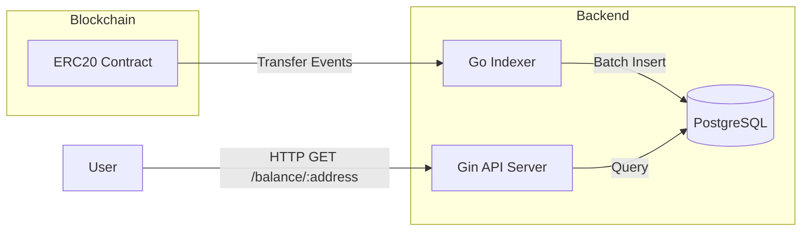

# Day 20: Week 3 整合与 Mini Project 设计

> **学习时间**：4-5 小时（设计 2h + 开发基础架构 3h）
>
> **核心目标**：设计并搭建 **链上资产追踪器 (Portfolio Tracker)** 的核心架构，完成合约部署与 Indexer 基础功能。

---

## 🎯 今日目标

- [ ] 设计 Mini Project 系统架构
- [ ] 回顾并整合 Week 3 核心知识点
- [ ] 部署 ERC-20 测试代币到 Anvil
- [ ] 生成 Go Binding 并编写部署脚本
- [ ] 搭建 Indexer 骨架代码

---

## 📐 项目设计

### 1. 项目概述

构建一个 "Mini Portfolio Tracker"，能够：
1.  追踪指定钱包地址持有的 ERC-20 代币余额。
2.  实时索引 `Transfer` 事件到数据库。
3.  提供 REST API 供前端查询。

### 2. 系统架构



### 3. Week 3 知识回顾

| Day  | 主题                       | 本项目应用                |
| :--- | :------------------------- | :------------------------ |
| 15   | Solidity ABI/Storage/Proxy | 理解 ABI 编码             |
| 16   | Abigen Go 绑定             | 生成 Token 合约 Go 客户端 |
| 17   | Go + Anvil E2E 测试        | 编写集成测试              |
| 18   | Indexer 架构与 Reorg       | 设计 Cursor 表            |
| 19   | ABI 解析与 Docker 部署     | 解析 Transfer Event       |

---

## 🛠️ 实战任务

### Part 1: 项目初始化

```bash
mkdir -p portfolio-tracker/{cmd/indexer,cmd/api,contracts,token,test,migrations}
cd portfolio-tracker
go mod init portfolio

# 安装依赖
go get github.com/ethereum/go-ethereum
go get github.com/gin-gonic/gin
go get github.com/lib/pq
```

### Part 2: 合约与 Binding

#### 2.1 使用 ERC-20 合约

复用 Day 13 的 `MyToken.sol` 或创建新合约：

```solidity
// contracts/MyToken.sol
// SPDX-License-Identifier: MIT
pragma solidity ^0.8.20;

import "@openzeppelin/contracts/token/ERC20/ERC20.sol";

contract MyToken is ERC20 {
    constructor(uint256 initialSupply) ERC20("MyToken", "MTK") {
        _mint(msg.sender, initialSupply);
    }
}
```

#### 2.2 生成 Go Binding

```bash
# 编译合约
cd contracts && forge build

# 生成 binding
abigen --abi out/MyToken.sol/MyToken.abi.json \
       --bin out/MyToken.sol/MyToken.bin \
       --pkg token \
       --out ../token/MyToken.go
```

### Part 3: 数据库设计

创建 `migrations/001_init.sql`:

```sql
-- 记录同步进度
CREATE TABLE indexer_cursor (
    id VARCHAR(50) PRIMARY KEY,
    last_block BIGINT NOT NULL,
    last_hash VARCHAR(66) NOT NULL,
    updated_at TIMESTAMP DEFAULT NOW()
);

-- 转账事件
CREATE TABLE transfers (
    id SERIAL PRIMARY KEY,
    tx_hash VARCHAR(66) NOT NULL,
    log_index INT NOT NULL,
    block_number BIGINT NOT NULL,
    block_hash VARCHAR(66) NOT NULL,
    from_address VARCHAR(42) NOT NULL,
    to_address VARCHAR(42) NOT NULL,
    amount NUMERIC(78, 0) NOT NULL,
    created_at TIMESTAMP DEFAULT NOW(),
    UNIQUE(tx_hash, log_index)
);

CREATE INDEX idx_transfers_from ON transfers(from_address);
CREATE INDEX idx_transfers_to ON transfers(to_address);
```

### Part 4: Indexer 骨架

创建 `cmd/indexer/main.go`:

```go
package main

import (
	"context"
	"database/sql"
	"log"
	"math/big"
	"os"
	"time"

	"github.com/ethereum/go-ethereum"
	"github.com/ethereum/go-ethereum/common"
	"github.com/ethereum/go-ethereum/ethclient"
	_ "github.com/lib/pq"
)

const BatchSize = 1000
const PollInterval = 3 * time.Second

func main() {
    rpcURL := os.Getenv("RPC_URL")
    dbDSN := os.Getenv("DB_DSN")
    tokenAddr := common.HexToAddress(os.Getenv("TOKEN_ADDRESS"))

    client, err := ethclient.Dial(rpcURL)
    if err != nil {
        log.Fatal(err)
    }

    db, err := sql.Open("postgres", dbDSN)
    if err != nil {
        log.Fatal(err)
    }
    defer db.Close()

    // 读取上次同步位置
    var lastBlock uint64 = 0
    db.QueryRow("SELECT last_block FROM indexer_cursor WHERE id = 'transfer'").Scan(&lastBlock)

    log.Printf("Starting indexer from block %d", lastBlock)

    for {
        ctx := context.Background()
        
        tipHeight, err := client.BlockNumber(ctx)
        if err != nil {
            log.Printf("Failed to get block number: %v", err)
            time.Sleep(PollInterval)
            continue
        }

        if lastBlock >= tipHeight {
            time.Sleep(PollInterval)
            continue
        }

        endBlock := lastBlock + BatchSize
        if endBlock > tipHeight {
            endBlock = tipHeight
        }

        log.Printf("Syncing blocks %d -> %d", lastBlock+1, endBlock)

        query := ethereum.FilterQuery{
            FromBlock: big.NewInt(int64(lastBlock + 1)),
            ToBlock:   big.NewInt(int64(endBlock)),
            Addresses: []common.Address{tokenAddr},
        }

        logs, err := client.FilterLogs(ctx, query)
        if err != nil {
            log.Printf("FilterLogs failed: %v", err)
            time.Sleep(5 * time.Second)
            continue
        }

        // 处理日志 (明天完成)
        log.Printf("Found %d logs", len(logs))

        lastBlock = endBlock
    }
}
```

---

## ✅ 今日检查清单

- [ ] 项目目录结构已创建
- [ ] ERC-20 合约已编译
- [ ] Go Binding 已生成
- [ ] 数据库 Schema 已设计
- [ ] Indexer 骨架代码已编写（可运行但未解析日志）

---

## 📌 明日预告

**Day 21: Mini Project 完成与部署**
- 实现 Transfer 事件解析
- 完成 API 服务
- 编写 E2E 测试
- Docker Compose 部署
