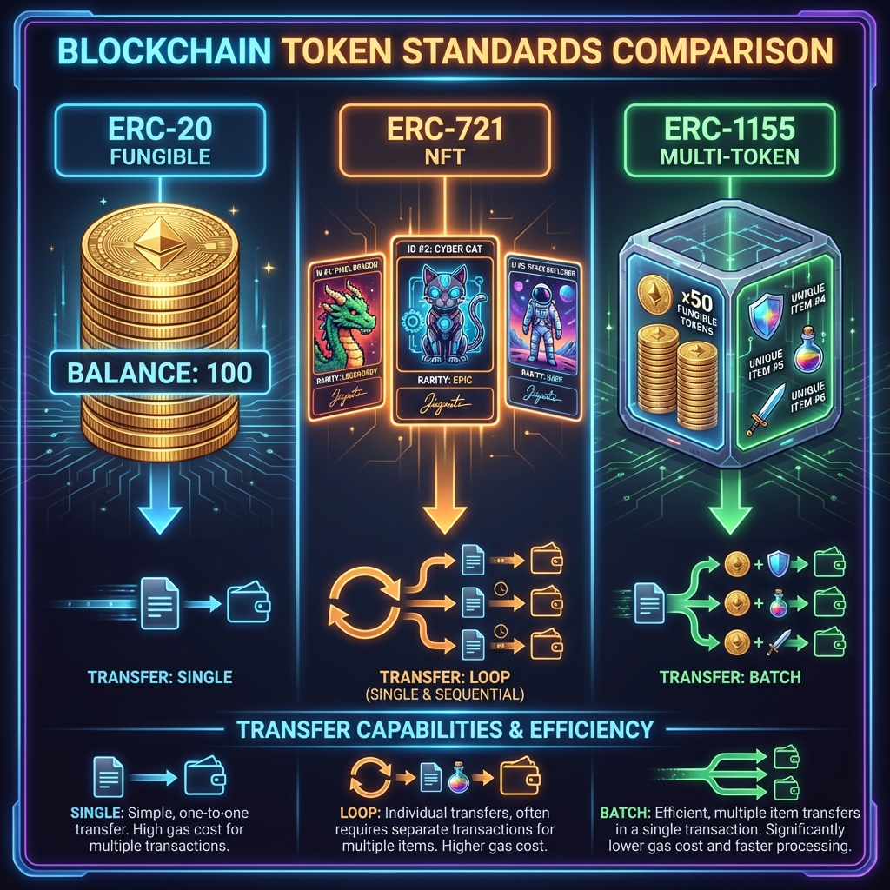
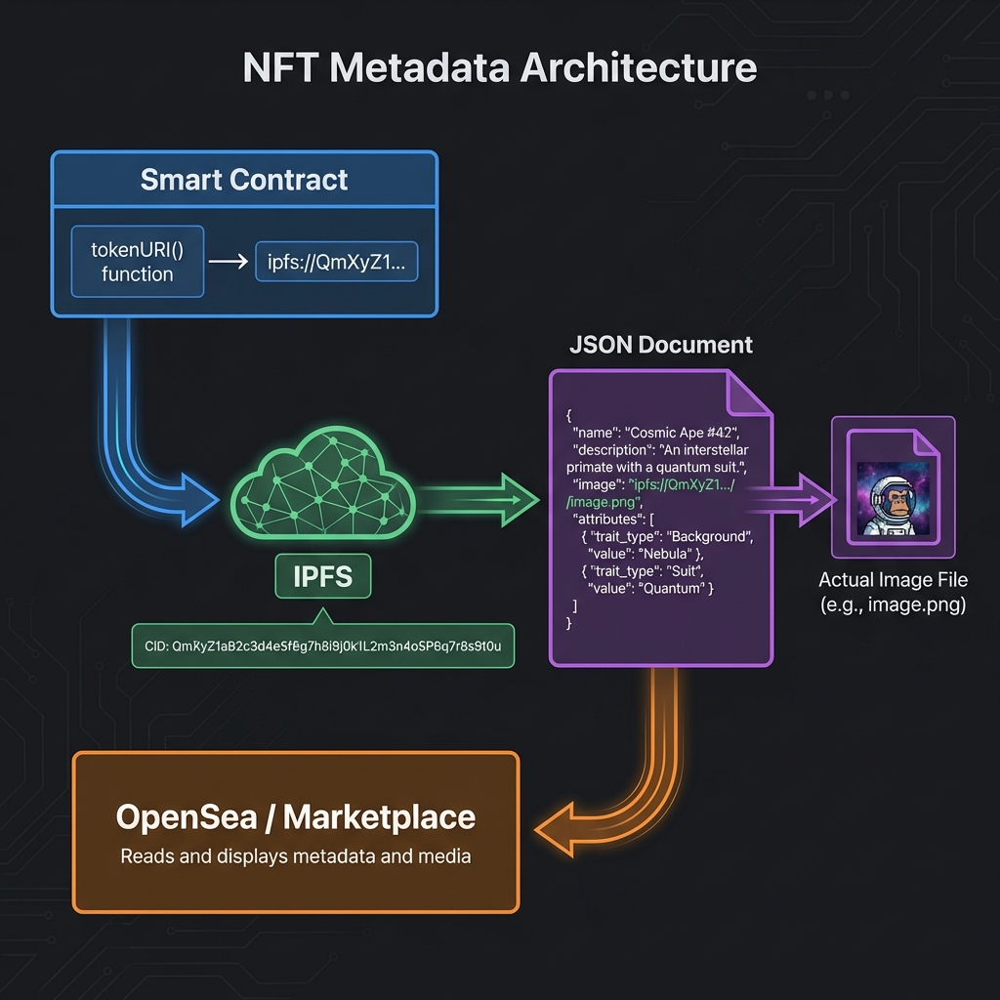
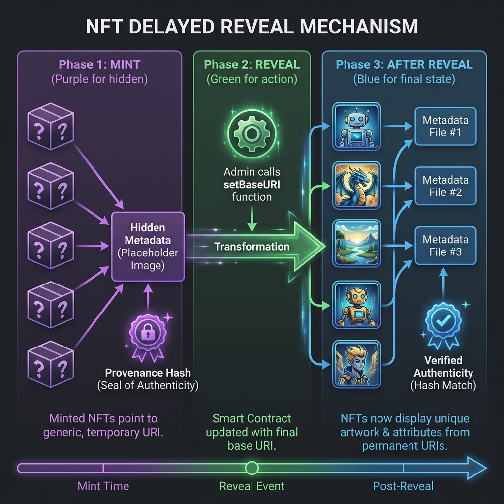
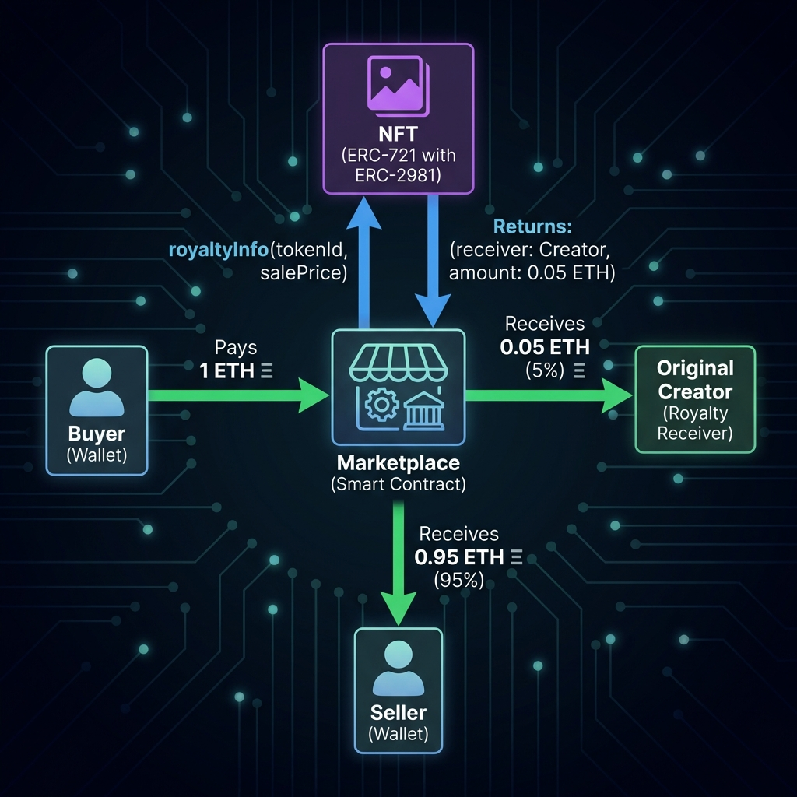

# Day 22: NFT 标准详解 —— ERC-721 与 ERC-1155

> **学习时间**：6-8 小时（理论 2h + 实战 5h + 复习 1h）
> 
> **核心目标**：掌握 NFT 核心标准，实现带有白名单、延迟开图和版税功能的高级 NFT 合约，并部署到测试网验证。

---

## 🎯 今日学习目标

- [ ] 理解 **ERC-721** (非同质化) 与 **ERC-1155** (半同质化) 的完整接口
- [ ] 掌握 **Metadata** 标准 (OpenSea 格式) 与链下存储方案 (IPFS/Pinata)
- [ ] 实现 **Merkle Tree Whitelist** (节省 Gas 的白名单机制)
- [ ] 实现 **Delayed Reveal** (延迟开图/盲盒) 机制
- [ ] 实现 **EIP-2981** NFT 版税标准
- [ ] 理解 NFT 合约的 **安全漏洞与防护**
- [ ] 使用 Foundry 进行全链路测试并部署测试网

---

## 📚 理论课

### 1. Token 标准对比

#### 1.1 ERC-20 vs ERC-721 vs ERC-1155



| 特性         | ERC-20 (同质化)          | ERC-721 (非同质化)       | ERC-1155 (多重代币)            |
| :----------- | :----------------------- | :----------------------- | :----------------------------- |
| **最小单位** | 可分割 (10^18)           | 不可分割 (1)             | 可配置                         |
| **ID 机制**  | 无 ID (只有余额)         | 每个 Token 唯一 ID       | ID 代表一类资产                |
| **批量传输** | 不支持 (需多次 Transfer) | 不支持 (需循环)          | 支持 (`safeBatchTransferFrom`) |
| **Gas 效率** | 中                       | 低 (每个 Token 独立存储) | 高 (单合约管理多资产)          |
| **应用场景** | 货币, 股份, 积分         | 艺术品, 房产证, 域名     | 游戏道具, 票务, 混合资产       |

> **ERC-1155 的优势**：
> 在游戏场景中，你可能需要 1 把屠龙刀 (NFT) 和 100 瓶红药水 (FT)。使用 ERC-1155，可以在同一个合约、同一笔交易中同时发送这两类资产，极大地节省 Gas。

#### 1.2 ERC-721 完整接口

**核心接口 (IERC721)**:
```solidity
interface IERC721 {
    // 查询
    function balanceOf(address owner) external view returns (uint256 balance);
    function ownerOf(uint256 tokenId) external view returns (address owner);
    
    // 转账
    function transferFrom(address from, address to, uint256 tokenId) external;
    function safeTransferFrom(address from, address to, uint256 tokenId) external;
    function safeTransferFrom(address from, address to, uint256 tokenId, bytes calldata data) external;
    
    // 授权
    function approve(address to, uint256 tokenId) external;
    function getApproved(uint256 tokenId) external view returns (address operator);
    function setApprovalForAll(address operator, bool _approved) external;
    function isApprovedForAll(address owner, address operator) external view returns (bool);
    
    // 事件
    event Transfer(address indexed from, address indexed to, uint256 indexed tokenId);
    event Approval(address indexed owner, address indexed approved, uint256 indexed tokenId);
    event ApprovalForAll(address indexed owner, address indexed operator, bool approved);
}
```

**Metadata 扩展 (IERC721Metadata)**:
```solidity
interface IERC721Metadata is IERC721 {
    function name() external view returns (string memory);
    function symbol() external view returns (string memory);
    function tokenURI(uint256 tokenId) external view returns (string memory); // 核心
}
```

**枚举扩展 (IERC721Enumerable)**:
```solidity
interface IERC721Enumerable is IERC721 {
    function totalSupply() external view returns (uint256);
    function tokenOfOwnerByIndex(address owner, uint256 index) external view returns (uint256);
    function tokenByIndex(uint256 index) external view returns (uint256);
}
```

> ⚠️ **注意**: `IERC721Enumerable` 会显著增加 Gas 成本，ERC721A 通过不同的数据结构优化了这一点。

---

#### 1.3 ERC-1155 完整接口

```solidity
interface IERC1155 {
    // 批量查询
    function balanceOf(address account, uint256 id) external view returns (uint256);
    function balanceOfBatch(address[] calldata accounts, uint256[] calldata ids) 
        external view returns (uint256[] memory);
    
    // 批量转账
    function safeTransferFrom(address from, address to, uint256 id, uint256 amount, bytes calldata data) external;
    function safeBatchTransferFrom(
        address from, address to, 
        uint256[] calldata ids, uint256[] calldata amounts, 
        bytes calldata data
    ) external;
    
    // 授权 (只有全局授权，没有单 Token 授权)
    function setApprovalForAll(address operator, bool approved) external;
    function isApprovedForAll(address account, address operator) external view returns (bool);
    
    // 事件
    event TransferSingle(address indexed operator, address indexed from, address indexed to, uint256 id, uint256 value);
    event TransferBatch(address indexed operator, address indexed from, address indexed to, uint256[] ids, uint256[] values);
    event URI(string value, uint256 indexed id);
}
```

**ERC-1155 URI 规范**:
```solidity
// 使用 {id} 占位符，客户端替换为实际 ID (16 进制, 64 位填充)
// 例如: "https://api.example.com/metadata/{id}.json"
// Token ID 5 -> "https://api.example.com/metadata/0000000000000000000000000000000000000000000000000000000000000005.json"
function uri(uint256 id) external view returns (string memory);
```

---

### 2. Metadata 与 存储方案

区块链存储极其昂贵，因此 NFT 的媒体数据（图片、视频）通常存储在链下，链上只保存一个指向元数据的链接 (`tokenURI`)。



#### 2.1 Metadata JSON 标准 (OpenSea 兼容)

```json
{
  "name": "GalaxyPass #1",
  "description": "A unique pass to the Galaxy DAO community.",
  "image": "ipfs://QmXxxx.../1.png",
  "external_url": "https://galaxypass.io/token/1",
  "animation_url": "ipfs://QmYyyy.../1.mp4",
  "background_color": "1a1a2e",
  "attributes": [
    { "trait_type": "Background", "value": "Cosmic Blue" },
    { "trait_type": "Rarity", "value": "Legendary" },
    { "display_type": "number", "trait_type": "Generation", "value": 1 },
    { "display_type": "boost_percentage", "trait_type": "Power Boost", "value": 25 }
  ]
}
```

**OpenSea 支持的 `display_type`**:
| Type               | 描述          | 示例                   |
| ------------------ | ------------- | ---------------------- |
| (无)               | 普通文本属性  | `"value": "Blue"`      |
| `number`           | 数字属性      | `"value": 42`          |
| `boost_number`     | 带 +/- 的数字 | `"value": 10` → "+10"  |
| `boost_percentage` | 百分比加成    | `"value": 25` → "+25%" |
| `date`             | Unix 时间戳   | `"value": 1609459200`  |

#### 2.2 存储方案对比

| 方案            | 描述                             | 优点                              | 缺点                              | 适用性            |
| :-------------- | :------------------------------- | :-------------------------------- | :-------------------------------- | :---------------- |
| **HTTP Server** | 将图片存在 AWS S3 等中心化服务器 | 速度快，易修改                    | **中心化**，服务器倒闭则 NFT 消失 | 传统企业项目      |
| **IPFS**        | 内容寻址的分布式文件系统         | **去中心化**，不可篡改 (CID 固定) | 需要节点长期钉存 (Pinning)        | **Web3 主流方案** |
| **Arweave**     | 永久存储网络                     | 一次付费，永久存储                | 技术栈较新                        | 高价值艺术品      |
| **On-Chain**    | SVG 代码直接写入合约             | 永久存在链上，无需依赖外部        | Gas 极高，只能存简单的矢量图      | Loot, CryptoPunks |

#### 2.3 使用 Pinata 上传到 IPFS

```bash
# 1. 注册 Pinata (https://app.pinata.cloud/)
# 2. 获取 API Key

# 3. 上传文件夹
curl -X POST "https://api.pinata.cloud/pinning/pinFileToIPFS" \
  -H "pinata_api_key: YOUR_API_KEY" \
  -H "pinata_secret_api_key: YOUR_SECRET_KEY" \
  -F "file=@./images/1.png"

# 返回:
# { "IpfsHash": "QmXxxx...", "PinSize": 12345 }
```

---

### 3. 高级机制

#### 3.1 Merkle Tree Whitelist

传统白名单通常使用 `mapping(address => bool)`，这需要管理员花费大量 Gas 将成千上万个地址写入链上。


**Merkle Tree 方案**：
1. **链下**：构建包含所有白名单地址的 Merkle Tree，计算出 **Merkle Root**。
2. **链上**：只存储一个 `bytes32 merkleRoot`。
3. **验证**：用户根据自己的地址和 Proof（路径哈希），在合约中验证 `MerkleProof.verify(proof, root, leaf)`。

**优势**：无论白名单有多少人，链上存储成本恒定为 1 个 Hash。

**Merkle Tree 生成脚本 (TypeScript)**:
```typescript
// scripts/generateMerkle.ts
import { MerkleTree } from "merkletreejs";
import keccak256 from "keccak256";
import fs from "fs";

// 白名单地址
const whitelist = [
  "0x1234567890abcdef1234567890abcdef12345678",
  "0xabcdefabcdefabcdefabcdefabcdefabcdefabcd",
  // ... 更多地址
];

// 生成叶子节点 (对每个地址进行 keccak256 哈希)
const leaves = whitelist.map((addr) => keccak256(addr));

// 构建 Merkle Tree
const tree = new MerkleTree(leaves, keccak256, { sortPairs: true });

// 获取 Root
const root = tree.getHexRoot();
console.log("Merkle Root:", root);

// 为每个地址生成 Proof
const proofs: Record<string, string[]> = {};
whitelist.forEach((addr) => {
  const leaf = keccak256(addr);
  proofs[addr] = tree.getHexProof(leaf);
});

// 保存到文件
fs.writeFileSync(
  "./merkle-output.json",
  JSON.stringify({ root, proofs }, null, 2)
);
console.log("Saved to merkle-output.json");
```

#### 3.2 Delayed Reveal (延迟开图)

为了制造"盲盒"体验并防止稀有款被内幕人士提前 mint 走：



1. **Mint 阶段**：所有 NFT 的 `tokenURI` 指向同一个 "Hidden Image" (比如一个问号)。
2. **Reveal 阶段**：管理员调用 `setBaseURI` 将链接更新为真实的 Metadata 目录。
3. **Provenance Hash**：(可选但推荐) 在 mint 之前公布最终图片的 Hash 集合，证明图片未被篡改。

```solidity
// Provenance Hash 示例
bytes32 public provenanceHash;

// 在 Mint 开始前设置 (不可更改)
function setProvenanceHash(bytes32 _hash) external onlyOwner {
    require(provenanceHash == bytes32(0), "Already set");
    provenanceHash = _hash;
}
```

#### 3.3 EIP-2981 NFT 版税标准



```solidity
import "@openzeppelin/contracts/token/common/ERC2981.sol";

contract GalaxyPass is ERC721A, ERC2981, Ownable {
    constructor() {
        // 设置默认版税: 接收地址, 比例 (500 = 5%)
        _setDefaultRoyalty(msg.sender, 500); 
    }
    
    // 支持 ERC-165 接口检测
    function supportsInterface(bytes4 interfaceId)
        public view virtual override(ERC721A, ERC2981)
        returns (bool)
    {
        return super.supportsInterface(interfaceId);
    }
    
    // 可选: 为单个 Token 设置不同版税
    function setTokenRoyalty(uint256 tokenId, address receiver, uint96 feeNumerator) 
        external onlyOwner 
    {
        _setTokenRoyalty(tokenId, receiver, feeNumerator);
    }
}
```

---

### 4. NFT 合约安全

#### 4.1 常见漏洞

| 漏洞          | 描述                                       | 防护                           |
| ------------- | ------------------------------------------ | ------------------------------ |
| **Mint 重入** | 恶意合约在 `_safeMint` 回调中重新调用 mint | 使用 `ReentrancyGuard`         |
| **整数溢出**  | 旧版本 Solidity 无溢出检查                 | Solidity 0.8+ 自动检查         |
| **IPFS 替换** | CID 指向的内容被替换                       | 使用 Arweave 或链上 Hash 验证  |
| **授权钓鱼**  | 用户被诱导 `setApprovalForAll` 给恶意合约  | 前端警告 + 合约检查            |
| **Rug Pull**  | Owner 可任意修改关键参数                   | 使用 Timelock 或放弃 Ownership |

#### 4.2 安全最佳实践

```solidity
import "@openzeppelin/contracts/security/ReentrancyGuard.sol";
import "@openzeppelin/contracts/security/Pausable.sol";

contract SecureNFT is ERC721A, Ownable, ReentrancyGuard, Pausable {
    // Mint 函数添加 nonReentrant
    function publicMint(uint256 qty) external payable nonReentrant whenNotPaused {
        // ...
    }
    
    // 紧急暂停
    function pause() external onlyOwner { _pause(); }
    function unpause() external onlyOwner { _unpause(); }
    
    // 放弃关键权限 (不可逆!)
    function lockBaseURI() external onlyOwner {
        renounceOwnership();
    }
}
```

---

## 🛠️ 实战：构建高级 NFT 合约

我们将开发一个名为 `GalaxyPass` 的 NFT 系列，包含以下功能：
1. **ERC-721A 优化** (批量 Mint 省 Gas)
2. **Merkle Whitelist** (白名单预售)
3. **Public Sale** (公开销售)
4. **Delayed Reveal** (盲盒开图)
5. **ERC-2981 版税** (5%)
6. **安全防护** (ReentrancyGuard)
7. **Withdraw** (资金提取)

### 1. 项目初始化

```bash
mkdir -p ~/blockchain-course/week4/day22_nft
cd ~/blockchain-course/week4/day22_nft
forge init --no-commit

# 安装依赖
forge install chiru-labs/ERC721A --no-commit
forge install OpenZeppelin/openzeppelin-contracts --no-commit

# 创建 remappings.txt
cat > remappings.txt << 'EOF'
@openzeppelin/=lib/openzeppelin-contracts/
erc721a/=lib/ERC721A/contracts/
EOF
```

### 2. 完整合约 `src/GalaxyPass.sol`

```solidity
// SPDX-License-Identifier: MIT
pragma solidity ^0.8.20;

import "erc721a/ERC721A.sol";
import "@openzeppelin/contracts/access/Ownable.sol";
import "@openzeppelin/contracts/security/ReentrancyGuard.sol";
import "@openzeppelin/contracts/utils/cryptography/MerkleProof.sol";
import "@openzeppelin/contracts/utils/Strings.sol";
import "@openzeppelin/contracts/token/common/ERC2981.sol";

contract GalaxyPass is ERC721A, ERC2981, Ownable, ReentrancyGuard {
    using Strings for uint256;

    // ============ 错误定义 ============
    error SaleNotActive();
    error MaxSupplyExceeded();
    error InsufficientFunds();
    error InvalidProof();
    error MaxPerWalletExceeded();
    error WithdrawFailed();

    // ============ 常量 ============
    uint256 public constant MAX_SUPPLY = 1000;
    uint256 public constant MINT_PRICE = 0.01 ether;
    uint256 public constant WL_PRICE = 0.005 ether;
    uint256 public constant MAX_PER_WALLET = 5;

    // ============ 状态变量 ============
    bytes32 public merkleRoot;
    string public baseURI;
    string public hiddenMetadataUri;
    
    bool public revealed = false;
    bool public publicSaleActive = false;
    bool public whitelistSaleActive = false;
    
    // 每个地址已 mint 数量追踪 (白名单独立计数)
    mapping(address => uint256) public whitelistMinted;

    // ============ 事件 ============
    event Revealed(string newBaseURI);
    event MerkleRootUpdated(bytes32 newRoot);
    event SaleStateChanged(bool publicActive, bool whitelistActive);

    // ============ 构造函数 ============
    constructor(
        string memory _name,
        string memory _symbol,
        string memory _hiddenMetadataUri,
        address _royaltyReceiver
    ) ERC721A(_name, _symbol) Ownable(msg.sender) {
        hiddenMetadataUri = _hiddenMetadataUri;
        // 设置默认版税 5%
        _setDefaultRoyalty(_royaltyReceiver, 500);
    }

    // ============ Mint 功能 ============

    /// @notice 白名单铸造
    function whitelistMint(uint256 quantity, bytes32[] calldata proof) 
        external payable nonReentrant 
    {
        if (!whitelistSaleActive) revert SaleNotActive();
        if (_totalMinted() + quantity > MAX_SUPPLY) revert MaxSupplyExceeded();
        if (msg.value < WL_PRICE * quantity) revert InsufficientFunds();
        if (whitelistMinted[msg.sender] + quantity > MAX_PER_WALLET) revert MaxPerWalletExceeded();

        bytes32 leaf = keccak256(abi.encodePacked(msg.sender));
        if (!MerkleProof.verify(proof, merkleRoot, leaf)) revert InvalidProof();

        whitelistMinted[msg.sender] += quantity;
        _mint(msg.sender, quantity);
    }

    /// @notice 公开铸造
    function publicMint(uint256 quantity) external payable nonReentrant {
        if (!publicSaleActive) revert SaleNotActive();
        if (_totalMinted() + quantity > MAX_SUPPLY) revert MaxSupplyExceeded();
        if (msg.value < MINT_PRICE * quantity) revert InsufficientFunds();
        if (_numberMinted(msg.sender) + quantity > MAX_PER_WALLET) revert MaxPerWalletExceeded();

        _mint(msg.sender, quantity);
    }

    /// @notice Owner 预留铸造 (用于团队/空投)
    function ownerMint(address to, uint256 quantity) external onlyOwner {
        if (_totalMinted() + quantity > MAX_SUPPLY) revert MaxSupplyExceeded();
        _mint(to, quantity);
    }

    // ============ URI 相关 ============

    function _startTokenId() internal pure override returns (uint256) {
        return 1;
    }

    function _baseURI() internal view override returns (string memory) {
        return baseURI;
    }

    function tokenURI(uint256 tokenId) public view override returns (string memory) {
        if (!_exists(tokenId)) revert URIQueryForNonexistentToken();

        if (!revealed) {
            return hiddenMetadataUri;
        }

        return string(abi.encodePacked(baseURI, tokenId.toString(), ".json"));
    }

    // ============ 管理员功能 ============

    function setMerkleRoot(bytes32 _merkleRoot) external onlyOwner {
        merkleRoot = _merkleRoot;
        emit MerkleRootUpdated(_merkleRoot);
    }

    function reveal(string calldata _newBaseURI) external onlyOwner {
        baseURI = _newBaseURI;
        revealed = true;
        emit Revealed(_newBaseURI);
    }

    function setHiddenMetadataUri(string calldata _uri) external onlyOwner {
        hiddenMetadataUri = _uri;
    }

    function togglePublicSale() external onlyOwner {
        publicSaleActive = !publicSaleActive;
        emit SaleStateChanged(publicSaleActive, whitelistSaleActive);
    }

    function toggleWhitelistSale() external onlyOwner {
        whitelistSaleActive = !whitelistSaleActive;
        emit SaleStateChanged(publicSaleActive, whitelistSaleActive);
    }

    function setDefaultRoyalty(address receiver, uint96 feeNumerator) external onlyOwner {
        _setDefaultRoyalty(receiver, feeNumerator);
    }

    function withdraw() external onlyOwner {
        (bool success, ) = payable(owner()).call{value: address(this).balance}("");
        if (!success) revert WithdrawFailed();
    }

    // ============ ERC-165 支持 ============

    function supportsInterface(bytes4 interfaceId)
        public view override(ERC721A, ERC2981)
        returns (bool)
    {
        return ERC721A.supportsInterface(interfaceId) || ERC2981.supportsInterface(interfaceId);
    }
}
```

### 3. 完整测试 `test/GalaxyPass.t.sol`

```solidity
// SPDX-License-Identifier: MIT
pragma solidity ^0.8.20;

import "forge-std/Test.sol";
import "../src/GalaxyPass.sol";

contract GalaxyPassTest is Test {
    GalaxyPass public nft;
    
    address public owner = address(this);
    address public user1 = address(0x1);
    address public user2 = address(0x2);
    address public royaltyReceiver = address(0x999);

    bytes32 public merkleRoot;
    bytes32[] public proof1;

    function setUp() public {
        // 部署合约
        nft = new GalaxyPass(
            "GalaxyPass",
            "GPASS",
            "ipfs://hidden/",
            royaltyReceiver
        );

        // 构建简单的 2 叶子 Merkle Tree
        bytes32 leaf1 = keccak256(abi.encodePacked(user1));
        bytes32 leaf2 = keccak256(abi.encodePacked(user2));
        
        if (leaf1 < leaf2) {
            merkleRoot = keccak256(abi.encodePacked(leaf1, leaf2));
        } else {
            merkleRoot = keccak256(abi.encodePacked(leaf2, leaf1));
        }
        
        proof1 = new bytes32[](1);
        proof1[0] = leaf2;

        nft.setMerkleRoot(merkleRoot);

        // 给用户 ETH
        vm.deal(user1, 10 ether);
        vm.deal(user2, 10 ether);
    }

    function testWhitelistMint() public {
        nft.toggleWhitelistSale();

        vm.prank(user1);
        nft.whitelistMint{value: 0.005 ether}(1, proof1);

        assertEq(nft.balanceOf(user1), 1);
        assertEq(nft.ownerOf(1), user1);
    }

    function testWhitelistMintFailNotInList() public {
        nft.toggleWhitelistSale();

        address notWhitelisted = address(0x99);
        vm.deal(notWhitelisted, 1 ether);

        bytes32[] memory fakeProof = new bytes32[](1);
        fakeProof[0] = bytes32(0);

        vm.prank(notWhitelisted);
        vm.expectRevert(GalaxyPass.InvalidProof.selector);
        nft.whitelistMint{value: 0.005 ether}(1, fakeProof);
    }

    function testPublicMint() public {
        nft.togglePublicSale();

        vm.prank(user1);
        nft.publicMint{value: 0.05 ether}(5);

        assertEq(nft.balanceOf(user1), 5);
    }

    function testMaxPerWalletLimit() public {
        nft.togglePublicSale();

        vm.prank(user1);
        nft.publicMint{value: 0.05 ether}(5);

        vm.prank(user1);
        vm.expectRevert(GalaxyPass.MaxPerWalletExceeded.selector);
        nft.publicMint{value: 0.01 ether}(1);
    }

    function testReveal() public {
        nft.togglePublicSale();

        vm.prank(user1);
        nft.publicMint{value: 0.01 ether}(1);

        // 未开图
        assertEq(nft.tokenURI(1), "ipfs://hidden/");

        // 开图
        nft.reveal("ipfs://real/");

        assertEq(nft.tokenURI(1), "ipfs://real/1.json");
        assertTrue(nft.revealed());
    }

    function testRoyaltyInfo() public {
        nft.togglePublicSale();
        vm.prank(user1);
        nft.publicMint{value: 0.01 ether}(1);

        (address receiver, uint256 amount) = nft.royaltyInfo(1, 10000);
        
        assertEq(receiver, royaltyReceiver);
        assertEq(amount, 500); // 5% of 10000
    }

    function testWithdraw() public {
        nft.togglePublicSale();

        vm.prank(user1);
        nft.publicMint{value: 0.01 ether}(1);

        uint256 balanceBefore = owner.balance;
        nft.withdraw();
        uint256 balanceAfter = owner.balance;

        assertEq(balanceAfter - balanceBefore, 0.01 ether);
    }

    function testOwnerMint() public {
        nft.ownerMint(royaltyReceiver, 10);
        assertEq(nft.balanceOf(royaltyReceiver), 10);
    }
}
```

### 4. 部署脚本 `script/Deploy.s.sol`

```solidity
// SPDX-License-Identifier: MIT
pragma solidity ^0.8.20;

import "forge-std/Script.sol";
import "../src/GalaxyPass.sol";

contract DeployScript is Script {
    function run() external {
        uint256 deployerPrivateKey = vm.envUint("PRIVATE_KEY");
        address royaltyReceiver = vm.envAddress("ROYALTY_RECEIVER");

        vm.startBroadcast(deployerPrivateKey);

        GalaxyPass nft = new GalaxyPass(
            "GalaxyPass",
            "GPASS",
            "ipfs://QmHiddenMetadata/hidden.json",
            royaltyReceiver
        );

        console.log("GalaxyPass deployed to:", address(nft));

        vm.stopBroadcast();
    }
}
```

```bash
# 部署到 Sepolia 测试网
forge script script/Deploy.s.sol:DeployScript \
    --rpc-url $SEPOLIA_RPC_URL \
    --broadcast \
    --verify
```

---

## 📝 课后作业

1. **实现 ERC-1155 版本**：
   - 创建 `GalaxyItems.sol`，支持同时 mint 多种道具
   - 实现 `mintBatch` 函数

2. **添加 Provenance Hash**：
   - 在 mint 开始前锁定最终图片的 Hash
   - 编写验证脚本证明图片未被篡改

3. **集成 Chainlink VRF**：
   - 使用随机数决定 Token 的稀有度
   - 每个 Token 的属性在 mint 时确定

---

## 🔗 参考资料

- [ERC-721A 官方文档](https://www.erc721a.org/)
- [OpenSea Metadata Standards](https://docs.opensea.io/docs/metadata-standards)
- [EIP-2981: NFT Royalty Standard](https://eips.ethereum.org/EIPS/eip-2981)
- [MerkleTree.js](https://github.com/miguelmota/merkletreejs)
