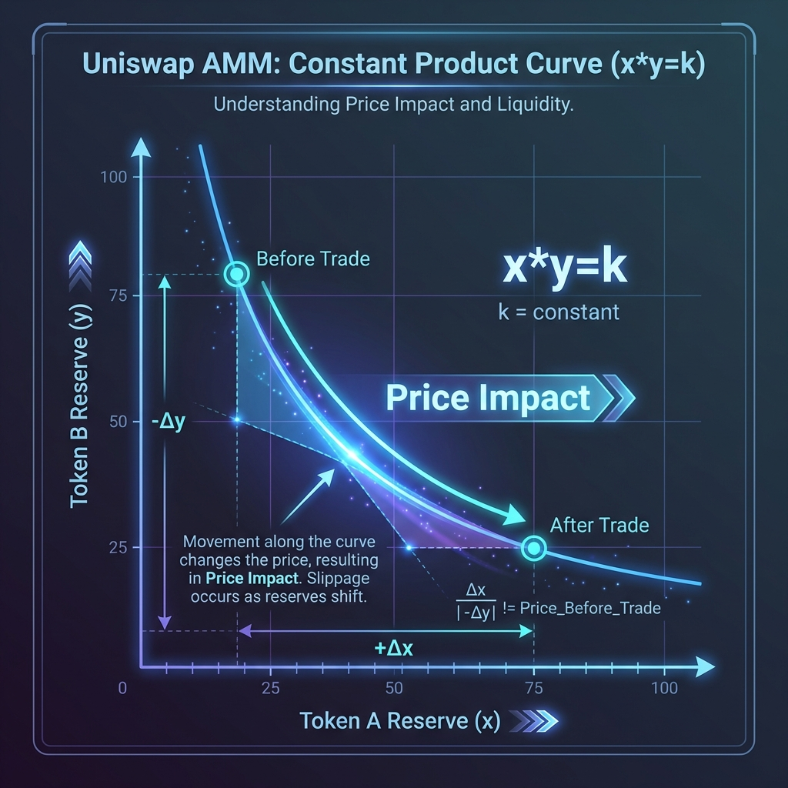
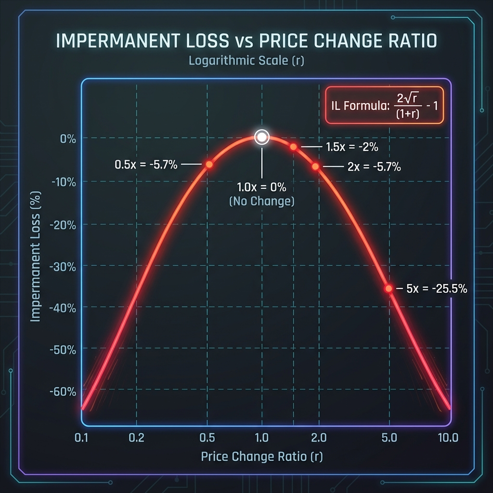
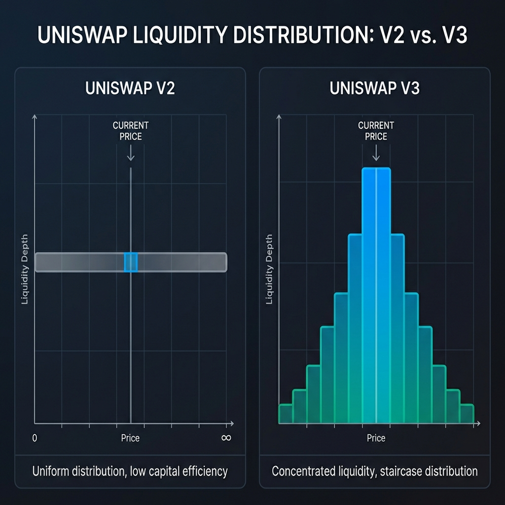

# Day 23: AMM 自动化做市商 —— Uniswap 原理深度解析

> **学习时间**：6-8 小时（理论 3h + 实战 4h + 复习 1h）
> 
> **核心目标**：深入理解 AMM 数学原理 (Constant Product)，掌握无常损失 (Impermanent Loss) 计算，并理解 Uniswap V3 的集中流动性机制与 Tick 数学。

---

## 🎯 今日学习目标

- [ ] 掌握 **Uniswap V2** 的恒定乘积公式 ($x \times y = k$)
- [ ] 理解并能计算 **无常损失 (IL)** 及其对 LP 的影响
- [ ] 掌握 **Uniswap V3** 核心概念：集中流动性、Tick、sqrtPriceX96
- [ ] 理解 **滑点 (Slippage)** 与 **价格影响 (Price Impact)** 的区别
- [ ] 编写 **Go 脚本** 模拟 AMM 交易与滑点计算
- [ ] 编写代码与 **Uniswap V3 Quoter** 交互获取链上报价

---

## 📚 理论课

### 1. 自动做市商 (AMM) 基础

传统的订单簿 (Orderbook) 需要买方和卖方挂单，而在链上由于 Gas 昂贵和速度限制，订单簿模式很难扩展。AMM 通过引入**流动性池 (Liquidity Pool)** 解决了这个问题。

#### 1.1 恒定乘积公式 (Constant Product Formula)

Uniswap V2 的核心公式：
$$ x \times y = k $$



- $x$: Token A 的储备量
- $y$: Token B 的储备量
- $k$: 恒定常数 (在交易过程中保持不变，仅在添加/移除流动性时改变)

**交易推导**：
假设你想用 $\Delta x$ 个 Token A 购买 Token B。
交易后池子应满足：
$$ (x + \Delta x) \times (y - \Delta y) = k $$

推导出能换出的 Token B 数量 $\Delta y$：
$$ \Delta y = y - \frac{k}{x + \Delta x} = \frac{y \times \Delta x}{x + \Delta x} $$

**含手续费的公式 (Uniswap V2 使用 0.3%)**:
$$ \Delta y = \frac{y \times \Delta x \times 997}{x \times 1000 + \Delta x \times 997} $$

> **为什么是 997/1000？**
> 0.3% 手续费意味着实际参与计算的输入只有 99.7%。手续费留在池子里，使 $k$ 值逐渐增加。

#### 1.2 价格计算

AMM 中的"价格"是一个**瞬时概念**：
$$ P = \frac{y}{x} $$

例如：池子有 10 ETH 和 20,000 USDT，则 1 ETH 的价格 = 20,000 / 10 = **2,000 USDT**。

**边际价格 vs 执行价格**：
- **边际价格 (Marginal Price)**：无穷小交易的价格 = $y/x$
- **执行价格 (Execution Price)**：实际交易的平均价格 = $\Delta y / \Delta x$

由于曲线的特性，执行价格总是比边际价格差，这就是**滑点**的来源。

---

### 2. 滑点与价格影响

#### 2.1 滑点 (Slippage) vs 价格影响 (Price Impact)

| 概念         | 定义                         | 原因                          |
| ------------ | ---------------------------- | ----------------------------- |
| **价格影响** | 你的交易对池子价格造成的变化 | 池子深度不足                  |
| **滑点**     | 预期价格与实际成交价格的差异 | 价格影响 + 交易期间的池子变化 |

**价格影响公式**：
$$ \text{Price Impact} = \frac{\Delta x}{x + \Delta x} $$

例如：池子有 10 ETH，你想卖 1 ETH：
$$ \text{Price Impact} = \frac{1}{10 + 1} = 9.09\% $$

#### 2.2 滑点保护 (Slippage Protection)

```solidity
// Uniswap Router 中的典型实现
function swapExactTokensForTokens(
    uint amountIn,
    uint amountOutMin,  // 滑点保护：最少接受的输出
    address[] calldata path,
    address to,
    uint deadline       // 时间保护：超时则回滚
) external returns (uint[] memory amounts);
```

**用户视角的滑点设置**：
- 用户设置容忍滑点 (如 0.5%)
- 前端计算 `amountOutMin = expectedOut * (1 - slippageTolerance)`
- 如果实际输出低于此值，交易回滚

---

### 3. 无常损失 (Impermanent Loss)

#### 3.1 什么是无常损失？

当你提供流动性 (LP) 时，如果两个代币的价格发生相对变化，你的资产总价值会低于"直接持有这两个代币不放入池子"的价值。这种差额就是无常损失。

**直观理解**：
- 价格上涨时，AMM 会自动卖出上涨的资产来维持 $k$ 恒定
- 相当于一个"反向交易"机器人，总是在高点卖出

> **为什么叫"无常"？**
> 如果价格回归到初始比例，损失就会消失。但如果价格一去不回，损失就变成了**永久损失**。

#### 3.2 IL 计算公式

假设价格比率从 $P$ 变为 $P'$，定义 $r = P'/P$，无常损失比率为：

$$ IL = \frac{2\sqrt{r}}{1 + r} - 1 $$



| 价格变化倍数 | 无常损失 |
| ------------ | -------- |
| 1.25x (↑25%) | -0.6%    |
| 1.5x (↑50%)  | -2.0%    |
| 2x (翻倍)    | -5.7%    |
| 3x           | -13.4%   |
| 5x           | -25.5%   |
| 10x          | -42.5%   |
| 0.5x (腰斩)  | -5.7%    |
| 归零         | -100%    |

> **关键洞察**：IL 只与价格变化的**幅度**有关，与方向无关（涨跌对称）。

#### 3.3 IL 与手续费的权衡

LP 的总收益 = **手续费收入** - **无常损失**

如果手续费收入 > IL，则提供流动性是盈利的。这就是为什么：
- 高波动资产的池子需要更高的手续费率
- 稳定币对 (如 USDC/USDT) 可以用低手续费 (0.01%)

---

### 4. Uniswap V3：集中流动性

#### 4.1 V2 的问题

V2 的流动性均匀分布在 $(0, \infty)$ 的价格区间，但：
- 实际交易只发生在当前价格附近
- 大部分资金闲置，资本效率低



#### 4.2 集中流动性 (Concentrated Liquidity)

V3 允许 LP 仅在特定价格区间 $[P_a, P_b]$ 提供流动性。

**核心思想**：
- V2 的 $x \cdot y = k$ 曲线在 $(0, \infty)$ 上分布
- V3 将曲线"压缩"到 $[P_a, P_b]$ 区间
- 用更少的资金达到相同的交易深度

**优势**：
- 在选定区间内，资金利用率可提高 **4000x+**
- LP 可以选择风险/收益偏好

**风险**：
- 如果价格跌出区间，你的流动性变为 100% 的贬值代币
- 不再赚取手续费（需要手动调整位置）

---

#### 4.3 Ticks (价格刻度) —— V3 的基础

> **为什么先学 Tick？** Tick 是 V3 的基石概念，后续的 sqrtPrice、流动性计算都依赖它。

V3 将连续的价格空间离散化为 Tick。每个 Tick $i$ 对应一个价格：
$$ P(i) = 1.0001^i $$

**直观理解**：
- Tick 0 对应价格 1.0
- Tick 1 对应价格 1.0001 (上涨 0.01%)
- Tick -1 对应价格 0.9999 (下跌 0.01%)
- 每跨越一个 Tick，价格变化约 0.01%

**Tick 间距 (Tick Spacing)**：
| Fee Tier | Tick Spacing | 每跨一个可用 Tick 的价格变化 |
| -------- | ------------ | ---------------------------- |
| 0.01%    | 1            | 0.01%                        |
| 0.05%    | 10           | 0.1%                         |
| 0.3%     | 60           | 0.6%                         |
| 1%       | 200          | 2%                           |

**从价格计算 Tick**：
$$ i = \lfloor \log_{1.0001}(P) \rfloor = \lfloor \frac{\ln(P)}{\ln(1.0001)} \rfloor $$

---

#### 4.4 sqrtPriceX96 —— V3 的内部表示

V3 内部使用 $\sqrt{P}$ 而非 $P$，并用 **Q64.96 定点数**格式表示：
$$ \text{sqrtPriceX96} = \sqrt{P} \times 2^{96} $$

**为什么用 sqrt？**
- 避免在计算中出现大数乘法溢出
- 简化 Tick 边界的数学运算
- Swap 公式只需要加减法，不需要乘除法

**Tick 与 sqrtPrice 的关系**：
$$ \sqrt{P(i)} = 1.0001^{i/2} $$

**价格转换代码**：
```python
# sqrtPriceX96 -> 真实价格
def sqrtPriceX96_to_price(sqrtPriceX96, decimals0, decimals1):
    sqrt_price = sqrtPriceX96 / (2 ** 96)
    price = sqrt_price ** 2
    # 调整 decimals
    return price * (10 ** (decimals0 - decimals1))

# 示例: ETH/USDC 池
# sqrtPriceX96 = 1771595571142957166518320255467520
# decimals0 (USDC) = 6, decimals1 (ETH) = 18
# price = ((1.77e33 / 2^96) ^ 2) * 10^(6-18) ≈ 2000 USDC/ETH
```

**从 Tick 计算 sqrtPriceX96**：
```python
import math

def tick_to_sqrtPriceX96(tick):
    sqrt_price = 1.0001 ** (tick / 2)
    return int(sqrt_price * (2 ** 96))

# 示例: Tick = 200000 (约 ETH = 10000 USDC)
tick_to_sqrtPriceX96(200000)  # -> 约 2.5e33
```

---

#### 4.5 流动性与虚拟储备

##### 4.5.1 流动性 L 的定义

V3 使用"虚拟储备"概念。在价格区间 $[P_a, P_b]$ 内，LP 提供的流动性 $L$ 定义为：

$$ L = \sqrt{x \cdot y} $$

其中 $x, y$ 是虚拟储备（不是实际存入的数量）。

##### 4.5.2 实际储备与流动性的关系

给定流动性 $L$ 和价格区间 $[\sqrt{P_a}, \sqrt{P_b}]$，当前价格为 $\sqrt{P}$：

**Token X 的实际数量**：
$$ x = L \cdot \left( \frac{1}{\sqrt{P}} - \frac{1}{\sqrt{P_b}} \right) $$

**Token Y 的实际数量**：
$$ y = L \cdot \left( \sqrt{P} - \sqrt{P_a} \right) $$

> **边界情况**：
> - 当 $P \geq P_b$：Position 全部变成 Token Y，$x = 0$
> - 当 $P \leq P_a$：Position 全部变成 Token X，$y = 0$

---

#### 4.6 Swap 公式

在 V3 中，交换 $\Delta x$ 个 Token X 获得的 Token Y：

$$ \Delta y = L \cdot \left( \sqrt{P_{new}} - \sqrt{P_{old}} \right) $$

其中新价格：
$$ \sqrt{P_{new}} = \sqrt{P_{old}} + \frac{\Delta x}{L} $$

> **注意**：这就是为什么 V3 使用 sqrtPrice —— Swap 只需要简单的加减法！

---

#### 4.7 资本效率

**资本效率比较**：V3 在区间 $[P_a, P_b]$ 的资本效率是 V2 的倍数：

$$ \text{效率倍数} = \frac{1}{1 - \sqrt{P_a / P_b}} $$

| 区间宽度               | 效率倍数 |
| ---------------------- | -------- |
| ±50% (如 1.5x - 0.67x) | ~6.9x    |
| ±20%                   | ~13.4x   |
| ±10%                   | ~25.6x   |
| ±5%                    | ~50x     |
| ±1%                    | ~250x    |

---

#### 4.8 Position Value (头寸价值计算)

给定一个 LP Position：
- 流动性: $L$
- 价格区间: $[P_a, P_b]$
- 当前价格: $P$

**头寸中的资产数量**：

```python
def get_amounts(L, sqrt_P, sqrt_Pa, sqrt_Pb):
    if sqrt_P <= sqrt_Pa:
        # 全部是 Token X
        x = L * (1/sqrt_Pa - 1/sqrt_Pb)
        y = 0
    elif sqrt_P >= sqrt_Pb:
        # 全部是 Token Y
        x = 0
        y = L * (sqrt_Pb - sqrt_Pa)
    else:
        # 在区间内
        x = L * (1/sqrt_P - 1/sqrt_Pb)
        y = L * (sqrt_P - sqrt_Pa)
    return x, y
```

**头寸总价值 (以 Token Y 计价)**：
$$ V = x \cdot P + y = L \cdot \left( 2\sqrt{P} - \sqrt{P_a} - \frac{P}{\sqrt{P_b}} \right) $$

---

#### 4.9 V3 Oracle (TWAP 预言机)

Uniswap V3 内置了一个高效的 **时间加权平均价格 (TWAP)** 预言机，被很多 DeFi 协议用于获取可靠的链上价格。

##### 4.9.1 核心概念

**Tick 累加器**：
V3 在每个区块记录 `tickCumulative`，即 tick 值随时间的累加：
$$ \text{tickCumulative}(t) = \sum_{i=0}^{t} \text{tick}_i \cdot \Delta t_i $$

**计算 TWAP**：
给定两个时间点 $t_1$ 和 $t_2$，TWAP tick 为：
$$ \text{avgTick} = \frac{\text{tickCumulative}(t_2) - \text{tickCumulative}(t_1)}{t_2 - t_1} $$

然后转换为价格：
$$ P_{TWAP} = 1.0001^{\text{avgTick}} $$

##### 4.9.2 为什么用几何平均？

V3 使用 **几何平均数** 而非算术平均数：
- 更难被操纵（操纵成本与时间成正比）
- 对极端值更不敏感
- 在对数空间中计算更高效

##### 4.9.3 累加器的存储技巧

**为什么不直接存储历史价格？**

```
不存储: [P₁, P₂, P₃, P₄, ...] ❌  (需要无限存储空间)
  
而是:   tickCumulative = tick₁×Δt₁ + tick₂×Δt₂ + ... ✅  (单个 int56)
```

**里程表类比**：
- 你不需要记录每公里的位置
- 只需要看"起点里程"和"终点里程"的差值
- 就能算出这段旅程的距离

**Solidity 存储结构**：

```solidity
// V3 Pool 中的 Observation 结构
struct Observation {
    uint32 blockTimestamp;      // 时间戳
    int56 tickCumulative;       // tick 累加器 (核心!)
    uint160 secondsPerLiquidityCumulativeX128;  // 流动性时间累加器
    bool initialized;
}

// 每次交易时更新累加器
function _updateOracle() internal {
    uint32 delta = block.timestamp - lastObservation.timestamp;
    // 累加: 旧值 + (当前tick × 时间间隔)
    tickCumulative += int56(currentTick) * int56(delta);
}
```

##### 4.9.4 环形缓冲区

V3 使用**环形缓冲区 (Ring Buffer)** 存储观测点，默认容量 65535 个（约 9 天）：

```
索引:   [0]    [1]    [2]    ...  [65534]
         ↑                          ↑
       oldest                     newest
       (循环覆盖)
```

- 当缓冲区满时，新数据覆盖最旧的数据
- 任何人可以调用 `increaseObservationCardinalityNext()` 扩容

##### 4.9.5 Solidity 调用示例

```solidity
// 获取过去 10 分钟的 TWAP
function getTWAP(address pool) external view returns (int24 avgTick) {
    uint32[] memory secondsAgos = new uint32[](2);
    secondsAgos[0] = 600;  // 10 分钟前
    secondsAgos[1] = 0;    // 现在
    
    (int56[] memory tickCumulatives, ) = IUniswapV3Pool(pool).observe(secondsAgos);
    
    avgTick = int24((tickCumulatives[1] - tickCumulatives[0]) / 600);
}
```

> **安全提示**：TWAP 时间窗口越长，抗操纵能力越强，但价格更新延迟也越大。通常建议 10-30 分钟。


---

## 🛠️ 实战：Go 语言模拟 DeFi 数学


### 1. 项目初始化

```bash
mkdir -p ~/blockchain-course/week4/day23_amm
cd ~/blockchain-course/week4/day23_amm
go mod init amm-simulator
```

### 2. AMM 模拟器 `amm/simulator.go`

```go
package amm

import (
	"fmt"
	"math"
)

// Pool 代表一个 Uniswap V2 流动性池
type Pool struct {
	Reserve0 float64 // Token A 储备
	Reserve1 float64 // Token B 储备
	Fee      float64 // 手续费率 (0.003 = 0.3%)
}

// NewPool 初始化池子
func NewPool(r0, r1 float64) *Pool {
	return &Pool{
		Reserve0: r0,
		Reserve1: r1,
		Fee:      0.003, // 默认 0.3%
	}
}

// GetK 获取 k 值
func (p *Pool) GetK() float64 {
	return p.Reserve0 * p.Reserve1
}

// GetPrice 获取当前价格 (Token A 对 Token B)
func (p *Pool) GetPrice() float64 {
	return p.Reserve1 / p.Reserve0
}

// Quote 计算预估输出 (不改变状态)
func (p *Pool) Quote(amountIn float64) (amountOut float64, priceImpact float64) {
	amountInAfterFee := amountIn * (1 - p.Fee)
	
	numerator := amountInAfterFee * p.Reserve1
	denominator := p.Reserve0 + amountInAfterFee
	amountOut = numerator / denominator
	
	// 价格影响 = amountIn / (reserve + amountIn)
	priceImpact = amountIn / (p.Reserve0 + amountIn)
	
	return amountOut, priceImpact
}

// QuoteWithSlippage 计算带滑点保护的最小输出
func (p *Pool) QuoteWithSlippage(amountIn, slippageTolerance float64) (amountOut, amountOutMin float64) {
	amountOut, _ = p.Quote(amountIn)
	amountOutMin = amountOut * (1 - slippageTolerance)
	return amountOut, amountOutMin
}

// Swap 执行交易 (改变储备状态)
func (p *Pool) Swap(amountIn float64) float64 {
	amountOut, _ := p.Quote(amountIn)
	
	// 更新储备
	amountInAfterFee := amountIn * (1 - p.Fee)
	p.Reserve0 += amountInAfterFee
	p.Reserve1 -= amountOut
	
	// 手续费留在池子里 (通过只扣除 afterFee 部分)
	// 实际上完整的 amountIn 都进入了池子
	p.Reserve0 += amountIn * p.Fee
	
	return amountOut
}

// CalculateSlippage 计算实际滑点 (基于边际价格)
func (p *Pool) CalculateSlippage(amountIn float64) float64 {
	marginalPrice := p.GetPrice()
	amountOut, _ := p.Quote(amountIn)
	executionPrice := amountOut / amountIn
	
	slippage := (marginalPrice - executionPrice) / marginalPrice
	return slippage
}

// CalculateImpermanentLoss 计算无常损失 (输入价格变化倍数)
func CalculateImpermanentLoss(priceRatio float64) float64 {
	// IL = 2 * sqrt(r) / (1 + r) - 1
	sqrtR := math.Sqrt(priceRatio)
	il := (2*sqrtR)/(1+priceRatio) - 1
	return il
}

// PrintILTable 打印无常损失表格
func PrintILTable() {
	ratios := []float64{1.1, 1.25, 1.5, 2.0, 3.0, 5.0, 10.0, 0.5, 0.25, 0.1}
	
	fmt.Println("╔════════════════════════════════════════╗")
	fmt.Println("║     无常损失 (Impermanent Loss) 表      ║")
	fmt.Println("╠═══════════════════╦════════════════════╣")
	fmt.Println("║    价格变化倍数     ║      无常损失       ║")
	fmt.Println("╠═══════════════════╬════════════════════╣")
	
	for _, r := range ratios {
		il := CalculateImpermanentLoss(r)
		var direction string
		if r > 1 {
			direction = fmt.Sprintf("↑%.0f%%", (r-1)*100)
		} else {
			direction = fmt.Sprintf("↓%.0f%%", (1-r)*100)
		}
		fmt.Printf("║   %.2fx (%8s) ║     %.2f%%          ║\n", r, direction, il*100)
	}
	
	fmt.Println("╚═══════════════════╩════════════════════╝")
}
```

### 3. 多跳路由模拟 `amm/router.go`

```go
package amm

import "fmt"

// Router 模拟多池路由
type Router struct {
	Pools map[string]*Pool // key: "tokenA-tokenB"
}

// NewRouter 创建路由器
func NewRouter() *Router {
	return &Router{
		Pools: make(map[string]*Pool),
	}
}

// AddPool 添加池子
func (r *Router) AddPool(tokenA, tokenB string, reserveA, reserveB float64) {
	key := tokenA + "-" + tokenB
	r.Pools[key] = NewPool(reserveA, reserveB)
}

// GetPool 获取池子 (自动处理方向)
func (r *Router) GetPool(tokenA, tokenB string) (*Pool, bool, bool) {
	key1 := tokenA + "-" + tokenB
	key2 := tokenB + "-" + tokenA
	
	if pool, ok := r.Pools[key1]; ok {
		return pool, true, false // found, not reversed
	}
	if pool, ok := r.Pools[key2]; ok {
		return pool, true, true // found, reversed
	}
	return nil, false, false
}

// QuoteMultiHop 多跳报价
func (r *Router) QuoteMultiHop(path []string, amountIn float64) (amountOut float64, totalPriceImpact float64) {
	currentAmount := amountIn
	totalPriceImpact = 0
	
	fmt.Printf("Path: %v\n", path)
	fmt.Printf("Input: %.4f %s\n", amountIn, path[0])
	
	for i := 0; i < len(path)-1; i++ {
		tokenIn := path[i]
		tokenOut := path[i+1]
		
		pool, found, reversed := r.GetPool(tokenIn, tokenOut)
		if !found {
			fmt.Printf("Pool not found: %s-%s\n", tokenIn, tokenOut)
			return 0, 0
		}
		
		var out, impact float64
		if reversed {
			// 需要反向交易
			tempPool := &Pool{
				Reserve0: pool.Reserve1,
				Reserve1: pool.Reserve0,
				Fee:      pool.Fee,
			}
			out, impact = tempPool.Quote(currentAmount)
		} else {
			out, impact = pool.Quote(currentAmount)
		}
		
		fmt.Printf("  Hop %d: %.4f %s -> %.4f %s (impact: %.2f%%)\n",
			i+1, currentAmount, tokenIn, out, tokenOut, impact*100)
		
		currentAmount = out
		totalPriceImpact += impact
	}
	
	fmt.Printf("Output: %.4f %s\n", currentAmount, path[len(path)-1])
	fmt.Printf("Total Price Impact: %.2f%%\n", totalPriceImpact*100)
	
	return currentAmount, totalPriceImpact
}
```

### 4. 主程序 `main.go`

```go
package main

import (
	"amm-simulator/amm"
	"fmt"
)

func main() {
	fmt.Println("=== AMM Simulator ===\n")

	// 1. 基础池子操作
	fmt.Println("--- 1. Basic Pool Operations ---")
	pool := amm.NewPool(10, 20000) // 10 ETH, 20000 USDT
	fmt.Printf("Initial: ETH=%.2f, USDT=%.2f, Price=%.2f USDT/ETH\n",
		pool.Reserve0, pool.Reserve1, pool.GetPrice())
	fmt.Printf("K = %.2f\n", pool.GetK())

	// 2. 报价 (不执行)
	fmt.Println("\n--- 2. Quote (No Execution) ---")
	amountIn := 1.0
	out, impact := pool.Quote(amountIn)
	fmt.Printf("Quote: 1 ETH -> %.2f USDT\n", out)
	fmt.Printf("Price Impact: %.4f%%\n", impact*100)
	fmt.Printf("Slippage: %.4f%%\n", pool.CalculateSlippage(amountIn)*100)

	// 3. 带滑点保护的报价
	fmt.Println("\n--- 3. Quote with Slippage Protection ---")
	expectedOut, minOut := pool.QuoteWithSlippage(1.0, 0.005) // 0.5% tolerance
	fmt.Printf("Expected: %.2f USDT, Minimum (0.5%% slippage): %.2f USDT\n",
		expectedOut, minOut)

	// 4. 执行交易
	fmt.Println("\n--- 4. Execute Swap ---")
	kBefore := pool.GetK()
	actualOut := pool.Swap(1.0)
	kAfter := pool.GetK()
	fmt.Printf("Swapped: 1 ETH -> %.2f USDT\n", actualOut)
	fmt.Printf("New State: ETH=%.2f, USDT=%.2f, Price=%.2f\n",
		pool.Reserve0, pool.Reserve1, pool.GetPrice())
	fmt.Printf("K: %.2f -> %.2f (increase due to fees)\n", kBefore, kAfter)

	// 5. 无常损失表格
	fmt.Println("\n--- 5. Impermanent Loss Table ---")
	amm.PrintILTable()

	// 6. 多跳路由
	fmt.Println("\n--- 6. Multi-Hop Routing ---")
	router := amm.NewRouter()
	router.AddPool("ETH", "USDT", 100, 200000)   // 1 ETH = 2000 USDT
	router.AddPool("USDT", "BTC", 500000, 10)    // 1 BTC = 50000 USDT
	
	// ETH -> USDT -> BTC
	router.QuoteMultiHop([]string{"ETH", "USDT", "BTC"}, 1.0)
}
```

### 5. 运行模拟

```bash
go run main.go
```

---

## 🔗 进阶：与 Uniswap V3 Quoter 交互

### 1. Quoter 合约接口

```solidity
interface IQuoterV2 {
    struct QuoteExactInputSingleParams {
        address tokenIn;
        address tokenOut;
        uint256 amountIn;
        uint24 fee;
        uint160 sqrtPriceLimitX96;
    }

    function quoteExactInputSingle(QuoteExactInputSingleParams memory params)
        external
        returns (
            uint256 amountOut,
            uint160 sqrtPriceX96After,
            uint32 initializedTicksCrossed,
            uint256 gasEstimate
        );
}
```

### 2. 使用 `cast` 获取报价

```bash
# Uniswap V3 QuoterV2 (Mainnet)
QUOTER=0x61fFE014bA17989E743c5F6cB21bF9697530B21e
USDC=0xA0b86991c6218b36c1d19D4a2e9Eb0cE3606eB48
WETH=0xC02aaA39b223FE8D0A0e5C4F27eAD9083C756Cc2

# 询问: 1 WETH 能换多少 USDC? (Fee=3000 -> 0.3%)
cast call $QUOTER \
    "quoteExactInputSingle((address,address,uint256,uint24,uint160))(uint256,uint160,uint32,uint256)" \
    "($WETH,$USDC,1000000000000000000,3000,0)" \
    --rpc-url $ETH_RPC_URL
```

### 3. Go 代码调用 Quoter

```go
package main

import (
	"context"
	"fmt"
	"math/big"

	"github.com/ethereum/go-ethereum/accounts/abi/bind"
	"github.com/ethereum/go-ethereum/common"
	"github.com/ethereum/go-ethereum/ethclient"
)

// QuoterV2 ABI 中的关键方法 (简化版)
// 完整版需要使用 abigen 生成绑定代码

func main() {
	// 连接 Ethereum 主网
	client, err := ethclient.Dial("https://eth-mainnet.g.alchemy.com/v2/YOUR_API_KEY")
	if err != nil {
		panic(err)
	}
	defer client.Close()

	// 合约地址
	quoterAddr := common.HexToAddress("0x61fFE014bA17989E743c5F6cB21bF9697530B21e")
	wethAddr := common.HexToAddress("0xC02aaA39b223FE8D0A0e5C4F27eAD9083C756Cc2")
	usdcAddr := common.HexToAddress("0xA0b86991c6218b36c1d19D4a2e9Eb0cE3606eB48")

	// 构造调用参数
	amountIn := new(big.Int)
	amountIn.SetString("1000000000000000000", 10) // 1 ETH (18 decimals)
	fee := big.NewInt(3000) // 0.3% 池子

	// 使用 cast 命令行工具更简单:
	// cast call 0x61fFE014bA17989E743c5F6cB21bF9697530B21e \
	//   "quoteExactInputSingle((address,address,uint256,uint24,uint160))" \
	//   "(0xC02...Cc2, 0xA0b...eB48, 1000000000000000000, 3000, 0)"

	fmt.Printf("Quoter: %s\n", quoterAddr.Hex())
	fmt.Printf("WETH: %s\n", wethAddr.Hex())
	fmt.Printf("USDC: %s\n", usdcAddr.Hex())
	fmt.Printf("Amount In: %s wei\n", amountIn.String())
	fmt.Printf("Fee Tier: %d (0.3%%)\n", fee.Int64())

	// 注意: 实际调用需要 abigen 生成的绑定代码
	// quoter, _ := quoterv2.NewQuoterV2(quoterAddr, client)
	// result, _ := quoter.QuoteExactInputSingle(&bind.CallOpts{}, params)
	// fmt.Printf("Amount Out: %s USDC\n", result.AmountOut.String())

	_ = client
	_ = bind.CallOpts{}
}
```

> **提示**: 使用 `abigen` 生成完整绑定代码的步骤见 Day 16。

---

## 📝 课后作业

1. **滑点保护实现**：
   - 修改 Go Router，添加 `SwapWithSlippage(path, amountIn, maxSlippage)` 方法
   - 如果总价格影响超过 `maxSlippage`，返回错误

2. **LP 收益计算器**：
   - 输入：初始价格、当前价格、交易量、手续费率
   - 输出：手续费收入、无常损失、净收益

3. **V3 Tick 数学**：
   - 给定 `sqrtPriceX96 = 79228162514264337593543950336` (ETH/USDC)
   - 计算真实价格（考虑 decimals）
   - 计算对应的 Tick index

---

## 💡 课后作业提示

### 作业 1 提示：滑点保护

```go
func (r *Router) SwapWithSlippage(path []string, amountIn, maxSlippage float64) (float64, error) {
    out, totalImpact := r.QuoteMultiHop(path, amountIn)
    if totalImpact > maxSlippage {
        return 0, fmt.Errorf("price impact %.2f%% exceeds max slippage %.2f%%", 
            totalImpact*100, maxSlippage*100)
    }
    // 执行实际交易...
    return out, nil
}
```

### 作业 2 提示：LP 收益计算器

```go
func CalculateLPProfit(initialPrice, currentPrice, volume, feeRate float64) (feeIncome, il, netProfit float64) {
    // 1. 计算手续费收入 (简化: 假设你占池子 1%)
    feeIncome = volume * feeRate * 0.01
    
    // 2. 计算无常损失
    priceRatio := currentPrice / initialPrice
    il = CalculateImpermanentLoss(priceRatio) // 返回负数
    
    // 3. 净收益 (假设初始投入 10000 USD)
    initialValue := 10000.0
    ilLoss := initialValue * math.Abs(il)
    netProfit = feeIncome - ilLoss
    
    return
}
```

### 作业 3 提示：Tick 计算

```python
import math

sqrtPriceX96 = 79228162514264337593543950336

# 1. 计算 sqrtPrice
sqrt_price = sqrtPriceX96 / (2 ** 96)

# 2. 计算价格 (注意: 这是 token1/token0)
price = sqrt_price ** 2

# 3. 调整 decimals (USDC=6, ETH=18)
real_price = price * (10 ** (6 - 18))
print(f"1 ETH = {real_price:.2f} USDC")

# 4. 计算 Tick
tick = math.floor(math.log(price) / math.log(1.0001))
print(f"Tick: {tick}")
```

---

## 🔗 参考资料

- [Uniswap V2 Whitepaper](https://uniswap.org/whitepaper.pdf)
- [Uniswap V3 Whitepaper](https://uniswap.org/whitepaper-v3.pdf)
- [Uniswap V3 Development Book](https://uniswapv3book.com/)
- [Finematics: Impermanent Loss Explained](https://finematics.com/impermanent-loss-explained/)
