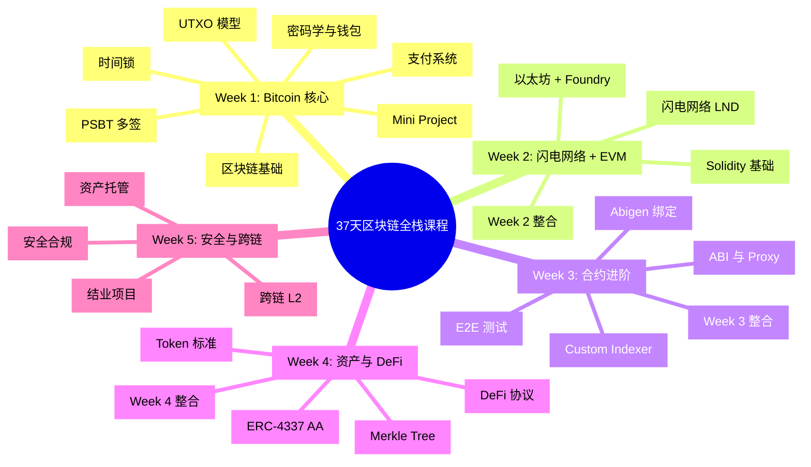
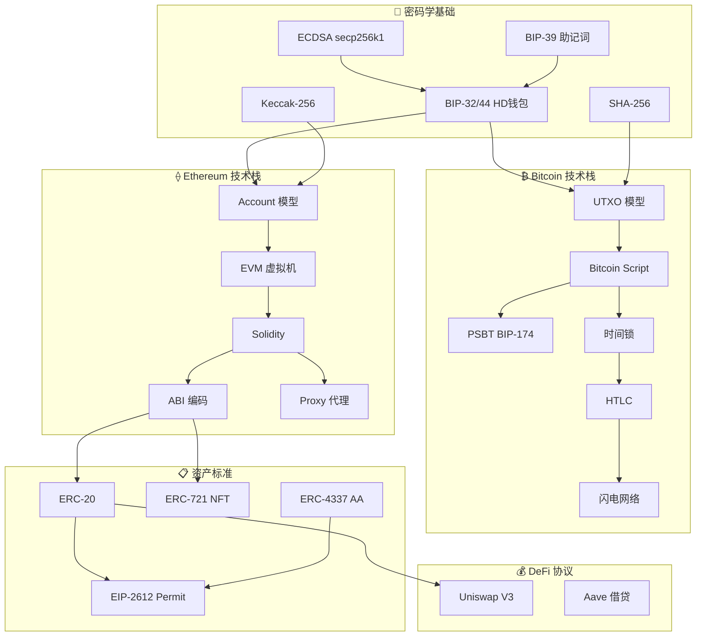
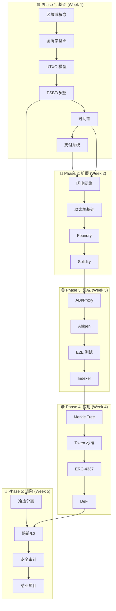
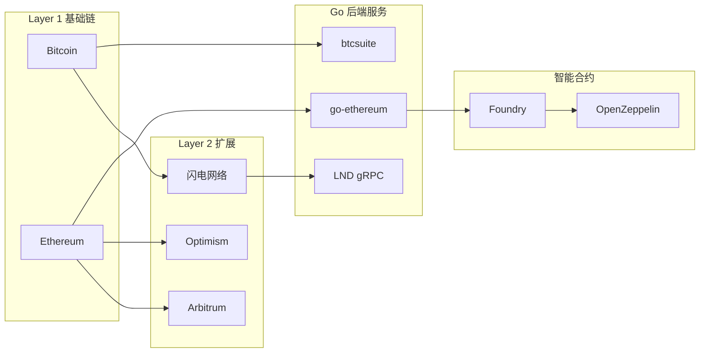
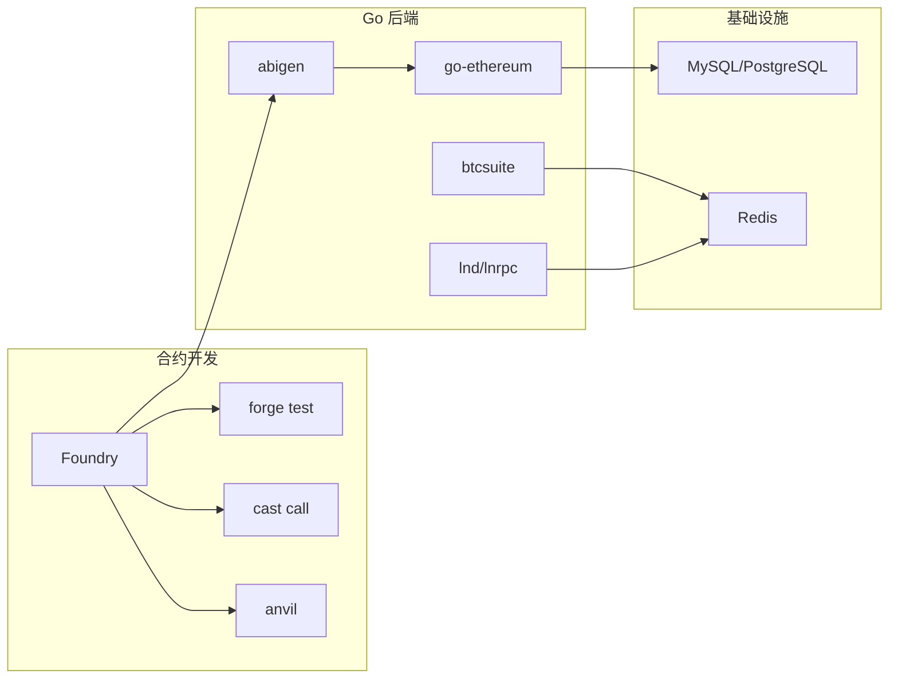

# 区块链后端开发培训课程（37天）

[](https://golang.org/)
[](https://soliditylang.org/)
[](https://book.getfoundry.sh/)
[](LICENSE)

> 🎯 **目标人群**：具备扎实 Golang 服务端开发经验，理解数据库、网络、分布式系统基础，但零区块链经验的开发者。

## 📖 课程简介

这是一个为期 **37 天**的密集实战课程，帮助后端开发者快速掌握 **Bitcoin + EVM 双技术栈**，具备支付系统、资产托管、DeFi 应用、跨链开发的能力。

### 技术栈

| 领域         | 技术                            |
| ------------ | ------------------------------- |
| **智能合约** | Solidity + Foundry              |
| **后端服务** | Golang (go-ethereum / btcsuite) |
| **数据库**   | MySQL/PostgreSQL + Redis        |
| **AI 辅助**  | Cursor / Windsurf               |

---

## 🗺️ 课程概览



---

## 🔗 知识图谱

### 核心概念关系



### 学习路径依赖



### 技术栈分层



---

## 📚 课程内容

| Week       | 主题               | 核心技术                         | Day   |
| ---------- | ------------------ | -------------------------------- | ----- |
| **Week 1** | Bitcoin 核心       | UTXO, PSBT, 时间锁, 支付系统     | 1-7   |
| **Week 2** | 闪电网络 + EVM     | LND, Ethereum, Foundry, Solidity | 8-14  |
| **Week 3** | 合约进阶与 Go 集成 | ABI, Abigen, E2E 测试, Indexer   | 15-21 |
| **Week 4** | 资产标准与 DeFi    | Merkle, ERC-4337, Uniswap, Aave  | 22-30 |
| **Week 5** | 安全与跨链         | 冷热分离, L2, MEV, 结业项目      | 31-37 |

### 详细课程文件

- [Day 1: 区块链核心概念](./Day01_区块链核心概念.md)
- [Day 2: 密码学基础与钱包原理](./Day02_密码学基础与钱包原理.md)
- [Day 3: Bitcoin UTXO 模型详解](./Day03_Bitcoin_UTXO模型详解.md)
- [Day 4: PSBT 多方协同](./Day04_PSBT多方协同.md)
- [Day 5: Bitcoin 时间锁](./Day05_Bitcoin时间锁.md)
- [Day 6: Bitcoin 支付系统开发](./Day06_Bitcoin支付系统开发.md)
- [Day 7: Week 1 复习与 Mini Project](./Day07_Week1_复习与_Mini_Project.md)

---

## 🛠️ 工具链生态



---

## 📋 核心技术点索引

| 类别         | 技术点                  | Day       | 前置知识 |
| ------------ | ----------------------- | --------- | -------- |
| **密码学**   | ECDSA / BIP-39 / BIP-32 | Day 2     | -        |
| **Bitcoin**  | UTXO / Coin Selection   | Day 3     | 密码学   |
| **Bitcoin**  | PSBT / 多签             | Day 4     | UTXO     |
| **Bitcoin**  | CLTV / CSV 时间锁       | Day 5     | Script   |
| **Bitcoin**  | 支付系统 / Reorg        | Day 6     | RPC      |
| **闪电网络** | 支付通道 / HTLC         | Day 8-10  | 时间锁   |
| **Ethereum** | Account / EVM           | Day 11    | -        |
| **Solidity** | ERC-20 / Fuzzing        | Day 13    | EVM      |
| **Solidity** | ABI / Proxy             | Day 15    | Solidity |
| **Go 集成**  | Abigen / Indexer        | Day 16-19 | ABI      |
| **Merkle**   | Merkle Tree / Proof     | Day 22-23 | 哈希     |
| **标准**     | ERC-4337                | Day 26-27 | Permit   |
| **DeFi**     | Uniswap / Aave          | Day 28-29 | ERC-20   |
| **安全**     | 冷热分离 / MEV          | Day 31-35 | 多签     |

---

## 🚀 快速开始

### 环境要求

```bash
# Go 1.21+
go version

# Foundry
curl -L https://foundry.paradigm.xyz | bash
foundryup

# 验证安装
forge --version
cast --version
anvil --version
```

### 创建第一个项目

```bash
# 创建课程目录
mkdir -p ~/blockchain-course
cd ~/blockchain-course

# 初始化 Go 模块
go mod init blockchain-course

# 安装依赖
go get github.com/btcsuite/btcd
go get github.com/ethereum/go-ethereum

# 初始化 Foundry 项目
forge init contracts
```

---

## 📖 参考资源

### 官方文档
- [Foundry Book (中文版)](https://book.getfoundry.sh/)
- [go-ethereum Wiki](https://geth.ethereum.org/docs)
- [btcsuite Documentation](https://github.com/btcsuite/btcd)

### 标准规范
- [Bitcoin BIPs](https://github.com/bitcoin/bips)
- [Ethereum EIPs](https://eips.ethereum.org/)
- [ERC-4337](https://eips.ethereum.org/EIPS/eip-4337)

### 进阶阅读
- [Paradigm Engineering Blog](https://www.paradigm.xyz/blog)
- [Flashbots Docs](https://docs.flashbots.net/)

---

## 📄 License

MIT License - 详见 [LICENSE](LICENSE) 文件
