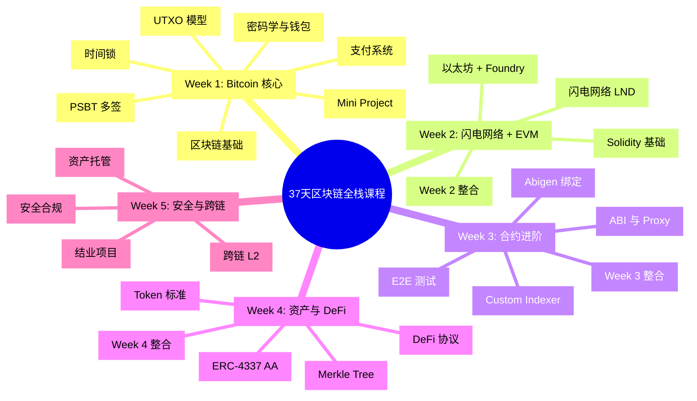

# 区块链后端开发培训课程（37天）

[](https://golang.org/)
[](https://soliditylang.org/)
[](https://book.getfoundry.sh/)
[](LICENSE)

> 🎯 **目标人群**：具备扎实 Golang 服务端开发经验，理解数据库、网络、分布式系统基础，但零区块链经验的开发者。

## 📖 课程简介

这是一个为期 **37 天**的密集实战课程，帮助后端开发者快速掌握 **Bitcoin + EVM 双技术栈**，具备支付系统、资产托管、DeFi 应用、跨链开发的能力。

### 技术栈

| 领域         | 技术                            |
| ------------ | ------------------------------- |
| **智能合约** | Solidity + Foundry              |
| **后端服务** | Golang (go-ethereum / btcsuite) |
| **数据库**   | MySQL/PostgreSQL + Redis        |
| **AI 辅助**  | Cursor / Windsurf               |

> 📚 **详细课程大纲请查看**: [课程大纲.md](./课程大纲.md)

---

## 🗺️ 课程概览



---

## 📚 课程进度

### ✅ Week 1: 区块链基础 + Bitcoin 核心 (已完成)

- [Day 1: 区块链核心概念](./Day01_区块链核心概念.md)
- [Day 2: 密码学基础与钱包原理](./Day02_密码学基础与钱包原理.md)
- [Day 3: Bitcoin UTXO 模型详解](./Day03_Bitcoin_UTXO模型详解.md)
- [Day 4: PSBT 多方协同](./Day04_PSBT多方协同.md)
- [Day 5: Bitcoin 时间锁](./Day05_Bitcoin时间锁.md)
- [Day 6: Bitcoin 支付系统开发](./Day06_Bitcoin支付系统开发.md)
- [Day 7: Week 1 复习与 Mini Project](./Day07_Week1_复习与_Mini_Project.md)

### ✅ Week 2: 闪电网络 + EVM 基础 (已完成)

- [Day 8: 闪电网络 Layer 2 支付通道](./Day08_闪电网络_Layer2支付通道.md)
- [Day 9: LND 开发 (Go)](./Day09_LND开发_Go.md)
- [Day 10: 以太坊基础 Account 模型与 EVM](./Day10_以太坊基础_Account模型与EVM.md)
- [Day 11: 以太坊交易与 Go 客户端开发](./Day11_以太坊交易与Go客户端开发.md)
- [Day 12: 合约开发 Foundry 入门](./Day12_合约开发_Foundry入门.md)
- [Day 13: Solidity 基础语法与 ERC-20](./Day13_Solidity基础语法与ERC20.md)
- [Day 14: Week 2 整合与 Mini Project](./Day14_Week2_整合与Mini_Project.md)

### 🔜 Week 3-5: 即将推出

详见 [课程大纲.md](./课程大纲.md) 了解完整课程内容。

---

## 🚀 快速开始

### 环境要求

```bash
# Go 1.21+
go version

# Foundry
curl -L https://foundry.paradigm.xyz | bash
foundryup

# 验证安装
forge --version
cast --version
anvil --version
```

### 创建第一个项目

```bash
# 创建课程目录
mkdir -p ~/blockchain-course
cd ~/blockchain-course

# 初始化 Go 模块
go mod init blockchain-course

# 安装依赖
go get github.com/btcsuite/btcd
go get github.com/ethereum/go-ethereum

# 初始化 Foundry 项目
forge init contracts
```

---

## 📖 参考资源

### 官方文档
- [Foundry Book (中文版)](https://book.getfoundry.sh/)
- [go-ethereum Wiki](https://geth.ethereum.org/docs)
- [btcsuite Documentation](https://github.com/btcsuite/btcd)

### 标准规范
- [Bitcoin BIPs](https://github.com/bitcoin/bips)
- [Ethereum EIPs](https://eips.ethereum.org/)
- [ERC-4337](https://eips.ethereum.org/EIPS/eip-4337)

---

## 📄 License

MIT License - 详见 [LICENSE](LICENSE) 文件
